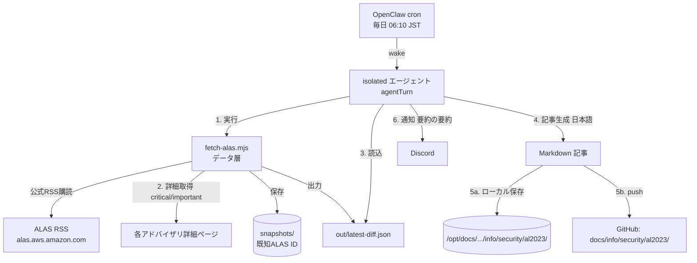
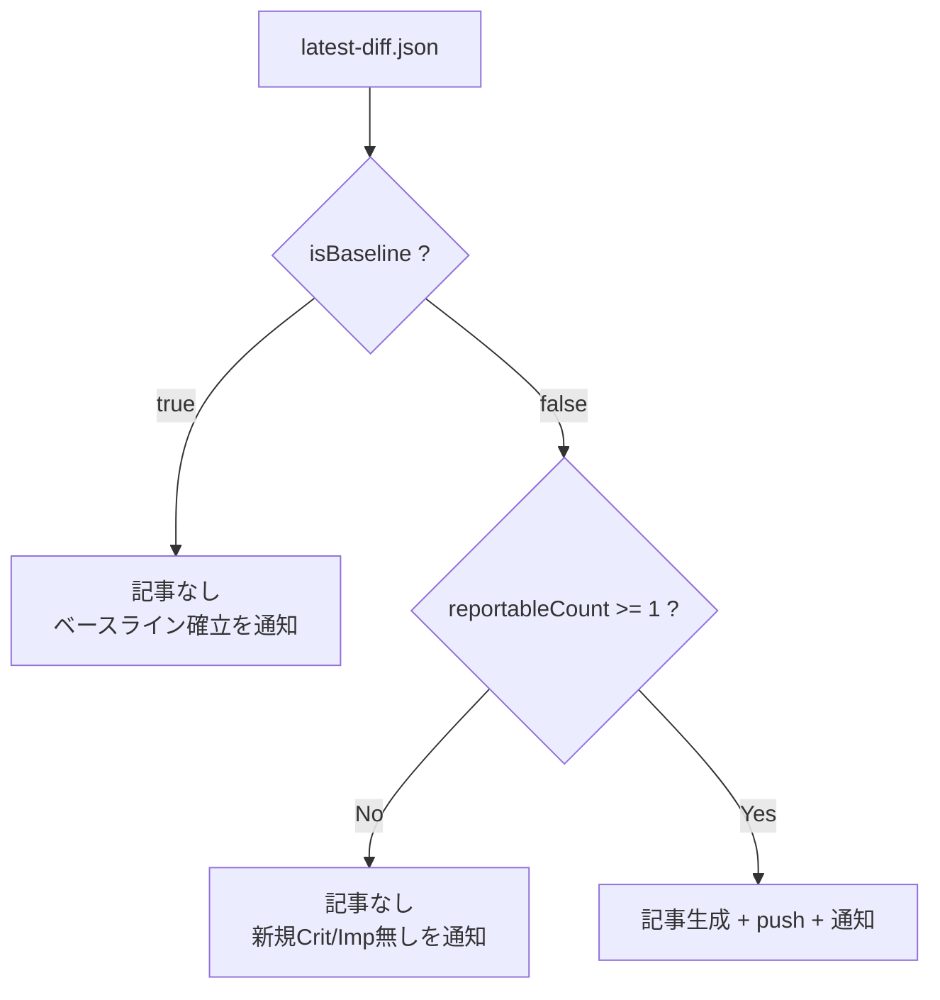

# AL2023 セキュリティアドバイザリ 日次監視タスク 構築手順

> STATUS: DONE / CATEGORY: SETUP / 作成日: 2026-06-07
> Amazon Linux 2023(AL2023) の公式セキュリティアドバイザリ(ALAS)を毎日チェックし、新規の Critical/Important を要約して `docs/info/security/al2023/` へ公開＋Discord 通知するタスクの構築手順です。[[009_DONE_SETUP_weekly-github-trending-task]] をベースに設計。

## 0. 概要（何をするタスクか）

毎日 **06:10 JST** に自動実行され、次を行います。

1. AWS 公式 **ALAS RSS フィード**から AL2023 のセキュリティアドバイザリ一覧を取得
2. 前回保存した「スナップショット（既知の ALAS ID 一覧）」と比較し、**新規アドバイザリ**を抽出
3. 新規のうち **Critical / Important** の詳細ページから概要・対象パッケージ・CVE を取得
4. 日本語の要約記事（Markdown）を生成
5. ドキュメント公開リポジトリの `docs/info/security/al2023/` へ push
6. Discord に「作成・push した旨 ＋ 要約の要約」を通知

> 用語: **ALAS** … Amazon Linux Security Center。Amazon Linux のセキュリティ修正情報（アドバイザリ）の公式公開先。`ALAS2023-YYYY-NNNN` の ID で管理。
> 用語: **アドバイザリ（advisory）** … 「この脆弱性に対する修正を出した」という公式のお知らせ。対象パッケージ・修正バージョン・該当 CVE を含む。
> 用語: **重大度（severity）** … Critical（緊急）> Important（重要）> Medium（中）> Low（低）。本タスクは上位2つを記事化対象とする。

### 採用方式（最小構成）
- **公式 ALAS RSS フィード購読 + 自前スナップショット差分**。
- AWS が「subscribe to our RSS feed」として提供する機械可読フィードを使用。**スクレイピングではない**ため規約上問題なし（詳細は §5）。
- ブラウザ自動化（playwright）も aws-mcp も**コア処理には使わない**（静的フィード＋静的 HTML で完結し、その方が堅牢・低コスト）。playwright は将来 JS 化した場合のフォールバックとして温存。

## 1. アーキテクチャ



分岐ロジック（記事を作るか否か）:



## 2. 前提

- Node.js v18 以降（`fetch` 使用。本番 v24 系）。**認証・トークン不要**（ALAS RSS は公開・無料）。
- OpenClaw の `cron` ツール（永続スケジューラ）。
- GitHub への push 用に `github-mcp`（既存）。
- ※ sudo は不要（フィード購読のみ。OS 更新の適用は記事内で「管理者が手動実行」と案内するだけ）。

## 3. ディレクトリ構成

```
~/.openclaw/workspace/tasks/al2023-security/
├── fetch-alas.mjs       # データ層スクリプト
├── snapshots/           # 既知ALAS IDスナップショット (snapshot-YYYY-MM-DD.json)
└── out/                 # 差分出力 (diff-YYYY-MM-DD.json, latest-diff.json)
```

```bash
mkdir -p ~/.openclaw/workspace/tasks/al2023-security/snapshots \
         ~/.openclaw/workspace/tasks/al2023-security/out
```

## 4. データ層スクリプト（fetch-alas.mjs）

役割は「**RSS取得 → スナップショット保存 → 差分計算 → 対象の詳細取得 → JSON出力**」まで。記事生成と push は呼び出し側（NEXUS）が担当（部品として再利用・テストしやすくするため）。

主な仕様:
- **情報源**: `https://alas.aws.amazon.com/AL2023/alas.rss`
- **対象重大度**: `critical` / `important`（記事・通知対象）。`medium` / `low` は件数のみ集計。
- **パース**: RSS の `<title>`（例 `ALAS2023-2026-1695 (important): kernel6.12`）から ID・重大度・パッケージを抽出。`<description>`＋詳細ページから CVE を抽出。
- **差分**: 直前スナップショットに無い ALAS ID = 新規。初回は `isBaseline`（差分なし＝全件を基準として保存するだけ）。
- **詳細取得**: 新規の critical/important のみ詳細ページを取得（上限 `MAX_DETAIL_FETCH=30`、間隔 `1.5s`、礼儀正しい User-Agent）。`Issue Overview` を best-effort 抽出。
- **出力**: `snapshots/snapshot-<日付>.json`、`out/diff-<日付>.json`、`out/latest-diff.json`。

> スクリプト全文はワークスペースの実ファイル `tasks/al2023-security/fetch-alas.mjs` を参照（環境固有値・機密は含めない方針）。

## 5. 利用規約の確認（重要）

- 値を取得するタスクは、**作成時に対象サイトの利用規約（自動取得可否）を必ず確認**する運用ルール。
- 本タスクの情報源 **ALAS RSS は、AWS が「subscribe to our RSS feed」と明記して提供する機械可読フィード**であり、プログラムによる購読が公式に想定されている。したがって 009 の GitHub 公式 API と同様「公式提供インターフェースの利用」に該当し、スクレイピング（画面の自動読み取り）ではない。
- 運用上の礼儀として、**日1回の低頻度**・適切な User-Agent・詳細ページ取得の間隔（1.5s）・取得上限（30件）を設ける。
- robots.txt は一部 UA に 403 を返すが、フィードは購読前提のため上記方針で運用。今後**スクレイピングへ変更する場合は再度規約確認し、違反時はタスクを中断して報告**すること。

## 6. cron 登録（OpenClaw 永続スケジューラ）

`cron` ツール `action=add` で登録（実値は 009 と同形式）。

| 項目 | 値 |
|---|---|
| name | `daily-al2023-security` |
| schedule | `{ kind: cron, expr: "10 6 * * *", tz: "Asia/Tokyo" }` |
| sessionTarget | `isolated` |
| payload.kind | `agentTurn` |
| payload.model | `anthropic/claude-opus-4-8` |
| payload.timeoutSeconds | `1200` |
| delivery | `{ mode: announce, channel: discord, to: user:<DISCORD_USER_ID> }` |
| failureAlert | `{ mode: announce, channel: discord, to: user:<DISCORD_USER_ID>, after: 1 }`（1回失敗で通知） |

> `expr "10 6 * * *"` は「分 時 日 月 曜日」で **毎日 06:10**。`tz` を付けると JST 壁時計でそのまま指定可。
> `payload.message` にタスク全手順を日本語で自己完結的に記述（フィード実行 → latest-diff.json 読込 → 分岐 → 記事生成 → push → 要約の要約を通知）。

## 7. 公開先と命名規則

- **ローカルマスター**: `/opt/docs/openclaw-news/info/security/al2023/`
- **GitHub**: `TakahitoSuzukiii/public-openclaw-01` の **`master`** ブランチ `docs/info/security/al2023/`
- **ファイル名**: `YYYYMMDD_INFO_ALAS_al2023-security.md`
  - `docs/info/` 命名規則 `YYYYMMDD_STATUS_TOPIC_title` に準拠（STATUS=INFO, TOPIC=ALAS）。

## 8. 動作テスト

```bash
cd ~/.openclaw/workspace/tasks/al2023-security
node fetch-alas.mjs
```

- 初回は `prior=none(baseline)` と表示され、スナップショット1つが作られる（`isBaseline=true`、新規0）。
- 差分・詳細取得の検証は、直前スナップショットから数件 ID を間引いた合成 prior を作って再実行すると、それらが「新規」として検知され詳細取得が走ることを確認できる。
- cron 全体の疎通は `cron action=run`（force）で即時トリガー可能。

### 構築時の検証結果（2026-06-07）
- RSS 取得 OK（フィード 2171 件をパース）。重大度内訳: critical=12, important=1125, medium=843, low=191。
- パース品質 OK（ID・重大度・パッケージ・日付・CVE・リンクを正しく抽出）。
- 合成 prior による差分テスト OK（新規 6 件を検知、critical/important の詳細ページから概要・CVE を取得）。
- baseline スモークテスト（cron force run）で isolated エージェントの疎通・Discord 通知を確認。
- 初回テストとして、現時点で Critical に分類されている全 12 件を棚卸しした記事を作成・push 済み（`docs/info/security/al2023/20260607_INFO_ALAS_al2023-security.md`）。

## 9. 運用・メンテナンス

- **対象重大度の変更**: `fetch-alas.mjs` の `REPORT_SEVERITIES`（既定 `critical`,`important`）を調整。
- **スケジュール変更**: cron `action=update` で `schedule.expr` を変更。
- **手動実行**: cron `action=run` に `<job-id>` を渡す。
- **詳細取得の上限/間隔**: `MAX_DETAIL_FETCH` / `DETAIL_GAP_MS` を調整。
- **スナップショット**: `snapshots/` はローカル保持（git push 不要）。差分の基準なので削除しない。
- **適用（OS 更新）は管理者作業**: `sudo dnf check-release-update` / `sudo dnf check-update` / `sudo dnf upgrade --security`。本タスクは通知のみで適用はしない。出典: <https://docs.aws.amazon.com/ja_jp/linux/al2023/ug/managing-repos-os-updates.html>

## 10. トラブルシュート

| 症状 | 原因 / 対処 |
|---|---|
| `RSS から item を取得できません` | フィード書式変更 or 一時的な配信不良。フィード URL と `parseRss` の正規表現を確認。 |
| 詳細取得が `detail ERR` | 詳細ページの 403/タイムアウト。`overview` は null になるが CVE は RSS 由来で保持。間隔を延ばす。 |
| 新規が常に 0 | 正常（その日新規アドバイザリ無し）。または前回スナップショットが古すぎる場合は一度フィード全件で再ベースライン。 |
| push で `Branch main not found` | デフォルトブランチは `master`。`branch=master` を指定。 |
| 1日の新規が多すぎる | `reportableTruncated=true` で詳細は先頭 30 件のみ。残件数は記事に注記。必要なら `MAX_DETAIL_FETCH` を調整。 |

---

## Author and Ownership / 著作権と所属について

This project was created as a personal initiative and is not connected to any organization or group.
It is published as an individual creative work.

本プロジェクトは個人の活動として作成したものであり、特定の組織や団体の業務とは関係ありません。
個人の創作物として公開しています。
