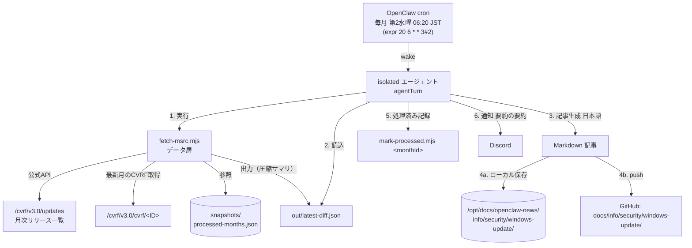
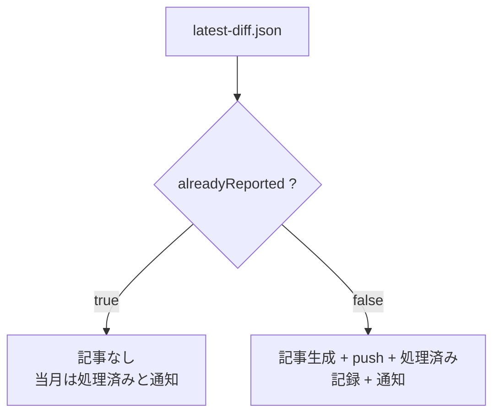

# Windows Update / MSRC 月次セキュリティ更新 監視タスク 構築手順

> STATUS: DONE / CATEGORY: SETUP / 作成日: 2026-06-07
> Microsoft の月次セキュリティ更新（Patch Tuesday）を毎月チェックし、新規月のリリースを要約して `docs/info/security/windows-update/` へ公開＋Discord 通知するタスクの構築手順です。[[012_DONE_SETUP_al2023-security-task]] をベースに設計。

## 0. 概要（何をするタスクか）

毎月 **第2水曜日 06:20 JST** に自動実行され、次を行います。

1. Microsoft **MSRC 公式 API（Security Update Guide / CVRF v3.0）** から月次セキュリティ更新の一覧を取得
2. 最新の **正式な月次リリース**（"Early Security Updates" は除外）を特定
3. 前回までに「処理済み」とした月の一覧と比較し、**未処理の月**だけを記事化対象とする
4. その月の CVRF 文書を取得・集計（重大度別件数・影響タイプ別・**悪用確認(Exploited)**・**公開済み(Publicly Disclosed)**・CVSS 上位）
5. 日本語の要約記事（Markdown）を生成
6. ドキュメント公開リポジトリの `docs/info/security/windows-update/` へ push
7. push 成功後に当月を「処理済み」に記録
8. Discord に「作成・push した旨 ＋ 要約の要約」を通知

> 用語: **MSRC** … Microsoft Security Response Center。Microsoft 製品のセキュリティ修正情報の公式公開元。
> 用語: **Patch Tuesday** … 毎月第2火曜日（米国時間）の定例セキュリティ更新公開日。JST ではおおむね水曜の朝にあたる。
> 用語: **CVRF** … Common Vulnerability Reporting Framework。脆弱性情報の機械可読フォーマット。MSRC が API で提供。
> 用語: **CVE / CVSS** … CVE=脆弱性の世界共通識別番号、CVSS=深刻さを 0〜10 で表す指標。
> 用語: **重大度(severity)** … Critical（緊急）> Important（重要）> Moderate（警告）> Low（低）。

### 採用方式（最小構成）
- **公式 MSRC CVRF API 利用 + 自前「処理済み月」差分**。
- Microsoft が公式提供する機械可読 API（プログラム利用が想定された正規インターフェース）。**スクレイピングではない**ため規約上問題なし（詳細は §5）。
- 鈴木さん提示の MSRC ブログ（人間向け月次サマリ）は記事内に**参照リンクとして併記**。取得ロジックは API 側を使用。
- ブラウザ自動化（playwright）も aws-mcp も**コア処理には使わない**（API＋JSON で完結し堅牢・低コスト）。

### ★ 脆弱性の選定ロジック（公式の見方に準拠・最重要）
**CVSS 基本値は“参考値”であり、それ単独で並べない。** 当初 CVSS 上位で並べたところ Azure クラウドの高スコアばかりが並び、MSRC 日本語ブログ「主な注意点」の顔ぶれと一致しなかった（2026-06-07 修正）。優先度は MSRC が提供する**公式シグナル**で決める。記事で扱う重要度順:
1. **悪用確認(Exploited / Exploitation Detected)** … ゼロデイ。最優先。
2. **公開済み(Publicly Disclosed)**。
3. **Exploitation More Likely**（公式の Exploitability Index＝悪用可能性指標。CVRF の Threats Type=1 文字列 `Latest Software Release` から抽出）。
4. **要・更新適用かつ高深刻度(CVSS≥9.8, Windows/オンプレ Microsoft 製品)** … MSRC ブログが CVSS 9.8 以上を目安に挙げる点に合わせた“中核”。

製品クラスで仕分け（CVSS≥9.8 を 3 区分）:
- **microsoft-update（要・更新適用）**: Remediations に Security Update(KB) / 更新カタログがある＝利用者がパッチ適用すべき。→「特に注意」の中核。
- **azure-cloud（参考・対応不要）**: Azure クラウド等で Remediations 空＝Microsoft 側で修正済み・利用者の操作は原則不要。
- **azure-linux（件数のみ）**: 製品名が Azure Linux / Mariner / `azl*` / CBL に一致＝Windows 利用者の対象外（OSS パッケージ）。

> CVRF Threats の Type: 0=影響(Impact)、1=悪用状況文字列(Publicly Disclosed/Exploited/Latest Software Release)、3=重大度(Severity)。CVSS ベクタ(`PR:`/`UI:`)も保持。

## 1. アーキテクチャ



分岐ロジック（記事を作るか否か）:



> 注: AL2023 タスクと異なり、**初回(baseline)でも記事を作成する**。差分の基準は「処理済み月の集合」で、未処理の最新月を必ず1本記事化する設計。

## 2. 前提

- Node.js v18 以降（`fetch` 使用。本番 v24 系）。**認証・トークン不要**（MSRC API は公開・無料）。
- OpenClaw の `cron` ツール（永続スケジューラ）。
- GitHub への push 用に `github-mcp`（既存）。
- ※ sudo 不要（API 取得のみ。更新の適用は記事内で「利用者/管理者が手動実行」と案内するだけ）。

## 3. ディレクトリ構成

```
~/.openclaw/workspace/tasks/windows-update-security/
├── fetch-msrc.mjs            # データ層スクリプト（取得・集計・差分・JSON出力）
├── mark-processed.mjs        # 記事化成功後に月IDを「処理済み」に記録
├── snapshots/                # processed-months.json（処理済み月の集合）
└── out/                      # 差分出力 (diff-YYYY-MM-DD.json, latest-diff.json)
```

```bash
mkdir -p ~/.openclaw/workspace/tasks/windows-update-security/snapshots \
         ~/.openclaw/workspace/tasks/windows-update-security/out
```

## 4. データ層スクリプト（fetch-msrc.mjs）

役割は「**一覧取得 → 最新の正式月次を選定 → 処理済み判定 → CVRF 取得・集計 → 圧縮サマリ JSON 出力**」まで。記事生成と push、処理済み記録は呼び出し側（NEXUS）が担当（部品として再利用・テストしやすくするため）。

主な仕様:
- **情報源**: `https://api.msrc.microsoft.com/cvrf/v3.0/updates`（一覧）/ `https://api.msrc.microsoft.com/cvrf/v3.0/cvrf/<ID>`（各月、例 `2026-May`）。`Accept: application/json` 指定で JSON 取得。
- **月選定**: タイトルに `Security Updates` を含み `Early` を含まない正式月次のうち、ID（年-月）が最大のものを採用。
- **集計**: 各 `Vulnerability` の `Threats` を参照。Type=3=重大度、Type=0=影響タイプ、Type=1=悪用状況文字列（`Publicly Disclosed:...;Exploited:...`）。`CVSSScoreSets[].BaseScore` の最大値を採用。
- **製品クラス分類**: `ProductTree` から ProductID→製品名を解決し、§0★のロジックで `microsoft-update` / `azure-cloud` / `azure-linux` に分類。`Remediations` の有無で「要・更新適用か」を判定、KB 番号も抽出。
- **差分**: `snapshots/processed-months.json` に無い最新月 = 未処理 → 記事化対象（`alreadyReported=false`）。
- **出力（圧縮）**: 4MB 級の生 CVRF はエージェントに渡さず、`out/latest-diff.json` に公式シグナル別の優先リストのみを出力。主フィールド: `attentionThreshold(=9.8)`, `exploited[]`, `publiclyDisclosed[]`, `exploitationMoreLikely[]`, `attentionUpdateRequired[]`（要更新適用 Windows/オンプレ, CVSS≥9.8）, `azureCloudHigh[]`（参考・対応不要）, `azureLinuxHighCount`（件数のみ）, `bySeverity`, `byImpact`。各レコードに `cvss/cvssVector/exploitabilityIndex/productClass/kbs[]` 等。
- **処理済み記録は分離**: 取得だけ成功して記事化前に落ちた月を誤って既処理にしないため、`mark-processed.mjs` を **push 成功後**に別途実行する。

> スクリプト全文はワークスペースの実ファイル `tasks/windows-update-security/fetch-msrc.mjs` / `mark-processed.mjs` を参照（環境固有値・機密は含めない方針）。

## 5. 利用規約の確認（重要）

- 値を取得するタスクは、**作成時に対象サイトの利用規約（自動取得可否）を必ず確認**する運用ルール。
- 本タスクの情報源 **MSRC Security Update Guide の CVRF API は、Microsoft が公式提供する機械可読 API** であり、プログラムによるアクセスが想定された正規インターフェース（ALAS RSS / GitHub API と同格）。したがって「公式提供インターフェースの利用」に該当し、スクレイピング（画面の自動読み取り）ではない。認証不要。
- 運用上の礼儀として、**月1回の低頻度**・適切な User-Agent で運用。
- 今後**スクレイピングへ変更する場合は再度規約確認し、違反時はタスクを中断して報告**すること。

## 6. cron 登録（OpenClaw 永続スケジューラ）

`cron` ツール `action=add` で登録。

| 項目 | 値 |
|---|---|
| name | `monthly-windows-update-security` |
| schedule | `{ kind: cron, expr: "20 6 * * 3#2", tz: "Asia/Tokyo" }` |
| sessionTarget | `isolated` |
| payload.kind | `agentTurn` |
| payload.model | `anthropic/claude-opus-4-8` |
| payload.timeoutSeconds | `1500` |
| delivery | `{ mode: announce, channel: discord, to: user:<DISCORD_USER_ID> }` |
| failureAlert | `{ mode: announce, channel: discord, to: user:<DISCORD_USER_ID>, after: 1 }` |

### ★ 第2水曜の cron 式（重要な落とし穴）
- OpenClaw の cron は **day-of-month と day-of-week を同時指定すると OR 判定**になる。そのため `20 6 8-14 * 3`（8〜14日 かつ 水曜）は「8〜14日 **または** 水曜」と解釈され、**毎週水曜＋毎月8〜14日**に発火してしまい誤り（検証で next run が 6/8 月曜になった）。
- 正解は **nth-weekday 記法 `3#2`（その月の第2水曜）**。`20 6 * * 3#2` で next run が **6/10(水) 06:20 JST** になることを実測確認済み。
- `payload.message` にタスク全手順を日本語で自己完結的に記述（取得 → latest-diff.json 読込 → 分岐 → 記事生成 → push → 処理済み記録 → 要約の要約を通知）。

## 7. 公開先と命名規則

- **ローカルマスター**: `/opt/docs/openclaw-news/info/security/windows-update/`
- **GitHub**: `TakahitoSuzukiii/public-openclaw-01` の **`master`** ブランチ `docs/info/security/windows-update/`
- **ファイル名**: `YYYYMMDD_INFO_WINUPDATE_windows-update-security.md`
  - 日付は当月 `initialReleaseDate`（Patch Tuesday の日付）を `YYYYMMDD` に変換。
  - `docs/info/` 命名規則 `YYYYMMDD_STATUS_TOPIC_title` に準拠（STATUS=INFO, TOPIC=WINUPDATE）。

## 8. 動作テスト

```bash
cd ~/.openclaw/workspace/tasks/windows-update-security
node fetch-msrc.mjs
```

- `out/latest-diff.json` が生成され、`alreadyReported` / `monthId` / 件数集計が確認できる。
- cron 全体の疎通は `cron action=run`（force）で即時トリガー可能。

### 構築時の検証結果（2026-06-07）
- 一覧取得 OK（189 月次エントリ）。最新正式月 = **2026-May**（"2026-Jun" は Early のため除外）。
- CVRF 取得・集計 OK：May 2026 は全 **1115 CVE**。重大度内訳 critical=61 / important=232 / moderate=396 / low=30 / unknown=396。
- 悪用確認(Exploited)=3、公開済(Publicly Disclosed)=3 を正しく抽出。CVSS 10.0 の Critical 多数を検知。
- cron 式 `3#2` で next run = 2026/06/10(水) 06:20 JST を確認。
- force run で end-to-end 成功：記事 `20260512_INFO_WINUPDATE_windows-update-security.md` を GitHub `master` へ push、ローカルマスター保存、`processed-months.json` に `2026-May` 記録、Discord 通知まで確認。

### 選定ロジック修正（2026-06-07・同日）
- 初版は CVSS 上位で並べたため、Azure クラウドの高スコアばかりが「注目」に並び、MSRC ブログ「主な注意点」（CVE-2026-42898 Dynamics 365 / CVE-2026-42823 Logic Apps / CVE-2026-41096 DNS Client / CVE-2026-41089 Netlogon）と不一致だった。
- §0★の公式シグナル優先ロジック（悪用確認→公開済み→Exploitation More Likely→要更新適用 CVSS≥9.8、製品クラスで microsoft-update / azure-cloud / azure-linux に仕分け）へ改修。`processed-months.json` をリセットして force run で 5月記事を再生成・再 push（公式4件すべて適切に配置、CVSS は参考値扱い）。
- 検証（May 2026）: 要更新適用(Windows/オンプレ)=4（ALDO/Dynamics365/Netlogon/DNS Client）、Azure クラウド(参考)=9（Logic Apps 含む）、Azure Linux/OSS=9（件数のみ）、Exploitation More Likely=18、ゼロデイ=3。

### 重複 cron ジョブの整理（2026-06-07）
- 別ジョブ `windows-update-security-summary`（id `99d8dc07…`、main セッション・汎用プロンプト・同一スケジュール `3#2`）が混入していた（NEXUS 作成の正規ジョブ `monthly-windows-update-security` `6989cfac…` と重複）。dedup を参照しない汎用プロンプトで二重投稿リスクがあるため、まず**無効化**し、鈴木さんの承認を得て **2026-06-07 に完全削除**（`cron action=remove`）。現存する cron は正規3件（daily-al2023-security / monthly-windows-update-security / weekly-github-trending）のみ。

## 9. 運用・メンテナンス

- **スケジュール変更**: cron `action=update` で `schedule.expr` を変更（第N水曜は `3#N`）。
- **手動実行**: cron `action=run`（force）に `<job-id>` を渡す。
- **再記事化したい場合**: `snapshots/processed-months.json` から該当月 ID を削除して再実行。
- **「特に注意」しきい値 / 各リスト上限**: `fetch-msrc.mjs` の `ATTENTION_CVSS`（既定 9.8）/ `MAX_LIST` を調整。
- **適用（更新）は利用者/管理者作業**: Windows は「設定 → Windows Update → 更新プログラムのチェック」、企業環境は WSUS/Intune で配布。本タスクは通知のみで適用はしない。

## 10. トラブルシュート

| 症状 | 原因 / 対処 |
|---|---|
| `月次セキュリティ更新の一覧を取得できません` | API 書式変更 or 一時障害。`/updates` の応答と `monthKey`/フィルタ条件を確認。 |
| 毎週水曜に発火する / 想定日とずれる | cron 式が `8-14 * 3` 等になっていないか確認。第2水曜は `3#2`。DoM+DoW 同時指定は OR 判定。 |
| 同じ月が二重に記事化される | `mark-processed.mjs` が push 成功後に実行されたか確認。`processed-months.json` を点検。 |
| push で `Branch main not found` | デフォルトブランチは `master`。`branch=master` を指定。 |
| 件数が極端に多い(1000超) | 正常。Azure Linux(Mariner) 等の重大度未付与(unknown)を含むため。記事では重大度付与分・悪用確認分に注目させる設計。 |

---

## Author and Ownership / 著作権と所属について

This project was created as a personal initiative and is not connected to any organization or group.
It is published as an individual creative work.

本プロジェクトは個人の活動として作成したものであり、特定の組織や団体の業務とは関係ありません。
個人の創作物として公開しています。
