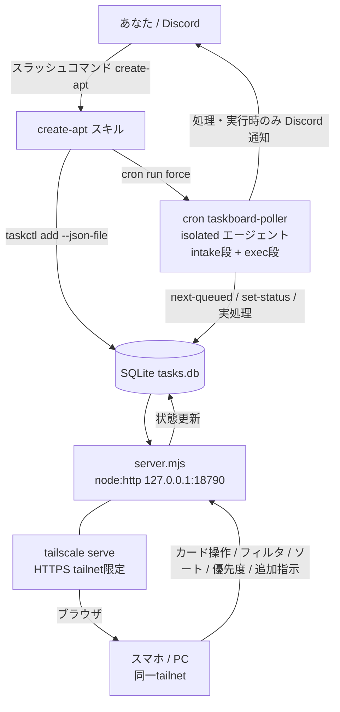
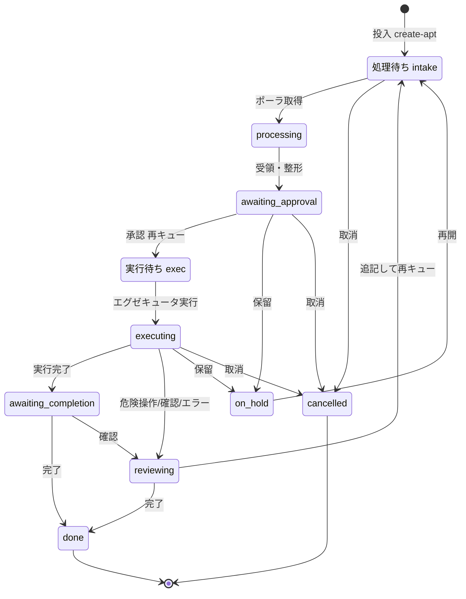

# チャット駆動タスク管理 ＋ カード型ダッシュボード（Task Board）構築手順 — Phase1+2

> STATUS: DONE / CATEGORY: SETUP / 作成日: 2026-06-07（Phase2 追記: 同日）
> Discord チャットからタスクを投入し、優先度付き FIFO キュー（SQLite）に保存 → サーバ常駐エージェント（cron ポーラ／エグゼキュータ）が取り出して状態を進め → カード型ダッシュボードでワンクリック操作・フィルタ・ソート・優先度編集・追加指示する仕組み。最小構成・追加費用ゼロ（Node 標準のみ／npm 依存なし／新規導入は Tailscale のみ）。

## 0. 概要

- **やること**: 「タスクを作って」と指示 → キュー登録 → エージェントがポーリング処理 → **承認後にエージェントが実処理** → 状態管理 → ダッシュボードのカードで承認・完了・確認・保留・取消・優先度編集・追加指示をワンクリック。フィルタ／ソート対応。
- **設計判断**: OpenClaw ネイティブの `tasks`/`TaskFlow` は「実行台帳」で状態が `queued→running→terminal` 固定。今回の6状態のカスタム状態機械＋カード UI には合わないため、**軽量な自前アプリ**を採用。
- **コスト**: 0円。LLM トークンは「処理／実行」時のみ消費。
- **言語/依存**: JavaScript（Node v24, ESM）＋ SQL（SQLite）＋ 素の HTML/CSS/JS。**フレームワーク無し・npm install ゼロ**（`node:sqlite` / `node:http` など Node 標準のみ）。新規導入ソフトは **Tailscale** のみ。

> 用語: **FIFO** … 優先度の高い順 → 同優先度は登録が古い順。
> 用語: **stage** … タスクの段。`intake`（投入処理→承認待ち）/ `exec`（承認後の実行）。
> 用語: **ポーラ／エグゼキュータ** … キューを定期的に取り出して処理/実行する常駐処理（OpenClaw cron の isolated エージェント）。
> 用語: **HITL** … Human-in-the-Loop。実行は人間の承認後にのみ進む。
> 用語: **Tailscale Serve** … 自分の tailnet 内だけにサービスを HTTPS 公開（インターネット非公開）。

## ★ タスクの新規追加方法（2通り）

### A. Discord チャットから（スラッシュコマンド `/create-apt`）
1. Discord で `/create-apt` と入力し、**同じメッセージ内で改行して**タスク内容を書く:
   ```
   /create-apt
   〇〇を調べて要約して
   ```
2. NEXUS が本文をタスク化して登録（status=処理待ち, stage=intake）→ ポーラを即キック。
3. 数十秒ほどで受領され『承認待ち』になり Discord 通知。ダッシュボードで承認すると 実行待ち→実行。
- 優先度: 本文に `優先度:2` または `[p2]` を含めると反映（既定 0）。
- 機密（トークン/パスワード等）は本文に書かない（検知時は登録拒否）。

### B. ダッシュボード画面から（手動追加）
1. ブラウザでダッシュボード `https://<hostname>.<tailnet>.ts.net/` を開く。
2. 最上部「手動でタスク追加」に入力:
   - **タイトル**（必須）／**詳細・指示**／**優先度**（数値・大きいほど先）
   - **🧪ダミー（テスト用・実処理しない）** にチェックするとダミータスクになる
3. 「追加」をクリック → カードが『処理待ち』で出現。以降はポーラが処理→承認待ち、カードのボタンで承認・実行完了・確認・完了・保留・再開・取消・差し戻し、優先度編集、カード展開で追加指示（💬コメント / 📌追撃指示 / ↻追記して再キュー）。

> **ダミー（🧪）** は状態だけ動かせる練習用。エグゼキュータは実コマンド・ファイル書き込み・外部操作・通知を一切行わず状態のみ進める。挙動確認やフィルタ/ソートの試用に使う。

## 1. アーキテクチャ



## 2. 状態機械（6状態 ＋ 制御3状態、＋ stage）

| status | 表示 | 意味 |
|---|---|---|
| queued (stage=intake) | 処理待ち | 投入され処理待ち |
| queued (stage=exec) | 実行待ち | 承認され実行待ち（カードは「実行待ち」表示） |
| processing | 処理中 | ポーラが取り出して処理中 |
| awaiting_approval | 承認待ち | 処理が終わり承認待ち |
| executing | 実行中 | エグゼキュータが実処理中 |
| awaiting_completion | 完了待ち | 実行が完了し完了待ち |
| reviewing | 確認中 | 危険操作要・曖昧・エラー等で要確認 |
| on_hold | 保留 | 一時停止 |
| cancelled / done | 取消 / 完了 | 終端 |



- **役割分担**: ポーラ（intake段）が `queued→processing→awaiting_approval`。**承認＝`queued`/`stage=exec` へ再キュー**（ダッシュボードは直接実行しない＝疎結合）。エグゼキュータ（exec段）が `queued(exec)→executing→awaiting_completion`。
- **HITL / 安全**: エグゼキュータは現行 NEXUS/AGENTS.md 準拠。**調査・読み取り・ワークスペース内作業のみ自走**。外部送信・削除・設定/cron 変更・sudo・push 等の**外部/破壊操作は実行せず `reviewing`(確認中) で停止**して人間判断（追撃指示/再承認/取消）を待つ。機密は保存しない。

## 3. ディレクトリ構成

```
~/.openclaw/workspace/tasks/task-board/
├── db.mjs              # データ層（node:sqlite, stage列, 優先度/追記ヘルパ）
├── taskctl.mjs         # CLI（add --json-file / list / show / set-status[--stage] / priority / append-instruction / log / next-queued --stage）
├── server.mjs          # API＋ダッシュボード配信（node:http, 127.0.0.1:18790）
├── public/index.html   # カードUI（フィルタ/ソート/優先度編集/展開詳細/追加指示, 素のJS）
└── data/tasks.db       # SQLite 実体（実行時生成・git管理しない）
```

## 4. データモデル / API

- `tasks(id, title, instruction, priority, status, result, created_at, updated_at, stage, is_dummy)` / `logs(id, task_id, ts, level, message)`。
  - `is_dummy=1` … ダミー（テスト用）。エグゼキュータは実処理・通知をせず状態のみ進める。
- 優先度付き FIFO（stage別）: `WHERE status='queued' AND stage=? ORDER BY priority DESC, id ASC`。

API（`server.mjs`, loopback 限定）:
- `GET /` ダッシュボード / `GET /api/tasks` 一覧＋ラベル / `GET /api/tasks/:id` 詳細＋ログ
- `POST /api/tasks` 作成
- `POST /api/tasks/:id/action` 遷移 `{action}`:
  - `approve→queued/stage=exec`（承認=実行待ち再キュー）, `finish_exec→awaiting_completion`, `review→reviewing`, `complete→done`, `hold→on_hold`, `resume→queued`, `cancel→cancelled`, `revert→awaiting_approval/stage=intake`（差し戻し）
- `POST /api/tasks/:id/priority` `{priority}`（優先度編集）
- `POST /api/tasks/:id/comment` `{text}`（💬コメントをログに追記）
- `POST /api/tasks/:id/instruct` `{text}`（📌追撃指示。次回 exec 実行時にエグゼキュータが参照）
- `POST /api/tasks/:id/requeue` `{text?}`（指示を追記して `queued/stage=intake` に再キュー＝再処理）

## 5. ダッシュボード機能

- **手動追加フォーム**: タイトル／詳細／優先度＋**🧪ダミー チェックボックス**（テスト用・実処理しない）。
- **カード**: 状態バッジ（実行待ちは専用表示）／🧪ダミー印／#ID／**優先度インライン編集（数値＋保存）**／最新ログ／文脈依存ボタン（承認・実行完了・確認・完了・差し戻し・保留・再開・取消）。
- **展開詳細**（タイトルクリック）: instruction 全文／result／全ログ＋**追加指示エリア**（💬コメント / 📌追撃指示 / ↻追記して再キュー）。
- **フィルタ**（手動追加の下）: 状態（複数選択チェック）／テキスト検索（タイトル・最新ログ）／優先度しきい値。
- **ソート**: 優先度 / 更新日時 / 作成日時 / 状態 / ID × 昇降。
- フィルタ/ソートはクライアント側。カード展開中・入力中は自動更新を抑止（操作の巻き戻り防止）。4秒間隔で自動更新。

## 6. ポーラ／エグゼキュータ（OpenClaw cron）

`taskboard-poller`（isolated agentTurn, model opus, timeout 1200, delivery=none）。schedule `*/10 * * * *` (Asia/Tokyo)。`/create-apt` が投入時に `cron run force` で即キック。

- **パスA intake**: `next-queued --stage intake` → `processing` → 受領・整形 → `awaiting_approval` → Discord 通知。1ターン最大10件。
- **パスB exec**: `next-queued --stage exec` → `executing`（＝実行クレーム）→ instruction＋📌追撃指示を確認 → §2 の安全範囲で実処理 →
  - 正常: `awaiting_completion`（result に要約）＋通知
  - 危険/外部操作要・曖昧・エラー: 実行せず `reviewing` ＋理由ログ＋通知
  - 1ターン最大3件。
- **ダミー制御**: `is_dummy=1` のタスクは intake/exec とも**実コマンド・書き込み・外部操作・通知を一切せず**状態だけ進める（テスト用）。
- **共通**: 対象が無ければ無通知で終了（アイドル時スパム防止）。
- **実行レイテンシ**: 承認後の実行は次のポーリング（最大10分）で開始。即時性が要るなら interval 短縮 or 承認時キックを追加（将来）。

## 7. 常駐サービス（systemd --user）

`~/.config/systemd/user/openclaw-taskboard.service`（抜粋）:
```ini
[Service]
ExecStart=/usr/bin/node /home/<your-user>/.openclaw/workspace/tasks/task-board/server.mjs
Restart=on-failure
Environment=NODE_NO_WARNINGS=1
Environment=TASKBOARD_HOST=127.0.0.1
Environment=TASKBOARD_PORT=18790
[Install]
WantedBy=default.target
```
```bash
systemctl --user daemon-reload && systemctl --user enable --now openclaw-taskboard.service
systemctl --user restart openclaw-taskboard.service   # コード更新後
```

## 8. 投入スキル `/create-apt`

- スラッシュコマンド＝スキル。`/create-apt` の本文をタスク化 → ポーラ即キック。本文は Write ツールで一時 JSON 化 → `taskctl add --json-file`（シェル注入回避）。
- Skill Workshop で提案作成 → `openclaw skills workshop apply <proposal-id>` で live 化（適用済み）。

## 9. ダッシュボードのアクセス（Tailscale Serve）

```bash
sudo dnf install -y dnf-plugins-core
sudo dnf config-manager --add-repo https://pkgs.tailscale.com/stable/amazon-linux/2023/tailscale.repo
sudo dnf install -y tailscale
sudo systemctl enable --now tailscaled
sudo tailscale up                  # 表示URLをブラウザ認証
sudo tailscale serve --bg 18790    # tailnet内だけにHTTPS公開
sudo tailscale serve status
```
- 管理コンソールで **HTTPS certificates 有効化**（必須）。**Funnel は無効**（インターネット非公開）。
- 公開URL（tailnet 限定）: `https://<hostname>.<tailnet>.ts.net/`。閲覧端末にも Tailscale を入れ同一アカウントでログイン。
- 代替: `ssh -N -L 18790:127.0.0.1:18790 <server>` → `http://127.0.0.1:18790`。

## 10. 検証結果（2026-06-07）

- Phase1: 優先度付きFIFO／状態遷移／API／配信／注入安全／intake E2E／承認→実行中、すべて OK。Tailscale Serve でスマホ・PC アクセス確認。
- Phase2: stage マイグレーション OK。`approve→queued/exec` 再キュー、優先度編集、コメント/追撃指示/再キュー/差し戻し、stage別 next-queued、すべて OK。**エグゼキュータ E2E**: 安全な read-only タスク（date/uptime/df）を実行→`result` 要約→`awaiting_completion`＋通知を確認。安全ルール（外部/破壊は reviewing 停止）組込み。
- ダミー: `is_dummy` でダミー10件投入 → intake をサイレント（通知なし・実処理なし）で `承認待ち` まで前進を確認。

## 11. 運用・トラブルシュート（抜粋）

- コード更新後は `systemctl --user restart openclaw-taskboard.service`。
- DB バックアップ: `data/tasks.db`（＋WAL）。git 非管理。
- 同じ exec タスクの二重実行防止: 取得直後に `executing` へ遷移（クレーム）。
- カードが更新されない: `journalctl --user -u openclaw-taskboard` / `GET /api/tasks`。
- 投入が反映されない: `/create-apt` が apply 済みか（`openclaw skills list`）。
- 実行が進まない: cron `taskboard-poller` が enabled か（`cron runs <id>`）。承認後は最大10分待ち。
- `serve` で HTTPS 無効: 管理コンソールで有効化後に再実行。

## 12. セキュリティ / マスキング

- ダッシュボードは loopback 限定＋Tailscale Serve（tailnet 限定・HTTPS）。Funnel 無効。
- エグゼキュータは外部/破壊操作をせず `reviewing` 停止（AGENTS.md/HITL）。機密は DB・ログ・result・タスク本文に保存しない（`/create-apt` は検知時に登録拒否）。
- 固有値はマスキング: `<hostname>`, `<tailnet>.ts.net`, `<your-user>`, `<discord-user-id>`, `<poller-job-id>`。実値は鈴木さん手元で管理。

## 13. 今後（Phase3 候補）

- 承認時の即時実行キック（レイテンシ短縮）。
- reviewing からの「続行承認」で中断ポイント再開（現状は再キューで先頭から）。
- アイドル時コストを下げる常駐ワーカー化（LLM 起動を作業時のみに）。
- タスクの依存関係・サブタスク、添付・成果物リンク。

---

## Author and Ownership / 著作権と所属について

This project was created as a personal initiative and is not connected to any organization or group.
It is published as an individual creative work.

本プロジェクトは個人の活動として作成したものであり、特定の組織や団体の業務とは関係ありません。
個人の創作物として公開しています。
