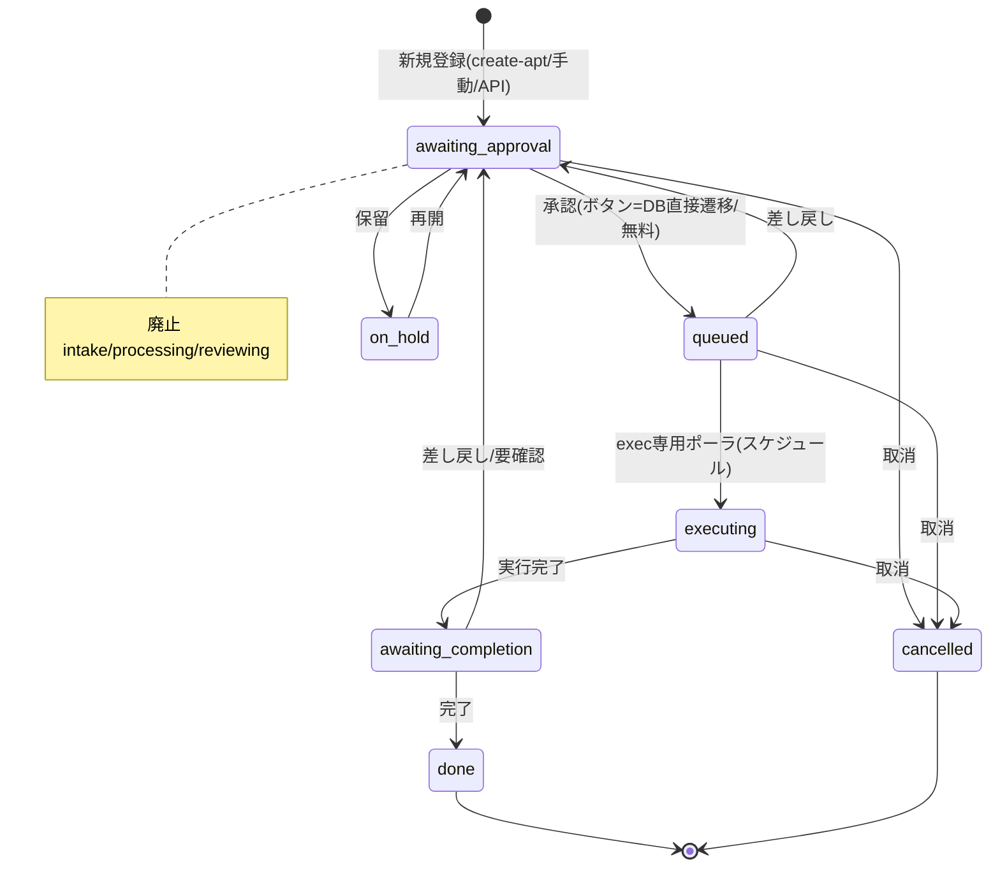

# チャット駆動タスク管理 ＋ カード型ダッシュボード（Task Board）構築手順 — Phase1+2

> STATUS: DONE / CATEGORY: SETUP / 作成日: 2026-06-07（Phase2 追記: 同日 / 状態機械刷新: 2026-06-09）
> Discord チャットからタスクを投入し、優先度付き FIFO キュー（SQLite）に保存 → カード型ダッシュボードでワンクリック承認 → exec 専用エージェント（cron ポーラ）がスケジュール実行で状態を進める仕組み。最小構成・追加費用ゼロ（Node 標準のみ／npm 依存なし／新規導入は Tailscale のみ）。

> ⚠️ **2026-06-09 更新（ポーラー再設計・015/016 反映）**: コスト・スコープ対策で状態機械を刷新。
> **intake / processing / reviewing を廃止**し、新規タスクは直接『承認待ち』へ登録。承認はダッシュボードのボタンが
> **server.mjs 内で DB 直接遷移**（gateway/LLM 不要・即時・無料）。ポーラは **exec 専用＋スケジュール実行**
> （JST 7:10/11:10/17:10、`enabled=true`）。旧「投入時の即時キック（`cron run force`）」「⚡即時/↻キュー処理ボタン」
> 「`/process` エンドポイント」は **gateway スコープ不足の発生源ごと撤去**。設計の確定記録は `016_DONE_PLAN_poller-redesign-no-scope.md` §9 を参照。

## 0. 概要

- **やること**: 「タスクを作って」と指示 → **『承認待ち』で登録** → ダッシュボードのカードで承認 → exec 専用ポーラ（スケジュール）が実処理 → 状態管理 → カードで承認・実行完了・完了・差し戻し・保留・取消・優先度編集・追加指示をワンクリック。フィルタ／ソート対応。
- **設計判断**: OpenClaw ネイティブの `tasks`/`TaskFlow` は「実行台帳」で状態が `queued→running→terminal` 固定。今回のカスタム状態機械＋カード UI には合わないため、**軽量な自前アプリ**を採用。
- **コスト**: 0円。LLM トークンは **exec（実処理）時のみ消費**。新規登録・承認は機械遷移で **LLM・gateway 不要・無料**。
- **言語/依存**: JavaScript（Node v24, ESM）＋ SQL（SQLite）＋ 素の HTML/CSS/JS。**フレームワーク無し・npm install ゼロ**（`node:sqlite` / `node:http` など Node 標準のみ）。新規導入ソフトは **Tailscale** のみ。

> 用語: **FIFO** … 優先度の高い順 → 同優先度は登録が古い順。
> 用語: **stage** … タスクの段。現行は `exec`（承認後の実行）のみ。旧 `intake` は廃止（`stage` 列は後方互換で常に `exec`）。
> 用語: **ポーラ／エグゼキュータ** … 承認済みキューをスケジュールで取り出して実行する常駐処理（OpenClaw cron の isolated エージェント）。
> 用語: **HITL** … Human-in-the-Loop。実行は人間の承認後にのみ進む。
> 用語: **Tailscale Serve** … 自分の tailnet 内だけにサービスを HTTPS 公開（インターネット非公開）。

## ★ タスクの新規追加方法（2通り）

### A. Discord チャットから（スラッシュコマンド `/create-apt`）
1. Discord で `/create-apt` と入力し、**同じメッセージ内で改行して**タスク内容を書く:
   ```
   /create-apt
   〇〇を調べて要約して
   ```
2. NEXUS が本文をタスク化して **直接『承認待ち』（awaiting_approval）で登録**。intake ポーラ・即時キックは廃止（exec はスケジュールで処理）。
3. ダッシュボードで承認すると『実行待ち』(queued)。次のスケジュール（JST 7:10/11:10/17:10）で exec ポーラが実行 →『完了待ち』。急ぐ場合は Discord で NEXUS に実行を依頼。
- 優先度: 本文に `優先度:2` または `[p2]` を含めると反映（既定 0）。
- 機密（トークン/パスワード等）は本文に書かない（検知時は登録拒否）。

### B. ダッシュボード画面から（手動追加）
1. ブラウザでタスクボード `https://<hostname>.<tailnet>.ts.net/dashboard` を開く（ホームは `/`）。
2. 最上部「手動でタスク追加」に入力:
   - **タイトル**（必須）／**詳細・指示**／**優先度**（数値・大きいほど先）
   - **🧪ダミー（テスト用・実処理しない）** にチェックするとダミータスクになる
3. 「追加」をクリック → カードが『承認待ち』で出現。以降はカードのボタンで 承認（→実行待ち）・実行完了・完了・差し戻し・保留・再開・取消、優先度編集、カード展開で追加指示（💬コメント / 📌追撃指示 / ↻追記して再キュー）。

> **ダミー（🧪）** は状態だけ動かせる練習用。エグゼキュータは実コマンド・ファイル書き込み・外部操作・通知を一切行わず状態のみ進める。挙動確認やフィルタ/ソートの試用に使う。

## 1. アーキテクチャ

```mermaid
flowchart TD
    U["あなた / Discord"] -->|スラッシュコマンド create-apt| SKILL["create-apt スキル"]
    SKILL -->|taskctl add --json-file<br/>新規=承認待ちで登録| DB[("SQLite tasks.db")]
    SCHED["Gateway cron スケジューラ<br/>JST 7:10 / 11:10 / 17:10"] --> POLL["cron taskboard-poller<br/>isolated エージェント<br/>exec 専用"]
    POLL -->|queued(承認済)を取得 → 実処理| DB
    POLL -->|実行時のみ Discord 通知| U
    DB --> SRV["server.mjs<br/>node:http 127.0.0.1:18790<br/>/ =ホーム /dashboard =ボード"]
    SRV --- SERVE["tailscale serve<br/>HTTPS tailnet限定"]
    SERVE -->|ブラウザ| DEV["スマホ / PC<br/>同一tailnet"]
    DEV -->|承認 / カード操作 / フィルタ / ソート / 優先度 / 追加指示| SRV
    SRV -->|状態更新（承認=DB直接遷移・gateway不経由）| DB
```

## 2. 状態機械（7状態 ＋ stage）

| status | 表示 | 意味 |
|---|---|---|
| awaiting_approval | 承認待ち | 新規登録の初期状態。承認待ち |
| queued (stage=exec) | 実行待ち | 承認され実行待ち |
| executing | 実行中 | エグゼキュータが実処理中 |
| awaiting_completion | 完了待ち | 実行が完了し完了待ち |
| on_hold | 保留 | 一時停止 |
| cancelled / done | 取消 / 完了 | 終端（7日後に自動削除） |

> **廃止**: `intake` / `processing` / `reviewing`。旧 `queued+intake` / `processing` / `reviewing` の既存行は、起動時マイグレーションで `awaiting_approval` へ冪等変換。`stage` 列は後方互換で残すが常に `exec`。



- **役割分担**: 新規登録は直接『承認待ち』（intake ポーラ・LLM 不要）。**承認＝ダッシュボードのボタンが `server.mjs` 内で `setStatus(id,'queued')` を直接実行**し実行待ちへ即時遷移（gateway/LLM 不要・無料・疎結合）。exec 専用ポーラ（スケジュール）が `queued(exec)→executing→awaiting_completion`。
- **HITL / 安全**: エグゼキュータは現行 NEXUS/AGENTS.md 準拠。**調査・読み取り・ワークスペース内作業のみ自走**。外部送信・削除・設定/cron 変更・sudo・push 等の**外部/破壊操作は実行せず `awaiting_approval`(承認待ち) へ差し戻し**（理由ログ＋通知）して人間判断（追撃指示/再承認/取消）を待つ。機密は保存しない。

## 3. ディレクトリ構成

```
~/.openclaw/workspace/tasks/task-board/
├── db.mjs              # データ層（node:sqlite, stage列, 優先度/追記ヘルパ, 起動時マイグレーション）
├── taskctl.mjs         # CLI（add --json-file / list / show / set-status[--stage] / priority / append-instruction / log / next-queued --stage）
├── server.mjs          # API＋画面配信（node:http, 127.0.0.1:18790, / と /dashboard, /api/home）
├── public/home.html    # ホーム画面（/ ・システム情報/cron状況/タスク集計/ボード遷移ボタン）
├── public/index.html   # タスクボード（/dashboard ・カードUI/フィルタ/ソート/優先度編集/展開詳細/追加指示/レスポンシブ/スワイプ/M3）
└── data/tasks.db       # SQLite 実体（実行時生成・git管理しない）
```

## 4. データモデル / API

- `tasks(id, title, instruction, priority, status, result, created_at, updated_at, stage, is_dummy)` / `logs(id, task_id, ts, level, message)`。
  - `is_dummy=1` … ダミー（テスト用）。エグゼキュータは実処理・通知をせず状態のみ進める。
- 優先度付き FIFO（exec）: `WHERE status='queued' AND stage='exec' ORDER BY priority DESC, id ASC`。

画面ルーティング:
- `GET /` … **ホーム画面**（home.html）。`GET /dashboard`（=`/index.html`）… **タスクボード**（index.html）。
- `GET /api/home` … ホーム用情報（OpenClawバージョン・Claudeモデル・Node・cron状況・タスク集計）。30秒キャッシュ。Gateway/LLM 非依存（`openclaw cron list --json --all` ＋ファイル読取り）。機密は含めない。

API（`server.mjs`, loopback 限定）:
- `GET /api/tasks` 一覧＋ラベル / `GET /api/tasks/:id` 詳細＋ログ
- `POST /api/tasks` 作成（status=`awaiting_approval`）
- `POST /api/tasks/:id/action` 遷移 `{action}`（**いずれも DB 直接遷移・gateway 不経由**）:
  - `approve→queued/stage=exec`（承認=実行待ち）, `finish_exec→awaiting_completion`, `complete→done`, `hold→on_hold`, `resume→awaiting_approval`, `cancel→cancelled`, `revert→awaiting_approval`（差し戻し）
- `POST /api/tasks/:id/priority` `{priority}`（優先度編集）
- `POST /api/tasks/:id/comment` `{text}`（💬コメントをログに追記）
- `POST /api/tasks/:id/instruct` `{text}`（📌追撃指示。次回 exec 実行時にエグゼキュータが参照）
- `POST /api/tasks/:id/requeue` `{text?}`（指示を追記して `awaiting_approval` に戻す＝承認からやり直し）

> **撤去済み**: 旧 `POST /api/tasks/:id/process`（intake 機械遷移用）と `kickPoller()`（`openclaw cron run` 起動）は、gateway の `operator.write` スコープ不足のブロッカーを発生源ごと除去するため削除。

## 5. ダッシュボード機能

- **手動追加フォーム**: タイトル／詳細／優先度＋**🧪ダミー チェックボックス**（テスト用・実処理しない）。
- **カード**: 状態バッジ／🧪ダミー印／#ID／**優先度インライン編集（数値＋保存）**／最新ログ／文脈依存ボタン（承認・実行完了・完了・差し戻し・保留・再開・取消）。
- **展開詳細**（タイトルクリック）: instruction 全文／result／全ログ＋**追加指示エリア**（💬コメント / 📌追撃指示 / ↻追記して再キュー＝承認待ちへ戻す）。
- **フィルタ**（手動追加の下）: 状態（複数選択チェック）／テキスト検索（タイトル・最新ログ）／優先度しきい値。
- **ソート**: 優先度 / 更新日時 / 作成日時 / 状態 / ID × 昇降。
- フィルタ/ソートはクライアント側。カード展開中・入力中は自動更新を抑止（操作の巻き戻り防止）。4秒間隔で自動更新。
- **デザイン**: Material 3 Expressive 風（ダーク・トナルカラーロール・大角丸28px・ピル型ボタン・状態別トナルチップ・スプリング的モーション）。外部フォント/CSS 依存なし（素のCSSのみ）。
- **レスポンシブ**: 640px 以下でカード1列・タップ領域拡大に最適化（スマホ対応）。
- **スワイプ操作（スマホ）**: カードを **右スワイプ＝その状態の主アクション（承認/実行完了/完了/再開）**、**左スワイプ＝削除（取消）**。閾値80px、ボタン/入力上では無効、縦スクロール優先。
- ヘッダーに **「🏠 ホーム」リンク**（`/` へ）。

## 5.1 保持期間（自動削除）

- **完了(done)・取消(cancelled)** のタスクは **7日間保持 → 自動削除**（物理削除＋ログ削除）。
- 実装: 常駐サービス `server.mjs` が起動時＋1時間毎に `purgeOld(RETENTION_DAYS)` を実行（`TASKBOARD_RETENTION_DAYS`、既定7）。LLM コストゼロ。

## 5.2 ホーム画面（`/`）

- `/`（`home.html`）はNEXUSのホーム。**「🔗 NEXUS タスクボードを開く」ボタン**で `/dashboard` へ遷移。
- 掲載情報（`/api/home`・30秒キャッシュ・Gateway/LLM 非依存）:
  - **システム情報**: OpenClaw バージョン（`package.json`）/ Claude モデル primary＋fallback（`openclaw.json`）/ Node バージョン。
  - **定期タスク（cron）状況**: 各ジョブの 有効/停止・前回ステータス・前回/次回実行時刻・連続エラー数（`openclaw cron list --json --all` を `server.mjs` が実行して取得。`openclaw` は絶対パス指定）。
  - **タスクボード サマリ**: 状態別の件数と合計。

## 6. ポーラ／エグゼキュータ（OpenClaw cron）

> ✅ **2026-06-09 再設計済み**: `taskboard-poller` は **exec 専用＋スケジュール実行**で `enabled=true`。
> アイドルでも10分毎に Opus を起動しトークンを浪費していた旧設計（`*/10`・intake/exec 2パス・投入時即キック）を撤去し、
> スケジュール実行（gateway スケジューラ側）に切り替えてループバックのスコープ問題を回避。詳細は 015/016。

`taskboard-poller`（isolated agentTurn, model opus, timeout 1200, delivery=none）。schedule `10 7,11,17 * * *`（Asia/Tokyo＝JST 7:10/11:10/17:10）。intake のロジックは撤去（新規は承認待ち登録、承認はダッシュボードのボタンが DB 直接遷移）。

- **exec のみ**: `next-queued --stage exec`（承認済 `queued`）→ `executing`（＝実行クレーム）→ instruction＋📌追撃指示を確認 → §2 の安全範囲で実処理 →
  - 正常: `awaiting_completion`（result に要約）＋通知
  - 危険/外部操作要・曖昧・エラー: 実行せず `awaiting_approval` へ差し戻し＋理由ログ＋通知
  - 1ターン最大3件。
- **コスト最小（R2）**: プロンプト冒頭で「exec キューが空なら即終了」。アイドル時は短いターンで終わるため課金が最小。
- **ダミー制御**: `is_dummy=1` のタスクは**実コマンド・書き込み・外部操作・通知を一切せず**状態だけ進める（テスト用）。
- **on-demand 即時実行**: スケジュールを待たず実行したい場合は **Discord で NEXUS に依頼**（エージェントは scope 有）。旧「投入時 `cron run force` 即キック」は gateway スコープ不足のため撤去。
- **実行レイテンシ**: 承認後の実行は次のスケジュール（最大で次の 7:10/11:10/17:10）まで待つ。急ぐ場合は Discord 依頼。

## 7. 常駐サービス（systemd --user）

`~/.config/systemd/user/openclaw-taskboard.service`（抜粋）:
```ini
[Service]
ExecStart=/usr/bin/node /home/<your-user>/.openclaw/workspace/tasks/task-board/server.mjs
Restart=on-failure
Environment=NODE_NO_WARNINGS=1
Environment=TASKBOARD_HOST=127.0.0.1
Environment=TASKBOARD_PORT=18790
[Install]
WantedBy=default.target
```
```bash
systemctl --user daemon-reload && systemctl --user enable --now openclaw-taskboard.service
systemctl --user restart openclaw-taskboard.service   # コード更新後
```

## 8. 投入スキル `/create-apt`

- スラッシュコマンド＝スキル。`/create-apt` の本文をタスク化 → **直接『承認待ち』で登録**（即時キックは廃止）。本文は Write ツールで一時 JSON 化 → `taskctl add --json-file`（シェル注入回避）。
- Skill Workshop で提案作成 → `openclaw skills workshop apply <proposal-id>` で live 化（適用済み）。

## 9. アクセス（Tailscale Serve）

```bash
sudo dnf install -y dnf-plugins-core
sudo dnf config-manager --add-repo https://pkgs.tailscale.com/stable/amazon-linux/2023/tailscale.repo
sudo dnf install -y tailscale
sudo systemctl enable --now tailscaled
sudo tailscale up                  # 表示URLをブラウザ認証
sudo tailscale serve --bg 18790    # tailnet内だけにHTTPS公開
sudo tailscale serve status
```
- **URL（tailnet 限定）**: ホーム `https://<hostname>.<tailnet>.ts.net/` / タスクボード `https://<hostname>.<tailnet>.ts.net/dashboard`。閲覧端末にも Tailscale を入れ同一アカウントでログイン。
- 管理コンソールで **HTTPS certificates 有効化**（必須）。**Funnel は無効**（インターネット非公開）。
- 代替: `ssh -N -L 18790:127.0.0.1:18790 <server>` → `http://127.0.0.1:18790/`（ホーム）/ `/dashboard`（ボード）。

## 10. 検証結果

- **Phase1（2026-06-07）**: 優先度付きFIFO／状態遷移／API／配信／注入安全／E2E、すべて OK。Tailscale Serve でスマホ・PC アクセス確認。
- **Phase2（2026-06-07〜08）**: stage マイグレーション、優先度編集、コメント/追撃指示/再キュー/差し戻し、stage別 next-queued、エグゼキュータ E2E（安全な read-only タスク→`result` 要約→`awaiting_completion`＋通知）、ダミーのサイレント前進、自動削除、画面分離（ホーム/ボード）を確認。
- **状態機械刷新（2026-06-09）**: `systemctl --user restart openclaw-taskboard` 後、E2E で確認 — add→`awaiting_approval` / 承認→`queued` / `next-queued --stage exec` 取得可 / 差し戻し→`awaiting_approval` / 保留→`on_hold`→再開→`awaiting_approval` / 取消→`cancelled`。旧 `intake/processing/reviewing` 行は起動時マイグレーションで `awaiting_approval` へ集約を確認。`node --check` で server.mjs / index.html(script) 構文 OK。
- **コスト/ポーラ**: 旧 `*/10` のアイドル課金を解消し、`enabled=true`＋スケジュール（JST 7:10/11:10/17:10）＋「キュー空なら即終了」で最小化（015/016）。

## 11. 運用・トラブルシュート（抜粋）

- コード更新後は `systemctl --user restart openclaw-taskboard.service`。
- DB バックアップ: `data/tasks.db`（＋WAL）。git 非管理。
- 同じ exec タスクの二重実行防止: 取得直後に `executing` へ遷移（クレーム）。
- カードが更新されない: `journalctl --user -u openclaw-taskboard` / `GET /api/tasks`。
- 投入が反映されない: `/create-apt` が apply 済みか（`openclaw skills list`）。
- 承認後に実行されない: `taskboard-poller` が `enabled=true` か・次回スケジュール時刻（`openclaw cron list`）。急ぐ場合は Discord で NEXUS に実行依頼。
- ホームの cron 状況が「取得失敗」: `openclaw` 絶対パス／gateway 稼働を確認（`GET /api/home`）。
- `serve` で HTTPS 無効: 管理コンソールで有効化後に再実行。

## 12. セキュリティ / マスキング

- 画面は loopback 限定＋Tailscale Serve（tailnet 限定・HTTPS）。Funnel 無効。
- エグゼキュータは外部/破壊操作をせず `awaiting_approval` へ差し戻し停止（AGENTS.md/HITL）。機密は DB・ログ・result・タスク本文・`/api/home` に保存/露出しない（`/create-apt` は検知時に登録拒否）。
- 固有値はマスキング: `<hostname>`, `<tailnet>.ts.net`, `<your-user>`, `<discord-user-id>`, `<poller-job-id>`。実値は鈴木さん手元で管理。

## 13. 今後（Phase3 候補）

- 差し戻し（`awaiting_approval`）からの「中断ポイント再開」（現状は承認からやり直し）。
- タスクの依存関係・サブタスク、添付・成果物リンク。
- exec の on-demand 即時実行を scope 追加なしで実現する経路の検討（現状は Discord 依頼 or スケジュール待ち）。

---

## Author and Ownership / 著作権と所属について

This project was created as a personal initiative and is not connected to any organization or group.
It is published as an individual creative work.

本プロジェクトは個人の活動として作成したものであり、特定の組織や団体の業務とは関係ありません。
個人の創作物として公開しています。
