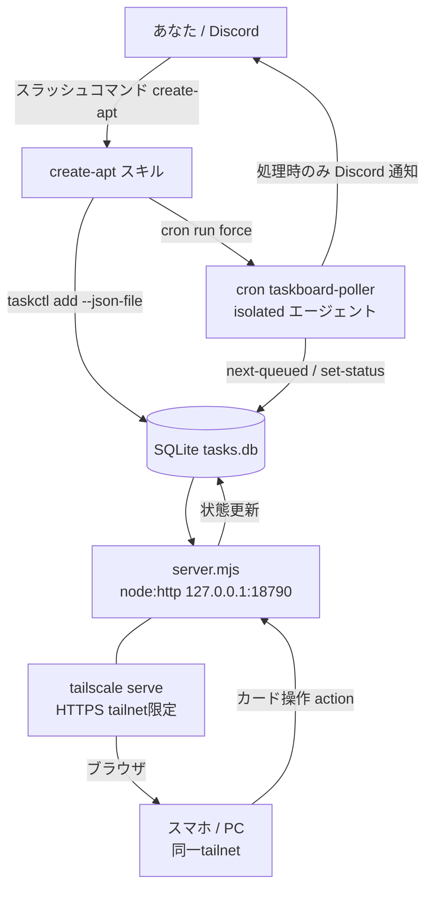
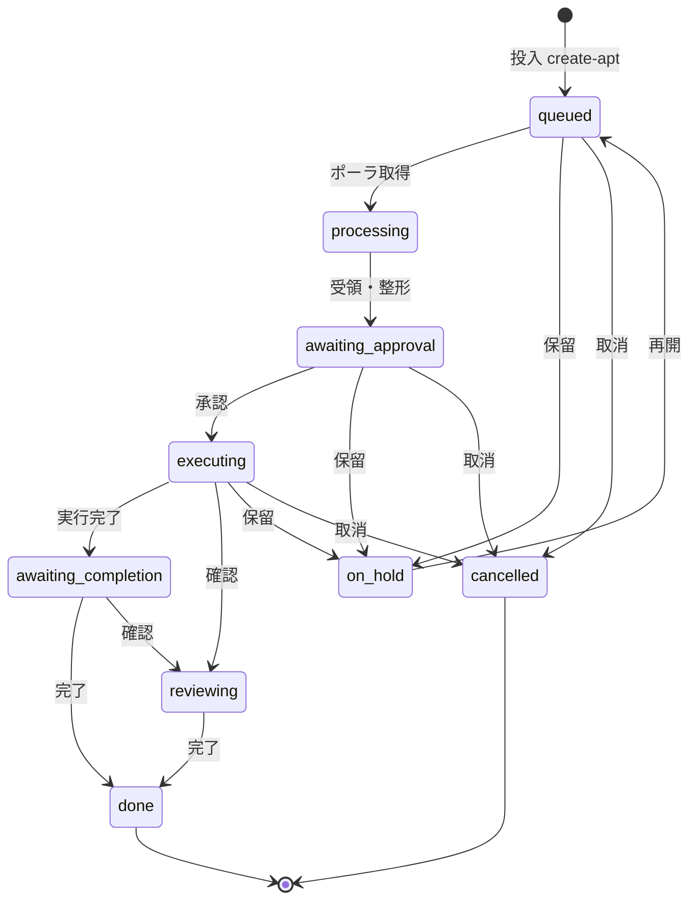

# チャット駆動タスク管理 ＋ カード型ダッシュボード（Task Board）構築手順 — Phase1

> STATUS: DONE / CATEGORY: SETUP / 作成日: 2026-06-07
> Discord チャットからタスクを投入し、優先度付き FIFO キュー（SQLite）に保存 → サーバ常駐エージェント（cron ポーラ）が取り出して状態を進め → カード型ダッシュボードでワンクリック操作する仕組みの構築手順（Phase1）。最小構成・追加費用ゼロ（Node 標準のみ／npm 依存なし／新規導入は Tailscale のみ）。

## 0. 概要

- **やること**: 「タスクを作って」と指示 → キュー登録 → エージェントがポーリング処理 → 状態管理 → ダッシュボードのカードで承認・完了・確認・保留・取消をワンクリック。
- **設計判断**: OpenClaw ネイティブの `tasks`/`TaskFlow` は「実行台帳」で状態が `queued→running→terminal` 固定。今回の6状態のカスタム状態機械＋カード UI には合わないため、**軽量な自前アプリ**を採用。
- **コスト**: 0円。LLM トークンは「処理」時のみ消費。
- **言語/依存**: JavaScript（Node v24, ESM）＋ SQL（SQLite）＋ 素の HTML/CSS/JS。**フレームワーク無し・npm install ゼロ**（`node:sqlite` / `node:http` など Node 標準のみ）。新規導入ソフトは **Tailscale** のみ。

> 用語: **FIFO** … First In, First Out（先入れ先出し）。本実装は「優先度の高い順 → 同優先度は登録が古い順」。
> 用語: **ポーラ(poller)** … キューを定期的に見に行って取り出す常駐処理。本実装は OpenClaw cron の isolated エージェント。
> 用語: **HITL** … Human-in-the-Loop。実行は人間の承認後にのみ進む。
> 用語: **Tailscale Serve** … 自分の Tailscale ネットワーク（tailnet）内だけにサービスを HTTPS 公開する機能（インターネット非公開）。

## 1. アーキテクチャ



## 2. 状態機械（ご指定の6状態 ＋ 制御3状態）

| status | 表示 | 意味 |
|---|---|---|
| queued | 処理待ち | キューにある |
| processing | 処理中 | ポーラが取り出して処理中 |
| awaiting_approval | 承認待ち | 処理が終わり承認待ち |
| executing | 実行中 | 承認され実行中 |
| awaiting_completion | 完了待ち | 実行が完了し完了待ち |
| reviewing | 確認中 | 実行完了したが他に確認事項あり |
| on_hold | 保留 | 一時停止 |
| cancelled | 取消 | 取り消し（終端） |
| done | 完了 | 完了（終端） |



- 遷移の役割分担: **エージェント（ポーラ）** が `queued→processing→awaiting_approval` を進め、**ダッシュボードのクリック** が承認・完了・確認・保留・取消・再開を担う。
- **HITL**: Phase1 は `awaiting_approval` で必ず停止。実行（executing 以降）は人間が承認してから。エージェントは勝手に実行しない。

## 3. ディレクトリ構成

```
~/.openclaw/workspace/tasks/task-board/
├── db.mjs              # データ層（node:sqlite）スキーマ＋CRUD
├── taskctl.mjs         # CLI（add --json-file / list / show / set-status / log / next-queued）
├── server.mjs          # API＋ダッシュボード配信（node:http, 127.0.0.1:18790）
├── public/index.html   # カード型ダッシュボード（素のHTML/CSS/JS, 4秒毎自動更新）
└── data/tasks.db       # SQLite 実体（実行時生成・git管理しない）
```

```bash
mkdir -p ~/.openclaw/workspace/tasks/task-board/public ~/.openclaw/workspace/tasks/task-board/data
```

## 4. コンポーネント

### 4.1 データ層 `db.mjs`
- `node:sqlite` の `DatabaseSync`（Node 24 組込・ゼロ依存）。`PRAGMA journal_mode=WAL`。
- テーブル: `tasks(id, title, instruction, priority, status, result, created_at, updated_at)` / `logs(id, task_id, ts, level, message)`。
- 優先度付き FIFO: `nextQueued()` = `SELECT ... WHERE status='queued' ORDER BY priority DESC, id ASC LIMIT 1`。
- 状態定義・日本語ラベルをエクスポート。`setStatus()` は遷移をログに自動記録。

### 4.2 CLI `taskctl.mjs`
- `add`: 任意のユーザー本文は **`--json-file <path>`**（JSON `{title,instruction,priority}`）で受け取り、**シェルインジェクションを回避**（本文を直接シェル引数にしない）。`--title/--instruction/--priority` 直接指定も可。
- 他: `list` / `show --id` / `set-status --id --status` / `log --id --message` / `next-queued`。

### 4.3 API＋配信 `server.mjs`
- `node:http` のみ。`127.0.0.1:18790`（**loopback 限定**。外部公開は Tailscale Serve 経由）。
- エンドポイント:
  - `GET /` … ダッシュボード HTML
  - `GET /api/tasks` … 一覧（最新ログ付き）＋ラベル
  - `GET /api/tasks/:id` … 詳細＋ログ
  - `POST /api/tasks` … 作成 `{title,instruction,priority}`
  - `POST /api/tasks/:id/action` … 遷移 `{action}`
- action→status マップ: `approve→executing` / `finish_exec→awaiting_completion` / `review→reviewing` / `complete→done` / `hold→on_hold` / `resume→queued` / `cancel→cancelled`。

### 4.4 ダッシュボード `public/index.html`
- カード = 状態バッジ／優先度／タイトル／最新ログ＋**文脈依存ボタン**（状態ごとに表示を出し分け）。4秒毎に自動更新。手動追加フォームも同梱。

### 4.5 投入スキル `/create-apt`（OpenClaw skill）
- スラッシュコマンド＝スキル。`/create-apt` に続く本文をタスク化して登録 → ポーラを即キック。
- 本文は Write ツールで一時 JSON 化 → `taskctl add --json-file` で登録（注入回避）。
- Skill Workshop で**提案として作成 → 承認(apply)で live 化**。`openclaw skills workshop apply <proposal-id>`。
- 機密（トークン等）が本文にある場合は登録せず警告（AGENTS.md セキュリティ原則）。

## 5. 常駐サービス（systemd --user）

`~/.config/systemd/user/openclaw-taskboard.service`:
```ini
[Unit]
Description=OpenClaw Task Board (dashboard + JSON API, loopback only)
After=network.target

[Service]
Type=simple
ExecStart=/usr/bin/node /home/<your-user>/.openclaw/workspace/tasks/task-board/server.mjs
Restart=on-failure
RestartSec=3
Environment=NODE_NO_WARNINGS=1
Environment=TASKBOARD_HOST=127.0.0.1
Environment=TASKBOARD_PORT=18790

[Install]
WantedBy=default.target
```
```bash
systemctl --user daemon-reload
systemctl --user enable --now openclaw-taskboard.service
systemctl --user status openclaw-taskboard.service
```
> sudo 不要（ユーザサービス）。gateway 等と同じ `systemd --user` 方式。

## 6. ポーラ（OpenClaw cron）

`cron` ツール `action=add` で登録（`taskboard-poller`）。

| 項目 | 値 |
|---|---|
| schedule | `{ kind: cron, expr: "*/10 * * * *", tz: "Asia/Tokyo" }`（10分毎） |
| sessionTarget | `isolated` |
| payload | agentTurn（次手順を自己完結記述）, model `anthropic/claude-opus-4-8`, timeout 600 |
| delivery | **`{ mode: none }`**（アイドル時のスパム防止。通知は処理時のみ message ツールで送る） |
| failureAlert | `{ after: 1, channel: discord, to: user:<discord-user-id>, mode: announce }` |

- ポーラの動作: `next-queued` → 無ければ**無通知で終了** → あれば `processing` → （Phase1 は実処理せず受領・整形）→ `awaiting_approval` → Discord 通知。1ターン最大10件。
- **即時性**: `/create-apt` スキルが登録後に `cron run force <poller-job-id>` でポーラを即キック（10分待たない）。

## 7. ダッシュボードのアクセス（Tailscale Serve）

新規導入は Tailscale のみ（**sudo は管理者が実行**）。

```bash
# 1) Tailscale 導入（Amazon Linux 2023）
sudo dnf install -y dnf-plugins-core
sudo dnf config-manager --add-repo https://pkgs.tailscale.com/stable/amazon-linux/2023/tailscale.repo
sudo dnf install -y tailscale
sudo systemctl enable --now tailscaled

# 2) tailnet に参加（表示URLをブラウザで認証）
sudo tailscale up
tailscale status        # 100.x の tailnet IP が付けば成功

# 3) ダッシュボードを tailnet 内だけに HTTPS 公開
sudo tailscale serve --bg 18790
sudo tailscale serve status
```
- 管理コンソールで **HTTPS certificates を有効化**（必須）。**Tailscale Funnel は有効化しない**（Funnel＝インターネット全体公開。今回は不要・非公開が要件）。
- 公開URL（tailnet 限定）: `https://<hostname>.<tailnet>.ts.net/`
- 閲覧する端末（スマホ/PC）にも Tailscale を入れ、同じアカウントでログインしてアクセス。
- **代替（導入不要）**: SSH トンネル `ssh -N -L 18790:127.0.0.1:18790 <server>` → `http://127.0.0.1:18790`。

## 8. 動作テスト・検証結果（2026-06-07）

```bash
cd ~/.openclaw/workspace/tasks/task-board
NODE_NO_WARNINGS=1 node taskctl.mjs add --title "テスト" --instruction "..." --priority 1
NODE_NO_WARNINGS=1 node taskctl.mjs list
curl -s http://127.0.0.1:18790/api/tasks
```
- 優先度付き FIFO 取り出し OK（p2 が p0 より先）。
- `--json-file` で `" ' \ $()` 等を含む本文を**安全に登録**できることを確認（注入回避）。
- 常駐サービス active、API・ダッシュボード配信・ワンクリック action すべて OK。
- ポーラ E2E: 投入 → `cron run force` → `queued→processing→awaiting_approval` ＋ Discord 通知を確認。
- ダッシュボード承認 → `awaiting_approval→executing` を確認。
- Tailscale Serve（tailnet 限定 HTTPS）でスマホ・PC からアクセス確認。Funnel は無効（非公開）。

## 9. 運用・メンテナンス

- サービス再起動: `systemctl --user restart openclaw-taskboard.service`。
- ポート変更: サービスの `TASKBOARD_PORT` と `tailscale serve` の対象ポートを合わせる。
- ポーラ頻度変更: cron `action=update` で `schedule.expr` を変更。
- DB バックアップ: `data/tasks.db`（＋ WAL ファイル）をコピー。git には含めない。
- Serve 停止: `sudo tailscale serve --https=443 off`。

## 10. トラブルシュート

| 症状 | 原因 / 対処 |
|---|---|
| ダッシュボードが開けない | サービス稼働 `systemctl --user status openclaw-taskboard`。Tailscale 接続 `tailscale status`。閲覧端末が同一 tailnet にあるか。 |
| `serve` が「HTTPS not enabled」 | 管理コンソールで HTTPS certificates を有効化してから再実行。 |
| カードが更新されない | サービスログ `journalctl --user -u openclaw-taskboard`。`GET /api/tasks` を確認。 |
| 投入してもカードが増えない | `/create-apt` が apply 済みか（`openclaw skills list`）。`taskctl add` の出力／DB を確認。 |
| ポーラが進めない | cron `taskboard-poller` が enabled か。`cron runs <id>` を確認。 |
| ExperimentalWarning(node:sqlite) | 仕様（実験的API）。`NODE_NO_WARNINGS=1` で抑制（サービスに設定済み）。 |

## 11. セキュリティ / マスキング

- ダッシュボードは **loopback 限定**、外部は **Tailscale Serve（tailnet 限定・HTTPS）**。Funnel（公開）は無効。
- 機密（トークン/パスワード/秘密鍵/PII）は **DB・ログ・タスク本文に保存しない**。`/create-apt` は検知時に登録拒否。
- 本書の固有値はマスキング: `<hostname>`（実: ip-XX-XX-XX-XX 形式）, `<tailnet>.ts.net`, `<your-user>`, `<discord-user-id>`, `<poller-job-id>`。実値は鈴木さん手元（shell history / 設定）で管理。

## 12. 今後（Phase2 予定）

- 承認後にエージェントが**実処理**（executing→awaiting_completion を自動進行）。
- 詳細ログのカード表示、優先度のカード編集、カードからの追加指示（再キュー・差し戻し等）。

---

## Author and Ownership / 著作権と所属について

This project was created as a personal initiative and is not connected to any organization or group.
It is published as an individual creative work.

本プロジェクトは個人の活動として作成したものであり、特定の組織や団体の業務とは関係ありません。
個人の創作物として公開しています。
