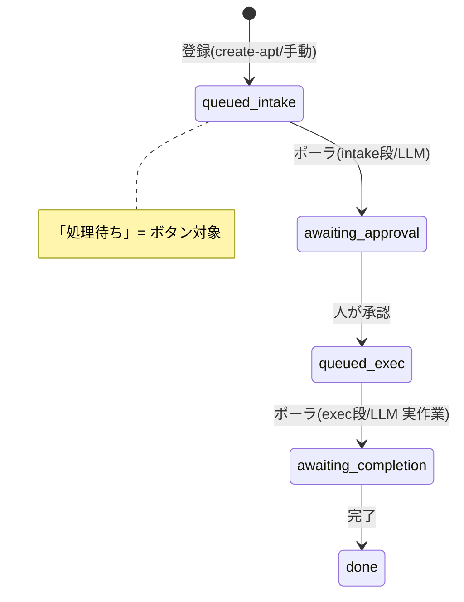
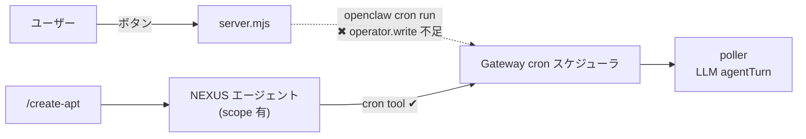
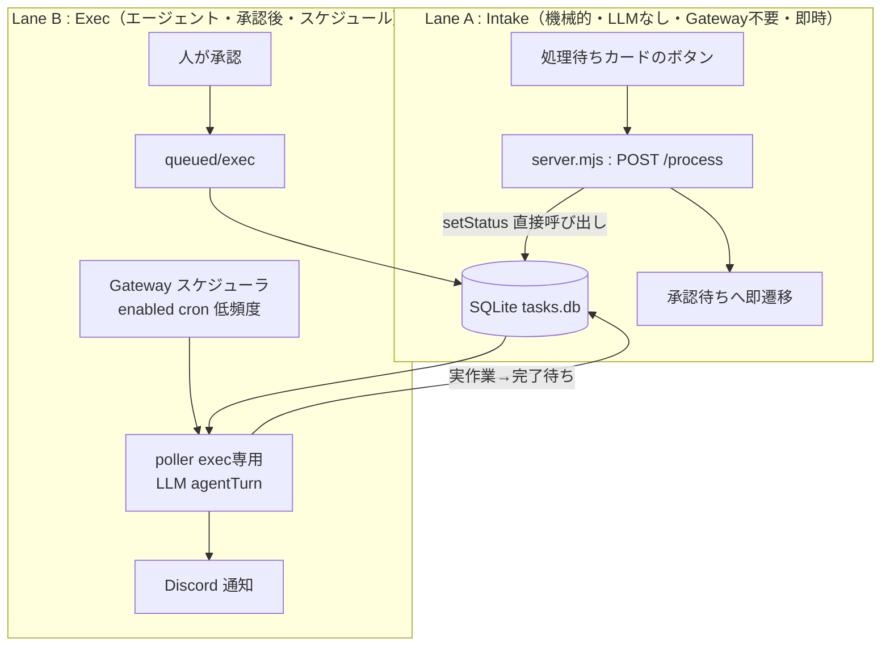
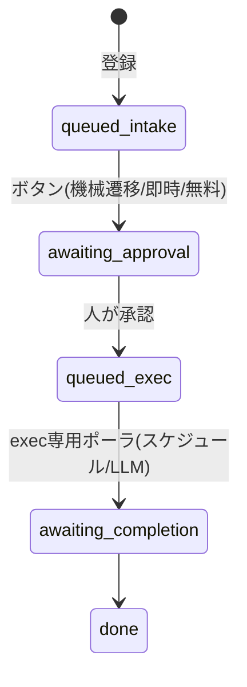

# 016_DONE_PLAN_poller-redesign-no-scope.md - ポーラー再設計（スコープ追加なし）

> ステータス: **DONE（2026-06-09 実装完了・検証済み）**。実装結果は末尾「9. 実装結果」を参照。
> 関連: `014_DONE_SETUP_task-board.md`（構築）/ `015_DONE_PLAN_poller-cost-redesign.md`（コスト再設計）
>
> 注: 以下 1〜8 は提案時点の記録。最終的な実装は提案（2レーン）より一歩進み、
> **intake 状態を完全廃止**して新規タスクを直接「承認待ち」に集約する形に確定した（§9）。

## 1. 背景と制約

ダッシュボードの「処理待ち」カードに **⚡即時処理 / ↻キュー処理** の2ボタンを追加し、ワンクリックで処理を進めたい。
しかし実装中に、ボタン → サーバー → ポーラー起動の経路が **gateway のスコープ不足** で弾かれることが判明した。

**ユーザー方針（確定事項）:**
- スコープ承認は **なし**。
- 権限・資格情報の追加は **なし**。
- ポーラーを **再設計** して上記制約内で実現する。
- LLM 呼び出しコストは最小化する（015 の方針を継続）。
- HITL は維持（実作業の前に人間が承認する）。

## 2. 現状アーキテクチャと問題点

### 構成要素
- `server.mjs`: ダッシュボード＋JSON API（loopback `127.0.0.1`、ゼロ依存 node:http）。SQLite に直接アクセス可。
- `db.mjs`: データ層（node:sqlite）。状態遷移・優先度ランクを管理。
- `taskctl.mjs`: CLI（投入・状態操作）。
- ポーラー: cron ジョブ `<taskboard-poller job-id>`（`agentTurn` ＝ LLM エージェントターン）。現在 **enabled:false**。
- `/create-apt`: NEXUS エージェントがタスク登録後、cron ツールでポーラーを即キック。

### 状態フロー（現行）


### 問題の所在


- ループバック CLI デバイスのスコープは `operator.read` のみ。`cron run`（on-demand 起動）には `operator.write` が必要。
- `/create-apt` が動くのは **エージェント側が広いスコープを持つ** ため。detached なサーバープロセスからは不可。
- **重要な実証:** `daily-al2023-security` 等の他 cron は `enabled:true` で定期実行に成功している。
  → **スケジュール実行は gateway スケジューラがサーバー側で行い、ループバックのスコープと無関係**。
  → ブロックされるのは **on-demand の `cron run` だけ**。

## 3. 要件

| # | 要件 | 種別 |
|---|---|---|
| R1 | 「処理待ち」カードに2ボタン、ワンクリックで処理 | 機能 |
| R2 | LLM コスト最小（アイドル時に無駄打ちしない） | 非機能 |
| R3 | gateway スコープ追加なし／権限・資格情報追加なし | 制約 |
| R4 | 実作業の前に人間が承認（HITL） | 制約 |

## 4. 設計上の重要な気づき

1. **intake 段は LLM 不要。** 現行 intake の LLM 用途は「受領・整形」のみ。整形を外せば intake は
   「queued → awaiting_approval へ遷移（＋任意で通知）」の **純粋な状態遷移**。
   → `server.mjs` が **SQLite に直接アクセスできる** ので、ボタンのエンドポイント内で `setStatus()` を
   呼ぶだけで完結。**LLM もポーラーも gateway も不要・即時・無料**。
2. **exec 段は本質的に LLM エージェントが必要**（指示を読んで実作業）。これは gateway 経由になる。
   ただし **承認後** のみ動くため緊急性は低い。
3. **スケジュール cron はスコープ問題の外**（§2 で実証）。exec を低頻度スケジュールで回せば
   ループバックの権限なしで実行できる。

## 5. 提案アーキテクチャ（推奨）: 2レーン分離

「機械的(intake) / エージェント(exec)」を分離する。



### Lane A: Intake（ボタンが直接担当）
- ボタン → `POST /api/tasks/:id/process` → サーバー内で **`setStatus(id,'awaiting_approval')` を直接実行**。
- **⚡即時処理**: 順位1へ繰り上げ ＋ 即 `awaiting_approval` へ遷移。
- **↻キュー処理**: （後述の論点 §7-D により意味を確定）。
- コスト: 0 LLM。gateway 不要。子プロセスも不要。**現在のブロッカーを完全に回避**。
- 通知: ユーザーはダッシュボード上でボタンを押している＝結果が即見えるため、intake 通知は **任意/省略可**。
  create-apt 経由はエージェントが既に Discord 返信している。

### Lane B: Exec（承認後の実作業）
- 既存ポーラーを **exec 専用に縮小**（intake のロジックを削除）。
- `enabled:true` に戻し、**低頻度スケジュール**（例: 既存の JST 7:10/11:10/17:10 の3回）で回す。
  → gateway スケジューラがサーバー側実行するので **スコープ不要**。
- R2 対策: プロンプト冒頭で「exec キューが空なら即終了」。アイドル時は短いターンで終わる。
- on-demand で exec も即実行したい場合は **Discord で NEXUS に依頼**（エージェントは scope 有）。
- 通知: exec はエージェントターンなので従来どおり `message` ツールで Discord 通知可。

### 状態フロー（提案）


## 6. 代替案と比較

| 案 | 概要 | 長所 | 短所 | 制約適合 |
|---|---|---|---|---|
| **推奨: 2レーン** | intake=機械/exec=スケジュールLLM | 低コスト・スコープ不要・ボタン即動作 | exec の on-demand 即時は不可（スケジュール待ち or Discord依頼） | ◎ |
| Alt1: 独立ミニエージェント | exec を Anthropic API 直叩きの常駐スクリプト化（gateway を使わない） | exec も on-demand 即時が可能 | 実装重・エージェント機能の再実装・モデル資格情報が別途必要・セキュリティ面増 | △（資格情報＝R3 抵触の懸念） |
| Alt2: intake 廃止 | 登録時に直接 awaiting_approval | 最小構成・intake ポーラ不要 | 「処理待ち」状態とボタンの居場所が消える・ユーザーの状態設計と不整合 | ○ |
| Alt3: スケジュールのみ | LLM ポーラを enabled に戻すだけ | 実装最小 | ワンクリック即時性なし（R1 未達） | ✗(R1) |
| Alt4: スコープ/トークン付与 | 権限を足す | 設計変更最小 | **ユーザー方針で却下済み** | ✗(R3) |

## 7. 論点（要決定）

- **D. 「即時処理」と「キュー処理」の意味**
  - intake が機械化されると両者の差が小さくなる。候補:
    - (a) 即時=順位1＋即遷移 / キュー=順位そのまま＋即遷移（差は順位のみ）
    - (b) 即時=即遷移 / キュー=遷移せず順位末尾へ（＝後回し、スケジュールに任せる）
    - (c) 「即時処理」に **exec まで** 期待するか？ → 期待するなら Alt1 が必要（R3 の資格情報懸念あり）。
      期待しない（即時＝承認待ちへ即上げ）なら推奨案で無料・即時に実現。
- **E. exec の起動方式**: 低頻度スケジュール（遅延許容）か、Discord で都度 NEXUS 依頼か、両方か。
- **F. intake 通知の要否**（Discord）。省略推奨だが要不要を確定。

## 8. 推奨と次アクション

- **推奨: §5 の2レーン設計**（D は 7-(a) もしくは 7-(b)、exec は低頻度スケジュール＋Discord 依頼の併用）。
- 確定後の実装範囲:
  1. `server.mjs` の `/process` を「gateway キック」→「DB 直接遷移」に変更（既に入れた kickPoller / spawn は撤去）。
  2. ポーラー cron を exec 専用プロンプトに更新し `enabled:true`・低頻度に。
  3. `index.html` のボタン文言/挙動を確定意味に合わせる。
  4. 014/015 ドキュメント更新、本書を DONE 化。

## 9. 実装結果（2026-06-09・確定）

提案の2レーン設計を踏まえつつ、状態機械を簡素化して実装した。**intake 段（受領・整形）は LLM もボタン経由の中間状態も不要**と判断し、§6 Alt2 寄りに「intake 状態の完全廃止」へ確定。

### 確定した状態機械（`db.mjs` 2026-06-09 再定義）

```mermaid
stateDiagram-v2
    [*] --> awaiting_approval: 新規登録(add/create-apt/API)
    awaiting_approval --> queued: 承認(ボタン)
    queued --> executing: exec専用ポーラ(スケジュール)
    executing --> awaiting_completion: 実行完了
    awaiting_completion --> done: 完了
    awaiting_completion --> awaiting_approval: 差し戻し/要確認
    queued --> awaiting_approval: 差し戻し
    awaiting_approval --> on_hold: 保留
    on_hold --> awaiting_approval: 再開
    note right of awaiting_approval: 廃止: intake / processing / reviewing
```

- ステータスは `awaiting_approval / queued(=LLM実行待ち) / executing / awaiting_completion / on_hold / cancelled / done` の7種に集約。`stage` 列は後方互換で残すが常に `exec`。
- 旧 `queued+intake` / `processing` / `reviewing` の既存行は起動時マイグレーションで `awaiting_approval` へ冪等変換。

### 変更点

1. **`db.mjs`**: 状態機械を上記に再定義。`addTask()` は新規を直接 `awaiting_approval` で作成。起動時マイグレーションで旧状態を集約。
2. **`server.mjs`**: `kickPoller()`（`openclaw cron run` 起動）と `/api/tasks/:id/process` エンドポイントを**撤去**（gateway スコープ不足のブロッカーを発生源ごと除去）。`applyAction` を新状態機械へ整合（`review`→`reviewing` の不正遷移を解消し承認待ちへ戻す等）。`/requeue` は指示追記＋承認待ちへ戻す。
3. **`index.html`**: `queued_intake` の ⚡即時/↻キュー2ボタンと `proc()` 経路を撤去。`BTNS`/`STATUS_ORDER`/`btnKey` を7状態へ整合。
4. **ポーラ cron（`taskboard-poller`）**: **exec 専用**プロンプトに更新し `enabled:true`。スケジュールは 015 の方針どおり JST 7:10/11:10/17:10（`10 7,11,17 * * *`）。承認後 `queued` のタスクのみ低頻度・低コストで実処理。on-demand 即時実行は Discord で NEXUS に依頼（エージェントは scope 有）。

### 制約適合

| 要件 | 結果 |
|---|---|
| R1 ワンクリック処理 | ◎ 承認ボタンは DB 直接遷移で即時・無料。gateway 不経由。 |
| R2 LLMコスト最小 | ◎ intake は LLM 不要。exec はキュー空なら即終了。スケジュールは日3回。 |
| R3 スコープ/権限追加なし | ◎ `cron run` 依存を撤去。スケジュール実行は gateway スケジューラ側でループバック権限と無関係。 |
| R4 HITL | ◎ 承認ゲート（awaiting_approval→queued）を必須化。 |

### 検証（2026-06-09）

`systemctl --user restart openclaw-taskboard` 後、E2E で確認: add→`awaiting_approval` / 承認→`queued` / `next-queued --stage exec` で取得可 / 差し戻し→`awaiting_approval` / 保留→`on_hold`→再開→`awaiting_approval` / 取消→`cancelled`。検証用タスクは取消済み。`node --check` で server.mjs / index.html(script) 構文 OK。

---

## Author and Ownership / 著作権と所属について

This project was created as a personal initiative and is not connected to any organization or group.
It is published as an individual creative work.

本プロジェクトは個人の活動として作成したものであり、特定の組織や団体の業務とは関係ありません。
個人の創作物として公開しています。
