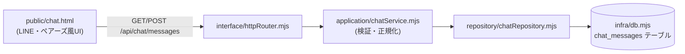

# 022_DONE_SETUP_taskboard-chat-and-poller-report.md - Nexusチャット追加＋ポーラー実行結果の毎回報告化

> STATUS: DONE / CATEGORY: SETUP / 作成日: 2026-06-13
> NEXUS タスクボードに 2 件の変更を実施した記録。
> ① **ポーラー（`taskboard-poller`）を「実行のたびに毎回、結果サマリを Discord DM へ報告」する**よう設定変更。
> ② **「Nexusチャット」画面（#46・方式A=画面＋メッセージ保存のみ）**を 4 層構成で追加。
> 関連: `014_DONE_SETUP_task-board.md`（本体）/ `015`・`016`（ポーラー再設計）。

## 背景

- 旧ポーラーは `delivery.mode=none`＋「対象が無ければ無通知で静かに終了」設計だったため、**実行されたか・何が起きたかが分からない**（実際、承認済みタスクが取りこぼされても気付けないケースが発生）。
  → 「実行が完了したら、その都度・毎回、結果をこの DM に報告する」運用に変更。
- タスクボードに Discord 風のチャット画面（Nexusチャット）を追加したい（#46）。今フェーズは **画面＋保存のみ**（Discord 双方向ブリッジ・NEXUS 自動応答は次フェーズ）。

---

## ① ポーラーの実行結果・毎回報告化

### 変更内容（cron ジョブ `taskboard-poller` のパッチ）

| 項目 | 変更前 | 変更後 |
|---|---|---|
| `delivery.mode` | `none` | **`announce`**（最終メッセージを Discord DM へ自動配信） |
| `payload.message`（プロンプト） | 「対象が無ければ無通知で静かに終了」 | **「ターン最後に必ず実行レポートを 1 メッセージで出力（0 件でも報告）」** に改訂 |
| `delivery.channel` / `to` | discord / `<discord-user-id>` | 変更なし（既存維持） |
| schedule / model / enabled | `10 7,11,17 * * *` / opus / true | 変更なし |

- 個別タスクの完了通知（`message` ツール送信）は廃止し、**1 ターン＝1 レポート**に集約（二重通知の防止）。`announce` がターンの最終テキストを配信する。
- レポート書式: `🔁 タスクボードポーラー実行レポート（JST HH:MM） 処理: N件 - #<id>「<title>」→ <完了待ち|承認待ちへ差し戻し|ダミー処理>: <一言>`。対象 0 件でも `実行待ちタスクなし・処理0件で終了` を必ず送る。
- 実装手段: **MCP `cron` ツールの `update`**（`patch.delivery.mode` ＋ `patch.payload.message`）。`openclaw cron edit` には agentTurn プロンプト変更フラグが無いため CLI 不可。ゲートウェイ再起動は不要（ホット適用）。

### 検証（2026-06-13）

- 強制実行（`cron run --runMode force`）で `lastRunStatus=ok` / **`lastDeliveryStatus=delivered`** を確認。
- 配信実例: `🔁 タスクボードポーラー（JST 18:59）: 実行待ちタスクなし・処理0件で終了。`（DM 着信を確認）。
- 失敗時は既存の `failureAlert`（after:1, announce）が別途通知。

---

## ② Nexusチャット画面（#46・方式A）

### 方針

- **方式A = 画面＋メッセージ保存のみ**。Discord 連携（Nexusチャット ↔ DM の双方向ブリッジ・NEXUS の自動応答）は理想だが**本フェーズでは実装しない**（次フェーズで方式合意後）。
- 追撃指示に従い、**最小構成・最小変更・保守性重視（4 層アーキ）**、**着手前にコード＋DB をバックアップ**（切り戻し可能に）。

### アーキテクチャ（既存 4 層に沿って追加）

- **`src/infra/db.mjs`**: `chat_messages(id, role, text, created_at)` テーブルを冪等追加（`role`='user'|'nexus'）。
- **`src/repository/chatRepository.mjs`**（新規）: `insertMessage` / `listMessages(afterId)`。
- **`src/application/chatService.mjs`**（新規）: `postMessage`（空文字・最大長 4000 を検証、role 正規化）/ `listMessages`。
- **`src/interface/httpRouter.mjs`**: ルート追加 `GET /chat`（画面）/ `GET /api/chat/messages?after=<id>`（差分取得）/ `POST /api/chat/messages`（保存）。
- **`public/chat.html`**（新規）: 吹き出しUI（自分=右／NEXUS=左）・自動スクロール・3 秒ポーリング・Enter 送信/Shift+Enter 改行・M3 ダーク統一・レスポンシブ。上部に「記録のみ／連携は今後」の注記。
- **ナビ**: `home.html` / `index.html` / `info.html` のヘッダーに「💬 チャット」リンクを追加。

### 検証（2026-06-13）

- `node --check` 全変更ファイル OK。`systemctl --user restart openclaw-taskboard.service` 後に E2E:
  - `GET /chat`=200 / `POST /api/chat/messages`=保存（id・created_at 返却）/ 空文字=400 / `GET /api/chat/messages`=一覧取得。
  - 既存機能デグレ無し: `/`・`/dashboard`・`/info`=200、`/api/tasks`=53 件。
- 検証で投入したテストメッセージは削除し、`chat_messages` を空に戻した。

### 既知の制限（次フェーズ候補）

- Discord 連携（双方向ブリッジ／NEXUS 応答）は未実装。サーバは loopback 限定・トークン非保持のため、DM へ直接送信できない。実装する場合はエージェント側リレーが必要。

---

## バックアップ

- **着手前**: コード一式（`data/`・`node_modules/` 除外）＋ SQLite DB を `~/.openclaw/workspace/.backups/task-board-<timestamp>/` に退避（切り戻し用）。
- **完了後**: 変更 8 ファイル（`public/{index,home,info,chat}.html` ＋ `src/infra/db.mjs`・`src/repository/chatRepository.mjs`・`src/application/chatService.mjs`・`src/interface/httpRouter.mjs`）を **private バックアップリポ（`private-openclaw-01`）へ反映**し、**git blob sha でローカルと byte-exact 一致を全件確認**。

## セキュリティ・マスキング

- 機密（トークン/パスワード/鍵）はコード・DB・ログ・画面に保存/露出しない。`chat_messages` はメッセージ本文のみで認証情報を持たない。
- 固有値はマスキング: `<hostname>`, `<tailnet>.ts.net`, `<your-user>`, `<discord-user-id>`, `<poller-job-id>`。

---

## Author and Ownership / 著作権と所属について

This project was created as a personal initiative and is not connected to any organization or group.
It is published as an individual creative work.

本プロジェクトは個人の活動として作成したものであり、特定の組織や団体の業務とは関係ありません。
個人の創作物として公開しています。
