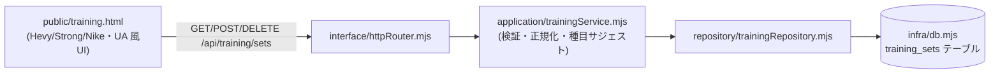

# 023_DONE_SETUP_training-management.md - トレーニング管理画面（#51・日付ベースの筋トレ記録）

> STATUS: DONE / CATEGORY: SETUP / 作成日: 2026-06-13
> NEXUS タスクボードに「トレーニング管理」画面（#51）を 4 層構成で追加した記録。
> ジムのウェイトトレーニングを **日付 → 種目 → セット（重量×レップ）** で記録する。
> 関連: `014_DONE_SETUP_task-board.md`（本体）/ `022`（Nexusチャット・ポーラー報告化と同じ開発方針＝#28/#46踏襲）。

## 背景・方針

- #28（3層アーキ）/ #46（Nexusチャット）の開発方針を踏襲。**最小構成・最小変更・保守性重視**、追加のみで既存機能はデグレさせない。
- 主対象は **筋トレ（ジムのウェイトトレーニング）**。日付ベースで複数種目・複数セットを記録（例: 2026/6/6 ベンチプレス 80kg×10 → 90kg×10 → 100kg×10、ペクトラルフライ …）。
- 着手前にコード＋DB をバックアップ（切り戻し可能に）。追撃指示の「fable5 で」は「使用制限がある場合は使わなくてよい」とあったため Opus で実装。

## 参考にした人気サイト/アプリ（調査結果）

ジム/ウェイト記録で最も人気の専用アプリの UX 構造を参考にした（Web 調査で確認）:

| アプリ | 位置づけ | 参考にした点 |
|---|---|---|
| **Hevy**（hevyapp.com） | "#1 workout tracker" | 中心に採用した「日付セッション → 種目 → セット(重量×レップ)」構造・連続セット入力 |
| **Strong** | 定番 | セット行のシンプルな「重量 × レップ」表記 |
| **Jefit**（jefit.com） | 種目DB系 | 種目名のサジェスト |
| **FitNotes** / **Fitbod** | 軽量ロガー | 日付ごとの素早い記録 |
| **Nike / Under Armour** | スポーツブランド | ダーク基調の見た目（既存 M3 テーマに統一） |

## アーキテクチャ（既存 4 層に沿って追加）

- **`src/infra/db.mjs`**: `training_sets(id, date, exercise, weight, reps, created_at)` テーブルを冪等追加（`date`='YYYY-MM-DD'、1行=1セット）。
- **`src/repository/trainingRepository.mjs`**（新規）: `insertSet` / `listSets(date?)` / `listDates` / `deleteSet` / `getSet`。並びは 日付降順 → 同日内 id 昇順。
- **`src/application/trainingService.mjs`**（新規）: `addSet`（検証: 日付 YYYY-MM-DD・種目必須/最大100字・重量 0〜1000kg・レップ 0〜1000 整数）/ `listSets` / `deleteSet` / `EXERCISE_SUGGESTIONS`（種目サジェスト21種）。
- **`src/interface/httpRouter.mjs`**: ルート追加 `GET /training`（画面）/ `GET /api/training/sets?date=`（一覧＋サジェスト）/ `POST /api/training/sets`（追加）/ `DELETE /api/training/sets/:id`（削除）。
- **`public/training.html`**（新規）: 追加フォーム（日付＝今日デフォルト・種目 datalist・重量・レップ）。**日付/種目を保持したまま重量・レップだけ変えて連続セット追加**（Hevy 流）、レップ欄 Enter で追加。日付（新しい順）→種目→セット行「1セット目 100kg × 10」表示。**種目別に「セット数・最大重量・総量(kg·rep)」スタッツ**。セット削除（✕）／種目で絞り込み。M3 ダーク・レスポンシブ。
- **ナビ**: `home.html` / `index.html` / `info.html` / `chat.html` のヘッダーに「🏋 トレーニング」リンクを追加。

## 検証（2026-06-13）

- `node --check` 全変更ファイル OK。`systemctl --user restart openclaw-taskboard.service` 後に E2E:
  - `GET /training`=200 / `POST /api/training/sets`（ベンチプレス 80/90/100kg×10、ペクトラルフライ 60kg×10）=201 / 空種目=400 / 日付フォーマット不正=400 / `GET /api/training/sets`=一覧取得 / `DELETE`=削除。
  - 既存機能デグレ無し: `/`・`/dashboard`・`/chat`・`/info`=200、`/api/tasks`=200。
- 検証で投入したセットは削除し、`training_sets` を空に戻した。

## バックアップ

- **着手前**: コード一式（`data/`・`node_modules/` 除外）＋ SQLite DB を `~/.openclaw/workspace/.backups/task-board-<timestamp>/` に退避（切り戻し用）。
- **完了後**: 変更 9 ファイル（`public/{index,home,info,chat,training}.html` ＋ `src/infra/db.mjs`・`src/repository/trainingRepository.mjs`・`src/application/trainingService.mjs`・`src/interface/httpRouter.mjs`）を **private バックアップリポ（`private-openclaw-01`）へ反映**し、**git blob sha でローカルと byte-exact 一致を全件確認**。

## 既知の制限・今後

- 認証は無し（loopback 限定＋Tailscale Serve の tailnet 限定でアクセス制御）。トレーニングデータは個人の記録のみで機密情報は持たない。
- 今後の候補: 種目別の推移グラフ（1RM 推定・最大重量の折れ線）、メモ/RPE 列、CSV エクスポート。

## セキュリティ・マスキング

- 機密（トークン/パスワード/鍵）はコード・DB・ログ・画面に保存/露出しない。
- 固有値はマスキング: `<hostname>`, `<tailnet>.ts.net`, `<your-user>`, `<discord-user-id>`, `<poller-job-id>`。

---

## Author and Ownership / 著作権と所属について

This project was created as a personal initiative and is not connected to any organization or group.
It is published as an individual creative work.

本プロジェクトは個人の活動として作成したものであり、特定の組織や団体の業務とは関係ありません。
個人の創作物として公開しています。
