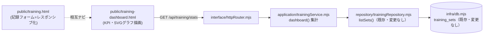

# 024_DONE_SETUP_training-dashboard.md - トレーニング ダッシュボード追加＋記録フォームのレスポンシブ対応（#60）

> STATUS: DONE / CATEGORY: SETUP / 作成日: 2026-06-14
> NEXUS タスクボードの「トレーニング管理」（#51）に、記録を分析・可視化する **ダッシュボード**（#60）を追加し、あわせて **記録フォームのレスポンシブ対応** を行った記録。
> 関連: `014_DONE_SETUP_task-board.md`（本体）/ `023_DONE_SETUP_training-management.md`（#51・記録画面）/ `020_DONE_SETUP_private-repo-backup.md`（private バックアップ）。

## 背景・方針

- #28（3層アーキ）/ #46（Nexusチャット）の開発方針を踏襲し、**追加のみ＝デグレ無し**・最小構成・保守性重視で実装（AGENTS.md「🛠 機能開発の方針」恒久ルール）。
- 既存の記録機能（#51）には手を入れず、**集計ロジック・新ルート・新画面の追加**と、既存 `training.html` の **CSS（レスポンシブ）配線のみの変更**に留めた。
- ジムの記録アプリ（Hevy / Strong 等）のダッシュボード UX を参考に、KPI・推移・部位別・頻度・種目別トップを 1 画面で俿瞰できる構成にした。
- npm 依存ゼロを維持（**グラフはフロントの素の SVG で描画**、チャートライブラリを導入しない）。
- 着手前にコード＋DB をバックアップ（切り戻し可能に）。

## 追加・変更点（既存 4 層に沿って追加）

| 層 | ファイル | 変更種別 | 内容 |
|---|---|---|---|
| application | `src/application/trainingService.mjs` | 追加 | `dashboard()` を追加。既存 `listSets()` の結果を集計し、サマリー／直近7・30日／日次系列（30日）／部位別／曜日別／種目別トップを返す。kg・lb 混在は **kg 換算**で総量比較。推定 1RM は **Epley 式**。既存の記録系関数は変更なし。 |
| interface | `src/interface/httpRouter.mjs` | 追加（配線） | ルート 2 本を追加：`GET /training/dashboard`（画面）/ `GET /api/training/stats`（集計 JSON）。既存ルートは変更なし。 |
| interface | `public/training-dashboard.html` | 新規 | ダッシュボード画面。KPI カード、ボリューム推移（縦棒）、部位別（ドーナツ＋凡例）、曜日別頻度（縦棒）、種目別トップ（バー）を **すべて SVG** で描画。M3 ダーク・レスポンシブ。 |
| interface | `public/training.html` | 変更（CSS のみ） | 記録フォームを **auto-fit で自動折り返し**し右へのはみ出しを解消。スマホは各項目 1 カラム。「＋追加」ボタンを常に独立行に配置。記録⇔ダッシュボードの相互ナビを追加。ロジックは変更なし。 |

### 集計仕様（`dashboard()`）

- **サマリー**: トレ日数 / 総セット / 総レップ / 総ボリューム(kg) / 種目数 / 初回・最終日付 / 1回平均セット数。
- **直近7日・30日**: ワークアウト日数・ボリューム・セット数。
- **series**: 直近30日の日次ボリューム（記録の無い日は 0 埋め）。
- **categoryDist**: 部位別ボリューム（降順）。
- **topExercises**: 種目別トップ8（ボリューム順、最大重量・推定1RM(Epley) 付き）。
- **weekday**: 曜日別の頻度（ワークアウト日数・ボリューム・セット数）。
- 単位換算: `lb → kg` は係数 `0.453592`。丸めは小数第1位。

## 検証（実施内容）

- `node --check` を新規・変更ファイルに対して実施（構文 OK）。
- **本番に触れず別ポート（18799）で一時起動**し E2E：各ページ 200 / `stats` 集計が正常 JSON / 既存 API（sets・tasks・dashboard）が回帰 200。
- PC・スマホ実画面のスクリーンショットで、フォーム折り返し・はみ出し解消・グラフ描画を確認。
- **本番反映後の再確認**（サービス再起動後、loopback `127.0.0.1:18790`）：

  | 期待 | パス |
  |---|---|
  | 200 | `/`（ホーム） |
  | 200 | `/training`（記録・既存） |
  | 200 | `/training/dashboard`（新規） |
  | 200 | `/api/training/stats`（新規） |
  | 200 | `/api/tasks`・`/info`・`/chat`（既存・デグレ無し） |

- 検証用のテストデータ投入は行わず（既存実データのみ）、原状を変更していない。
- 着手前バックアップ: `~/.openclaw/workspace/.backups/`（コード＋DB）取得済み。

## 反映・完了処理

- **本番反映**: `systemctl --user restart openclaw-taskboard.service`（ユーザ単位サービス・loopback のみ）で新コードを反映。再起動後 E2E は上表のとおり全 200。
- **private バックアップ**（コードのみ）: GitHub MCP `push_files` で private リポジトリへ 4 ファイルを投入し、**blob SHA をローカル `git hash-object` と突合（byte-exact 一致）**を全ファイルで確認。手順は `020_DONE_SETUP_private-repo-backup.md` に準拠。
- **ドキュメント化**: 本ファイル（マスター: `/opt/docs/openclaw/`）＋ public リポジトリへミラー。

## セキュリティ・マスキング上の注意

- 機密情報（トークン・パスワード・鍵）は記載しない。
- 接続情報は環境変数（`TASKBOARD_HOST` / `TASKBOARD_PORT` / `TASKBOARD_DB` 等）から取得し、ハードコードしない。
- 公開ドキュメントではホスト名・外部 IP・実ユーザ名等を記載せず placeholder（`~/` 等）で表現する。`127.0.0.1`（loopback）は汎用表記のため記載可。
