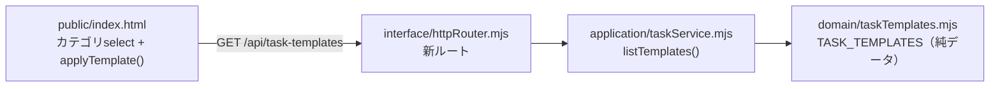

# 025_DONE_SETUP_taskboard-create-templates.md - タスクボード 新規作成「カテゴリ＆ひな形」機能

> 関連: `014_DONE_SETUP_task-board.md`（本体）/ `022_DONE_SETUP_taskboard-chat-and-poller-report.md`（チャット・ポーラ）/ `020_DONE_SETUP_private-repo-backup.md`（private バックアップ）。
> 対象タスク: タスクボード #67。方針: **追加のみ＝デグレ無し**（既存ロジック非改変・最小差分）。作成日: 2026-06-17。

## 1. 概要・背景

NEXUS タスクボードの「手動でタスク追加」フォームに **カテゴリ選択**を追加。カテゴリを選ぶと、そのカテゴリに対応した**ひな形（テンプレート）**をタスク名（title）・詳細／指示（instruction）へ自動反映（prefill）する。

- **目的**: 毎回同じような入力を簡略化する。よく作るタスク種別（調査・記事作成／開発・改修／新機能追加 等）の定型を雛形化し、記入漏れと手間を減らす。
- **カテゴリの決め方**: 過去タスクの傾向から自動抽出（調査・記事作成系が最多、次いでタスクボードの開発・改修系／新機能・新画面系／定期タスク(cron)／OpenClaw設定／再キャッチアップ）。

## 2. カテゴリ一覧（7種＋自由入力）

| id | ラベル | 用途 |
|---|---|---|
| `free` | 📌 自由入力（ひな形なし） | prefill しない。既存の手動入力そのまま |
| `research_article` | 📝 調査・記事作成 | docs/info への記事化（命名規則・マスキング込み） |
| `research` | 🔎 調査（成果メモ） | リサーチ。保存先・公開可否・スクレイピング規約確認 |
| `dev_change` | 🛠 開発・改修（タスクボード等） | 追加のみ・層構造・backup・検証・private push を雛形化 |
| `feature` | ✨ 新機能・新画面 | repository→application→interface の追加手順を雛形化 |
| `cron` | ⏰ 定期タスク（cron）追加 | cron 式・TZ・出力先・ドキュメント化 |
| `openclaw_setup` | ⚙️ OpenClaw設定・セットアップ | config/MCP/権限・検証・構築手順ドキュメント化 |
| `relearn` | 📚 技術キャッチアップ・再学習 | 公式参照・成果メモ先 |

## 3. 設計（4層構造を踏襲・追加のみ）

- **domain**: `src/domain/taskTemplates.mjs`（新規）。`TASK_TEMPLATES` 配列（純データ・副作用なし・ゼロ依存）＋ `templateById()`。
- **application**: `taskService.mjs` に `listTemplates()` を追加（`TASK_TEMPLATES` を橋渡し）。既存関数は不変。
- **interface**: `httpRouter.mjs` に `GET /api/task-templates` を追加（既存ルートは不変）。
- **UI**: `public/index.html` の作成フォームに `<select id="c-cat">` を追加。`loadTemplates()` で起動時に取得、`applyTemplate()` で選択時に title/instruction を prefill（入力済みなら確認ダイアログで上書き可否）。作成後はカテゴリを `free` に戻す。

### 設計上のポイント
- **DB マイグレーション無し**: ひな形は入力補助（prefill）のみ。`tasks` テーブルにカラム追加せず、作成 API（`POST /api/tasks`）も不変。＝デグレ余地ゼロ。
- **npm 依存ゼロ**を維持（Node 標準のみ）。
- 取得失敗時はセレクト空のままで既存の手動入力に影響しない（フォールバック）。

## 4. 変更ファイル（4点）

- `src/domain/taskTemplates.mjs`（新規）
- `src/application/taskService.mjs`（`listTemplates()` 追加）
- `src/interface/httpRouter.mjs`（`GET /api/task-templates` 追加）
- `public/index.html`（カテゴリ select・`loadTemplates()`・`applyTemplate()` 追加）

## 5. 検証（実施済み・全て pass）

- **着手前バックアップ**: `~/.openclaw/workspace/.backups/task-board-<timestamp>/`（code＋DB）。
- **構文チェック**: `node --check` を変更3 .mjs に対し実行 → OK。
- **本番反映**: `systemctl --user restart openclaw-taskboard.service` → active。
- **新エンドポイント**: `GET /api/task-templates` → 200・8件（free＋7カテゴリ）。
- **回帰（デグレ確認）**: `/api/tasks` `/api/home` `/api/server-status` `/api/training/sets` → 全 200。`/dashboard` にカテゴリ select 出力を確認。
- **作成フロー E2E**: `POST /api/tasks`（ひな形 title 投入・dummy）→ 201 で作成成功 → **テスト行は DB から物理削除して原状復帰**。

## 6. 完了処理

- **private バックアップ**: GitHub private リポ `private-openclaw-01`（master）へ変更4ファイルを反映。**remote blob SHA をローカル `git hash-object` と全件突合し byte-exact 一致を確認**。手順は `020_DONE_SETUP_private-repo-backup.md` に準拠。
- **ドキュメント化**: 本ファイル（マスター: `/opt/docs/openclaw/`）＋公開リポジトリへミラー。

## 7. セキュリティ・マスキング上の注意

- 機密情報（トークン・パスワード・鍵）は記載しない。固有情報（ホスト名/IP/実ユーザ名）は placeholder 化。
- 接続情報は環境変数（`TASKBOARD_HOST` / `TASKBOARD_PORT` / `TASKBOARD_DB`）から取得し、ハードコードしない。
