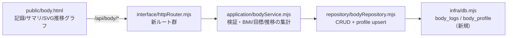

# 026_DONE_SETUP_taskboard-bodymake.md - タスクボード「ボディメイク管理（体重管理）」

> 関連: `014_DONE_SETUP_task-board.md`（本体）/ `023_DONE_SETUP_training-management.md`・`024_DONE_SETUP_training-dashboard.md`（トレーニング管理＝設計の踏襲元）/ `020_DONE_SETUP_private-repo-backup.md`（private バックアップ）。
> 対象タスク: タスクボード #61。方針: **追加のみ＝デグレ無し**（既存テーブル・既存ルート非改変）。作成日: 2026-06-17。

## 1. 概要・背景

NEXUS タスクボードに **ボディメイク管理（体重管理）画面 `/body`** を新規追加。日々の体重・体脂肪率・メモを記録し、身長/目標体重プロフィールから **BMI・目標体重までの差分・体重推移**を可視化する。

- **要件補完**: 元タスクは指示が空欄のため、人気の体重管理アプリ（あすけん／シンプル・ダイエット／ハミング／Cahoのかわいいダイエット等）の**定番項目を Web 調査**して仕様を確定。
- **定番として採用した項目**: 体重(kg) / 体脂肪率(%) / **BMI（身長から自動計算）** / 目標体重 / メモ ／ 体重推移グラフ。1日に複数回記録も可。

## 2. 画面・機能

- **サマリ**: 現在の体重（前回比）／BMI（日本肥満学会の判定ラベル付き）／体脂肪率／目標体重まで／7日・30日・通算の増減／最小・最大。
- **体重推移グラフ**: 直近30日の折れ線（依存ゼロのインライン SVG）。目標体重の水平線も描画。
- **プロフィール**: 身長・目標体重（BMI・目標差分の算出に使用）。
- **記録**: 日付・体重（必須）・体脂肪率（任意）・メモ（任意）。日付降順でグルーピング表示、各記録は削除可。

## 3. 設計（4層構造を踏襲・追加のみ）

- **infra/db.mjs**: 新規2テーブル `body_logs`（date, weight, body_fat, memo）/ `body_profile`（id=1固定, height_cm, target_weight）。`CREATE TABLE IF NOT EXISTS` で冪等・既存非改変。
- **repository/bodyRepository.mjs**（新規）: insertLog / listLogs / getLog / deleteLog / getProfile / upsertProfile。
- **application/bodyService.mjs**（新規）: 入力検証＋ `dashboard()`（BMI＝体重kg/(身長m)²、目標差分、前回比、7/30/通算増減、直近30日系列）。
- **interface/httpRouter.mjs**: `GET /body`、`GET/POST /api/body/logs`、`DELETE /api/body/logs/:id`、`GET/POST /api/body/profile`、`GET /api/body/stats` を追加（既存ルート不変）。
- **配線（最小）**: `home.html`（ナビ＋カード）/ `training.html`（ナビ）/ `index.html`（ナビ）に `/body` リンク追加。

### 設計ポイント
- **追加のみ・デグレ無し**: 既存テーブル/ルート/関数は一切変更せず、新規ファイル・新規テーブル・新規ルートのみ。
- **npm 依存ゼロ**を維持（Node 標準＋インライン SVG）。

## 4. 変更ファイル（8点）

- 新規: `src/repository/bodyRepository.mjs`・`src/application/bodyService.mjs`・`public/body.html`
- 追記: `src/infra/db.mjs`（テーブル2）・`src/interface/httpRouter.mjs`（ルート群）・`public/home.html`・`public/training.html`・`public/index.html`（ナビ配線）

## 5. 検証（実施済み・全て pass）

- **着手前バックアップ**: `~/.openclaw/workspace/.backups/task-board-<timestamp>/`（code＋DB）。
- **構文チェック**: `node --check`（db / bodyRepository / bodyService / httpRouter）→ OK。
- **本番反映**: `systemctl --user restart openclaw-taskboard.service` → active。
- **新エンドポイント**: `/body`・`/api/body/logs`・`/api/body/profile`・`/api/body/stats` → 全 200。
- **機能 E2E**: プロフィール(172cm/65kg)設定 → 体重3件投入 → `stats` で **BMI 23.3=68.8/1.72²・目標差分 +3.8・前回比 -0.6・通算 -1.2** を確認。バリデーション（体重600=範囲外／不正日付）→ 400。**テストデータは DB から物理削除し、新規テーブルの採番(sqlite_sequence)も初期化して原状復帰**。
- **回帰（デグレ確認）**: `/api/tasks` `/api/task-templates` `/api/training/sets` `/api/home` `/dashboard` `/` → 全 200。

## 6. 完了処理

- **private バックアップ**: GitHub private リポ `private-openclaw-01`（master）へ変更8ファイルを反映。**remote blob SHA をローカル `git hash-object` と全件突合し byte-exact 一致を確認**。
- **ドキュメント化**: 本ファイル（マスター: `/opt/docs/openclaw/`）＋公開リポジトリへミラー。

## 7. セキュリティ・マスキング上の注意

- 体重・体脂肪率は個人の身体データ。タスクボードは loopback 限定（外部公開は Tailscale Serve 経由）で、本ドキュメントには実データを記載しない。
- 接続情報は環境変数（`TASKBOARD_HOST` / `TASKBOARD_PORT` / `TASKBOARD_DB`）から取得しハードコードしない。固有情報は placeholder 化。
