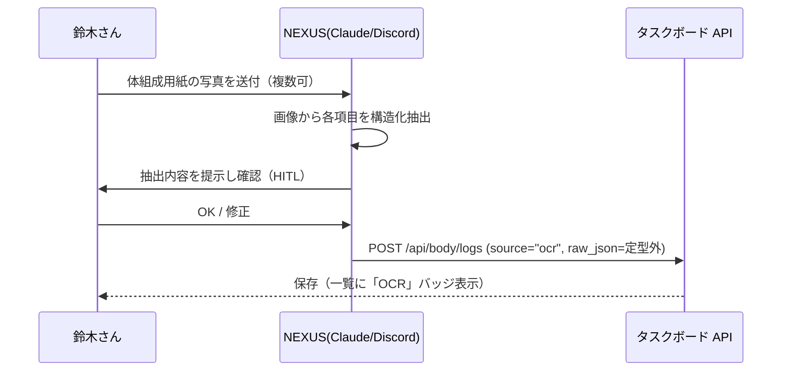

# 027_DONE_SETUP_taskboard-body-composition-ocr.md - ボディメイク管理 体組成データ拡張＋OCR取り込み

> 関連: `026_DONE_SETUP_taskboard-bodymake.md`（ボディメイク管理 本体）/ `020_DONE_SETUP_private-repo-backup.md`（private バックアップ）。
> 対象タスク: タスクボード #61 の機能拡張。方針: **追加のみ＝デグレ無し**（既存テーブル・既存フロー非改変）。作成日: 2026-06-18。

## 1. 概要・背景

ジムの体組成計（InBody / Tanita 等）の**出力用紙（紙）を読み取って**ボディメイク管理に保存できるようにする。入力は **手入力と OCR の両対応**。

- OCR エンジンは **方式A（NEXUS 経由）を採用**（鈴木さん承認 2026-06-18）。理由＝追加依存ゼロ・高精度・身体データがローカル内に留まる（プライバシー）。ダメなら方式B（アプリ内 Tesseract）へ切替の方針。
- 保存項目は体組成計の定番をまず採用（運用しながら不足分は追加する方針）。

## 2. OCR 取り込みフロー（方式A）

- アプリ側に OCR エンジンは持たない（npm 依存ゼロを維持）。OCR は NEXUS が担当し、結果を既存 API で保存する。
- 取り込み結果は**必ず確認を通してから保存**（直接保存しない）。

## 3. 変更点（追加のみ・層構造踏襲）

- **infra/db.mjs**: `body_logs` に nullable 列を追加（冪等 `ALTER TABLE ADD COLUMN`）。
  - 数値: `muscle_mass`(筋肉量) / `skeletal_muscle`(骨格筋量) / `body_water`(体水分) / `bone_mass`(骨量) / `bmr`(基礎代謝) / `visceral_fat`(内臓脂肪) / `protein` / `mineral` / `body_age`(体年齢) / `lean_body_mass`(除脂肪量)
  - `source`(`'manual'`|`'ocr'`、既定 manual) / `raw_json`(部位別など定型外項目の自由領域)
- **repository/bodyRepository.mjs**: insert/select を拡張列に対応。`latestLog()`（最新体組成サマリ用）を追加。
- **application/bodyService.mjs**: 拡張項目の検証（範囲・任意）、`source`・`raw_json` の検証、`dashboard().current.composition` で最新体組成を返す。入力キーは camelCase/snake_case 両対応。
- **interface/httpRouter.mjs**: `POST /api/body/logs` が拡張項目・`source`・`raw_json` を受理（サービスが有効キーのみ採用）。**既存ルートは不変**。
- **public/body.html**: OCR 取り込み案内パネル＋「体組成の詳細（任意）」入力（折りたたみ）＋記録一覧の `source` バッジ（OCR/手入力）＋体組成サマリ表示。

### 設計ポイント
- 既存の `weight/body_fat/memo` の手入力フロー・API・スキーマは**一切変更せず**、列・項目・経路を「追加」しただけ＝デグレ余地ゼロ。
- 拡張項目は全て nullable・任意。既存行・既存リクエストはそのまま動作。

## 4. 検証（実施済み・全て pass）

- **着手前バックアップ**: `~/.openclaw/workspace/.backups/task-board-<timestamp>/`（code＋DB）。
- **構文チェック**: `node --check`（db / bodyRepository / bodyService / httpRouter）→ OK。
- **マイグレーション**: 再起動後 `PRAGMA table_info(body_logs)` で新規列を全て確認。
- **機能 E2E**:
  - 手入力（camelCase・体組成つき）→ 保存・取得で `muscle_mass`/`visceral_fat`/`bmr` 反映、`source=manual`。
  - OCR 取り込み（`source=ocr` + `raw_json`（日本語キー）+ snake_case）→ 保存。
  - `GET /api/body/stats` → `current.composition` に最新体組成（source 含む）。
  - バリデーション：不正 `source` / 範囲外 `muscleMass` / 不正 `raw_json` → 400。
- **回帰（デグレ確認）**: `/body` `/api/body/logs` `/api/tasks` `/api/task-templates` `/api/training/sets` `/api/home` `/dashboard` → 全 200。
- 投入テストデータは DB から物理削除し、`body_logs` の採番(sqlite_sequence)も初期化して原状復帰。

## 5. 完了処理

- **private バックアップ**: GitHub private リポ `private-openclaw-01`（master）へ変更5ファイルを反映。**remote blob SHA をローカル `git hash-object` と全件突合し byte-exact 一致を確認**。
- **ドキュメント化**: 本ファイル（マスター: `/opt/docs/openclaw/`）＋公開リポジトリへミラー。

## 6. セキュリティ・マスキング上の注意

- 体組成は機微な身体データ。OCR は NEXUS（ユーザー自身の OpenClaw 内）で処理し、外部 OCR API へ送らない。タスクボードは loopback 限定。
- 本ドキュメントに実測値は記載しない。固有情報は placeholder 化。
