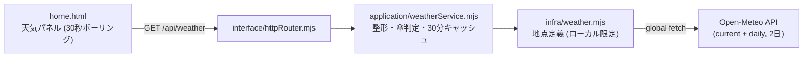

# 028_DONE_SETUP_home-weather.md - ホーム画面「自宅〜職場の天気」機能

> 関連: `014_DONE_SETUP_task-board.md`（タスクボード本体）/ `020_DONE_SETUP_private-repo-backup.md`（private バックアップ）。
> 対象タスク: タスクボード #78（一般機能）。方針: **追加のみ＝デグレ無し**（既存フロー非改変・配線のみ）。作成日: 2026-06-20。

## 1. 概要・目的

ホーム画面（`/`）に **自宅・職場の天気（現在＋今日・明日）と「傘の要否」** を表示するパネルを追加する。出勤判断を一目で行えるようにするのが狙い。

- データソースは **Open-Meteo Forecast API**（無料・APIキー不要・非商用個人利用 OK）。
- **追加依存ゼロ**（Node 標準の global `fetch` のみ）。永続化なし・機密なし。
- 層構造（`infra → application → interface`）に沿って追加。既存のホーム/サーバ状況パネルには手を入れない。

### 公式ドキュメント（作業の根拠）

- Open-Meteo Forecast API: <https://open-meteo.com/en/docs>
- 利用規約: 非商用・個人利用は無料、レート上限の範囲内（数百 calls/min）。本機能は 30 分キャッシュで十分余裕。

## 2. 構成図 (Mermaid)

## 3. 実装（追加・配線）

| 層 | ファイル | 役割 |
|---|---|---|
| infra | `src/infra/weather.mjs` | **新規**。地点定義（ローカル限定）＋ Open-Meteo 取得。複数地点を1リクエストで取得（`AbortController` で 8 秒タイムアウト）。 |
| application | `src/application/weatherService.mjs` | **新規**。WMO 天気コード→絵文字＋日本語、現在/今日/明日へ整形、**傘判定**、30 分メモリキャッシュ。 |
| interface | `src/interface/httpRouter.mjs` | **配線**。`GET /api/weather` を追加（`weatherService.getWeather()`）。 |
| UI | `public/home.html` | **配線**。天気パネルと描画 JS を追加。`loadAll()` に天気取得を合流（30 秒ごと更新）。 |

### 仕様メモ

- **地点**: `infra/weather.mjs` の `LOCATIONS`（自宅・職場の2地点）。座標は**区レベルに丸めて**保持し、正確な住所は持たない（PII 最小化）。`tasks/` は `.gitignore` 済みで公開リポへは出さない。
- **取得項目**: `current=temperature_2m,weather_code,precipitation` / `daily=weather_code,temperature_2m_max,temperature_2m_min,precipitation_probability_max,precipitation_sum`、`timezone=Asia/Tokyo`、`forecast_days=2`。
- **傘判定**: 降水確率 `>=50%` **または** 予想降水量 `>=1.0mm` で「傘が必要」。今日・明日それぞれ判定。
- **キャッシュ**: 30 分メモリキャッシュ（レート制限配慮・無保存）。`force` で即時再取得。

## 4. 検証

- `node --check` 全対象ファイル → OK。
- `systemctl --user is-active openclaw-taskboard.service` → active。
- `GET /api/weather` → `{source:"Open-Meteo", locations:[...]}` を返し、現在気温・今日/明日の天気・`umbrella` 真偽・降水確率/量を確認（実データで動作確認済み）。
- **回帰（デグレ確認）**: `/` `/api/home` `/api/server-status` `/dashboard` `/api/tasks` → 既存挙動に影響なし（天気は独立パネル・独立 fetch）。

## 5. 完了処理

- **private バックアップ**: GitHub private リポ `private-openclaw-01`（master）へ反映。**remote blob SHA をローカル `git hash-object` と突合し byte-exact 一致を確認**。
- **ドキュメント化**: 本ファイル（マスター: `/opt/docs/openclaw/`）＋公開リポジトリへミラー。

## 6. セキュリティ・マスキング上の注意

- **地点情報は PII 相当**。本ドキュメントには自宅・職場の地名・座標を記載しない（実値はコード `infra/weather.mjs` 側にローカル限定で保持。例: `<home-area>` / `<work-area>`）。
- タスクボードは loopback / Tailscale 限定（Funnel 無効）。天気 API への送信は座標のみで個人特定情報は送らない。
- Open-Meteo 由来データの表示はあくまで参考値。商用利用はしない（非商用前提）。
