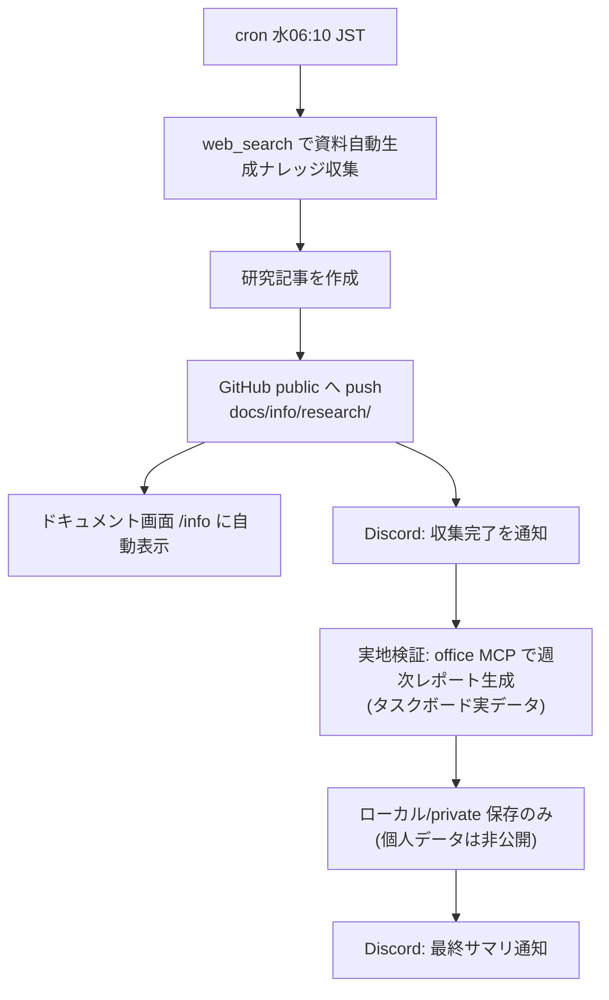

# 031_DONE_SETUP_weekly-doc-automation-cron.md - 週次「資料自動生成ナレッジ＋実地検証」cron

> 関連: `009_DONE_SETUP_weekly-github-trending-task.md` ほか週次 cron 群。対象タスク: タスクボード #80。作成日: 2026-06-21。
> 方針: 既存の週次ナレッジ cron 群（claude/aws automation knowledge 等）と同型で**追加のみ**。OpenClaw Gateway cron を1件追加。

## 1. 概要・目的

Excel(.xlsx) / PowerPoint(.pptx) 資料の**自動生成ナレッジを週次収集**し、さらに**タスクボードの実データから週次レポートを1本自動生成して実地検証**する定期タスクを追加する。定型業務・ルーティンワーク自動化の継続的な情報蓄積と、生成パイプラインの定期動作確認が狙い。

- 対象トピック: Claude / Claude Agent Skills（pptx/xlsx/docx/pdf）/ Python（openpyxl・python-pptx・pandas）/ OpenClaw 連携 MCP（excel-mcp・office-powerpoint-mcp）。
- 調査結果は公開記事化（`docs/info/research/`）→ ドキュメント画面（`/info`）に自動表示。
- 実地検証で生成した週次レポートは**個人データを含むためローカル/private 限定**（公開しない）。

## 2. cron 設定

| 項目 | 値 |
|---|---|
| ジョブ名 | `weekly-doc-automation` |
| スケジュール | `10 6 * * 3`（毎週水曜 06:10）/ tz `Asia/Tokyo` |
| sessionTarget | `isolated`（背景タスク） |
| payload.kind | `agentTurn`（model: opus-4.8 / timeout 1500s） |
| delivery | `announce` → Discord（最終出力をそのまま通知） |
| failureAlert | 1 回失敗で Discord 通知 |

> 既存の週次 cron は月〜日に分散（月=claude自動化, 火=aws自動化, 木=claude CLI更新, 金=openclaw更新, 土=GitHubトレンド, 日=AL2023）。**水曜は空き**だったため衝突なし。

## 3. 週次処理フロー (Mermaid)



## 4. HITL（タスク #80 で本人が事前承認した運用）

- **システム変更を伴う検証**（例: `pip install` で openpyxl/python-pptx を新規導入、パッケージ/設定変更）→ 実行前に Discord で確認・承認。
- **システム非変更の検証・ローカル新規追加・private への push のみ** → 承認不要で実行（本人事前承認済み）。
- 既定は OpenClaw 連携 office MCP を使用（pip 導入不要＝システム変更なし）。

## 5. 初回（手動）実地検証の結果

- 情報収集 → 公開記事 `docs/info/research/20260621_INFO_AUTODOC_claude-skills-python-office-generation.md` を作成・public へ push（ドキュメント画面に表示）。
- excel-mcp で**週次トレーニングレポート(.xlsx)** を実データから新規生成。有効な OOXML（Microsoft Excel 2007+）・全セクション格納を確認＝**パイプライン正常**。
- 生成レポートは個人データを含むためローカル限定保存（`tasks/task-board/data/reports/`・gitignore 配下）。公開せず。

## 6. 運用・確認コマンド

```bash
# 一覧（このジョブを確認）
openclaw cron list --json | jq '.jobs[] | select(.name=="weekly-doc-automation")'
# 手動トリガ（即時テスト実行）
openclaw cron run <jobId>
# 実行履歴
openclaw cron runs <jobId>
```

## 7. セキュリティ・マスキング上の注意

- 機密（トークン/パスワード/鍵/個人情報）は記事・ログ・コミット・通知に残さない。マスキング規約厳守。
- 生成レポートに含まれる身体・トレーニング等の個人データは公開リポへ出さない（ローカル/private のみ）。
- 情報収集は web_search 中心・出典明記・要約は自分の言葉で（著作権・ToS 配慮）。
