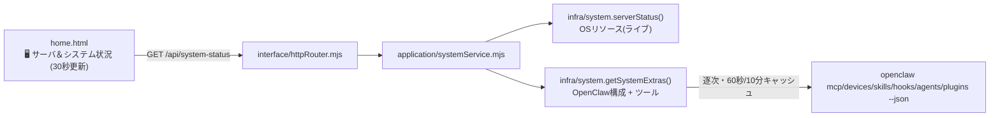

# 032_DONE_SETUP_home-server-system-merge.md - ホーム「サーバ＆システム状況」統合・拡張

> 関連: `014_DONE_SETUP_task-board.md`（本体）。対象タスク: タスクボード #79。作成日: 2026-06-21。
> 方針: 追加のみ＝デグレ無し。層構造（interface→application→infra）に沿って追加し、既存エンドポイントは温存。

## 1. 概要・目的

ホーム画面（`/`）の「サーバ状況」と「システム状況」を **1 パネルに統合**し、さらに **OpenClaw の構成（連携 MCP・ペアリング済デバイス・Skills・Hooks・エージェント・プラグイン）とシステムツール（Chrome 等）のステータス**を毎描画時に表示する。

## 2. 構成図 (Mermaid)

## 3. 実装（追加・配線）

| 層 | ファイル | 役割 |
|---|---|---|
| infra | `src/infra/system.mjs` | **追加**。`getSystemExtras()`＝OpenClaw 構成（mcp/devices/skills/hooks/agents/plugins の安全サマリ）＋ツール（Chrome/Node/uvx/Python/Go）。`openclawJson()` で `openclaw <cmd> --json` を実行。 |
| application | `src/application/systemService.mjs` | **新規**。OSリソース＋メタ（version/model）＋構成＋ツールを 1 DTO に統合。 |
| interface | `src/interface/httpRouter.mjs` | **配線**。`GET /api/system-status`（async）。 |
| UI | `public/home.html` | **配線**。2 パネルを1枚に統合。リソース／システム・モデル・ツール／OpenClaw 構成の3区画。 |

## 4. 設計上の要点（重要）

- **OS リソース**は軽量なので毎回ライブ取得。
- **OpenClaw 構成**は `openclaw` CLI が重く（1 回 8〜13 秒）、かつ**複数を並列起動すると共有 SQLite state が競合して失敗**する。そのため:
  - **逐次実行**（並列禁止）。
  - **stale-while-revalidate**（リクエストはキャッシュ即返し＋TTL 超過時のみ裏で再取得）。構成 TTL=10分、ツール TTL=60秒。初回はキャッシュ未生成のため UI に「収集中」を表示し、約1分以内に反映。
- 個別取得は try/catch で失敗しても全体を壊さない（追加のみ・デグレ無し）。

## 5. セキュリティ・マスキング

- **機密は一切返さない**：MCP の起動コマンドライン（`launch`）・トークン・鍵・env は除外し、name/enabled/ok/transport などの安全サマリのみ。デバイスの deviceId/publicKey も出さない。
- ホスト名・IP は従来どおり非表示（マスキング規約）。

## 6. 検証

- `node --check` 全対象 OK／サービス再起動／`GET /api/system-status` で構成（MCP 6 ok・デバイス・Skills・Hooks・エージェント・プラグイン）＋ツールを確認。
- 回帰: `/` `/api/home` `/api/server-status` `/dashboard` 他 全 200（既存 API 温存）。ブラウザで統合パネル表示確認。

## 7. 完了処理

- private バックアップ `private-openclaw-01`（master）へ反映・byte-exact 一致確認。
- 本ドキュメント（`/opt/docs/openclaw/`）＋公開リポジトリへミラー。
