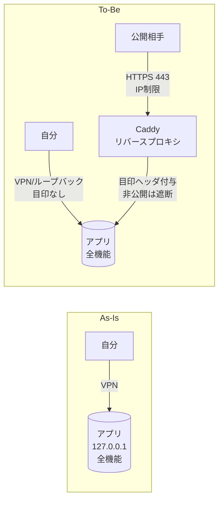
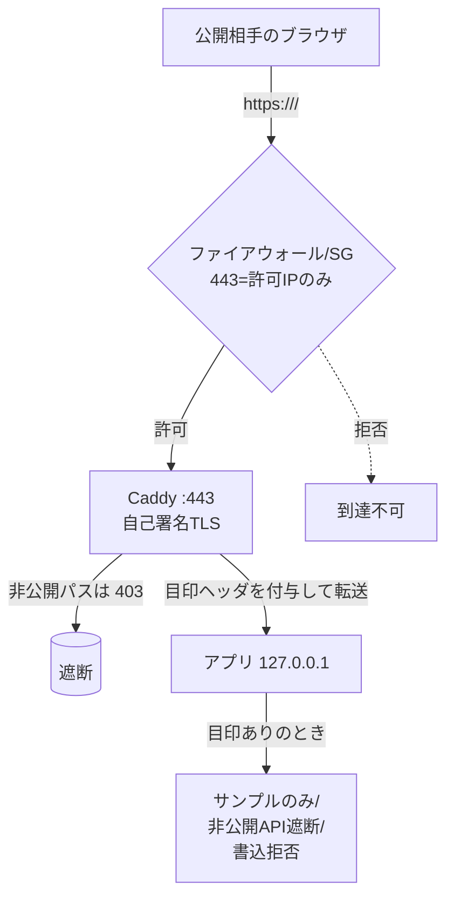
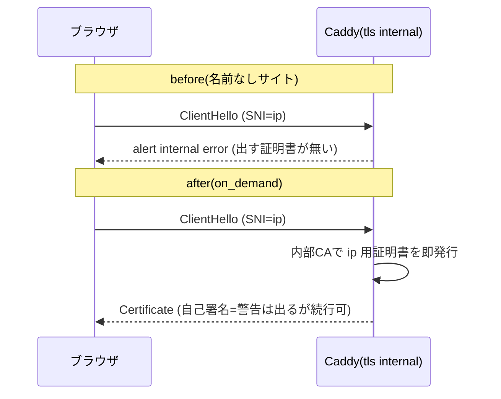
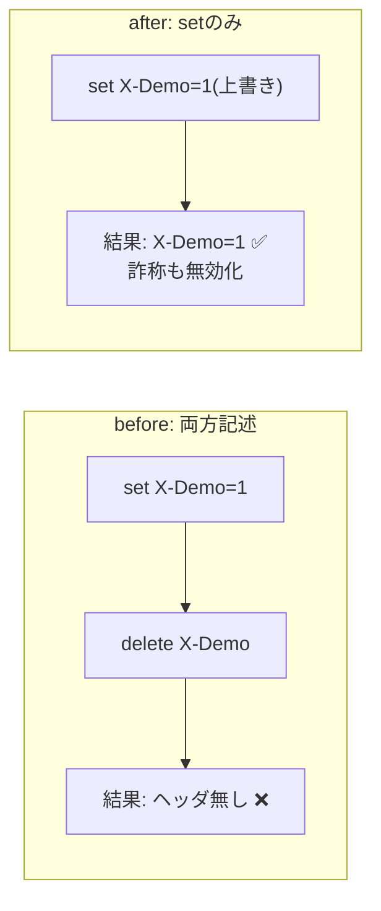

# 037 Caddy で社内/個人アプリを「IP制限つきデモ公開」する — 構築手順と3つのハマりどころ

> ループバック限定で動かしていた Web アプリを、**特定の相手にだけ**見せる限定デモとして安全に公開した記録。
> リバースプロキシ(Caddy)を1段かませ、**「デモ経路」だけ機能を絞る**多層防御パターンと、実際にハマった
> Caddy 特有の落とし穴3つを「症状→原因→なぜ→対処」で解説する。
> マスキング規約により実値(IP/ホスト名/ユーザ名)は placeholder。

- 公式: Caddy reverse_proxy <https://caddyserver.com/docs/caddyfile/directives/reverse_proxy> ／ tls <https://caddyserver.com/docs/caddyfile/directives/tls> ／ on-demand TLS <https://caddyserver.com/docs/automatic-https#on-demand-tls>

---

## 1. 目的とゴール

- 普段はループバック(`127.0.0.1`)限定の Web アプリを、**限られた相手にだけ**閲覧してもらいたい。
- 公開するのは一部の画面だけ。**非公開ルート(個人情報を含む画面・API)は絶対に見せない**。
- アプリ本体は極力いじらない（「追加のみ」でデグレを避ける）。

---

## 2. As-Is → To-Be（何が変わったか）

### As-Is（変更前）
- アプリは `127.0.0.1:<app-port>` のループバック限定。外部からは見えない。
- 自分は VPN(例: Tailscale)経由で全画面を閲覧。

### To-Be（変更後）
- 公開用の入口として **Caddy(リバースプロキシ)** を `443` に追加。
- Caddy を通った通信だけ「デモ扱い」になり、**非公開ルートは遮断・一覧はサンプルデータのみ**に制限。
- 自分の従来アクセス(VPN/ループバック)は**まったく変わらず全機能**（デグレ無し）。



**肝**: アプリの判定は **「目印ヘッダ」1つ**で切り替える。Caddy 経由＝デモ、直アクセス＝管理者。

---

## 3. 仕組み（多層防御）

「経路で見分ける」ために、Caddy が**全プロキシ要求に目印ヘッダ(例: `X-Demo: 1`)を付与**する。守りは2段:

1. **Caddy 側**: 非公開パスは転送せず `403`。
2. **アプリ側**: 目印ヘッダを見たら、一覧はサンプルのみ・非公開API は 403・書き込み(POST/DELETE)拒否(デモは閲覧専用)・一部ナビ非表示。

→ どちらか片方が漏れても、もう片方で止まる。



> ネットワーク層の **IP制限(クラウドの Security Group 等)** は必ず併用する。アプリ/プロキシの制御は「多層防御の一段」であって、到達制御の代わりにはならない。

---

## 4. Caddy 設定（要点）

```caddyfile
{
	auto_https disable_redirects
	skip_install_trust          # 自己署名CAを system trust に登録しない(sudo不要・ブラウザ警告は許容)
}

:443 {
	bind {$BIND_ADDR}           # 待受IPを限定(落とし穴①)
	tls internal {
		on_demand           # 接続先に応じ証明書を都度発行(落とし穴②)
	}
	@blocked path /private/* /api/private/*   # 公開しない画面・APIを列挙して 403
	respond @blocked 403
	reverse_proxy 127.0.0.1:<app-port> {
		header_up X-Demo 1  # set のみ(落とし穴③)。上書きなので詐称も無効化
	}
}
```

- `BIND_ADDR` は systemd drop-in 等の環境変数で注入（公開用インターフェースのIP）。
- インストールは AL2023(RHEL系)では公式 static binary 方式が確実（copr は AL2023 で不可なことが多い）。

---

## 5. ★ハマりどころ3つ（Caddy 特有）

### ① 待受IPは `bind` で絞る（`address already in use`）

- **症状**: 起動が `listen tcp :443: bind: address already in use` で失敗。
- **原因**: 別サービス(例: VPN デーモン)が**特定IPの 443** を既に使用中。Caddy の `:443` は**全インターフェース**を掴もうとして衝突。
- **なぜ**: Linux では「特定IP:443」が使用中だと「全IP(0.0.0.0):443」のバインドは失敗する。
- **対処**: `bind <公開用IP>` で待受を限定。これで両サービスが 443 を**別IPで共存**できる。
- **誤解しやすい点**: サイト見出し `10.0.x.x:443 {` のIPは「Hostマッチ用」で、待受は結局全IFになる。**待受を絞るのは `bind` ディレクティブ**。

### ② `tls internal` はサイトがポートのみだと `on_demand` 必須（TLS internal error）

- **症状**: 起動はするが接続で `TLS alert, internal error`／curl が `000`。
- **原因**: サイトを `:443`(ポートのみ)で定義したため、Caddy に**証明書の subject(名前)が無い**。IPアクセス時に出す証明書を作れずハンドシェイク失敗。
- **なぜ**: 自己署名(内部CA)でも「どの名前で発行するか」が要る。名前無しサイトは SNI/IP 接続に応える証明書を持てない。
- **対処**: `tls internal { on_demand }`。**接続先のSNI(IP等)に応じて内部CAが証明書を都度発行**。`:443`(名前なし)のまま外部IPアクセスでもハンドシェイク成立。
- 補足: 公開用途では on-demand に保護(ask)を付けるのが本来推奨。内部CA＋IP制限済みのクローズドなデモなら許容。



### ③ `header_up` は「-削除」と「set」を併記すると set が消える

- **症状**: 非公開パスの403は効くのに、**目印ヘッダがアプリに届かず制限が効かない**。
- **原因**: 詐称防止のつもりで `header_up -X-Demo`(削除) と `header_up X-Demo 1`(設定) を**両方**書いていた。Caddy はヘッダ操作で **set の後に delete を実行**するため、設定した値が**消える**。
- **なぜ**: Caddy のヘッダ処理は操作種別ごとの順序があり、ソース記述順とは限らない（delete が後段）。
- **対処**: `header_up X-Demo 1`(**set のみ**)。set は上書きなので、クライアントが値を**詐称しても上書き**され、詐称防止も同時に満たす（検証: client が `X-Demo:0` 送信→受信側 `1`）。



---

## 6. グローバルIPの扱い（固定IP推奨）

- 公開IPがクラウドのパブリックIPv4の場合、**固定IP(Elastic IP 等)未割当だと再起動でIPが変わる**。
- 対策: アプリ側で IP を**動的取得(クラウドのインスタンスメタデータ)**して表示する／または**固定IPを割り当てて安定化**する。

---

## 7. 検証の型

```bash
# 公開する画面: 200 / 非公開パス: 403
for p in <公開パス...>; do curl -sk -o /dev/null -w "$p %{http_code}\n" https://<global-ip>$p; done
for p in <非公開パス...>; do curl -sk -o /dev/null -w "$p %{http_code}\n" https://<global-ip>$p; done
# 443 の共存確認(別サービスと別IPで並ぶ)
sudo ss -tlnp | grep ':443'
```
- IP制限は「許可IP端末で到達」「許可外端末で到達不可」を必ず両方確認する。

---

## 8. まとめ（再利用できる学び）

- 限定デモは「**リバースプロキシで目印ヘッダ＋多層防御**」が筋が良い（アプリ改変は最小）。
- Caddy の3点は定番のハマり: **`bind` で待受限定／ポートのみサイトは `tls internal { on_demand }`／`header_up` は set 単独**。
- 到達制御は必ず**ネットワーク層(IP制限)**で。プロキシ/アプリ制御はその上の多層防御。

---

## Author and Ownership / 著作権と所属について

This project was created as a personal initiative and is not connected to any organization or group.
It is published as an individual creative work.

本プロジェクトは個人の活動として作成したものであり、特定の組織や団体の業務とは関係ありません。
個人の創作物として公開しています。
