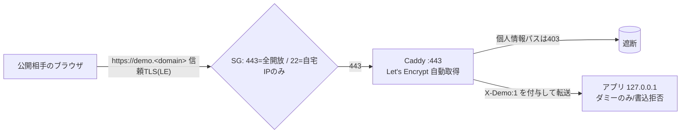

# 040 デモサイトを「正規HTTPS（信頼される証明書）」で限定公開する — Route53格安ドメイン＋Caddy自動Let's Encrypt

> #037（自己署名＋IP制限のデモ公開）の証明書警告を解消し、**正規（信頼）HTTPS**にした記録。
> 全てAWS内で完結（Route53でドメイン取得＋EC2上の既存Caddy）し、**Caddyのサイト定義を1か所変えるだけ**で対応。追加コンポーネント無し・デグレ無し。
> マスキング規約により実値（ドメイン/IP/ホスト名/ユーザ名/各種ID）は placeholder。
> 公式: Caddy Automatic HTTPS <https://caddyserver.com/docs/automatic-https> ／ Let's Encrypt TLS-ALPN-01 <https://letsencrypt.org/docs/challenge-types/> ／ Route53 <https://docs.aws.amazon.com/route53/>

- 由来: NEXUS タスクボード #89（#82/#83 の自己署名デモを正規HTTPS化）。実施日: 2026-06-29。

---

## 1. As-Is → To-Be

### As-Is（#037）
- 既存 Caddy が `:443` で **自己署名（internal CA・on_demand）** → ブラウザに「証明書が信頼されない」警告。
- アクセス制御は **SG で 443 を自宅IPのみ許可**（限定公開）。
- アプリは `127.0.0.1:<app-port>` ループバック。X-Demo 多層防御（個人情報パス遮断・ダミー表示・書込拒否）あり。

### To-Be（本手順）
- **Route53 で格安ドメイン取得**（例: `.click` 年$3）＋ **A レコード `demo.<domain>` → EIP**。
- 既存 Caddy のサイトを **`demo.<domain>` の自動 Let's Encrypt** に変更 → **信頼された正規証明書**（警告ゼロ）。
- **X-Demo 多層防御・アプリのデモ制御・アプリのループバック束縛はすべて不変**（追加のみ）。



---

## 2. アクセス制御の方針（採用＝パターン②）

公開範囲とACME方式はセットで決める。今回は「デモは全開放／SSHは自宅IP限定」のため**パターン②**を採用。

| パターン | SG | ACME | 備考 |
|---|---|---|---|
| ① | 80+443 全開放, 22=自宅IP | HTTP-01/TLS-ALPN-01 両可 | http→httpsリダイレクト有・最も確実 |
| **② 採用** | **443 全開放, 80閉, 22=自宅IP** | **TLS-ALPN-01(443)** | ポート最小。`http://` は不通（リダイレクト無し） |
| ③ | 443=自宅IP, 80全開放 | HTTP-01 | 限定公開のまま（全開放したい場合は不適） |
| ④ | 全閉 | DNS-01(Route53) | Caddy再ビルド要。全閉維持したい場合のみ |

- **443を全開放するとACMEは自動成立**（TLS-ALPN-01）。DNS-01やCaddy再ビルドは不要。
- **SSH(22)は必ず自宅IP限定を維持**（全開放しない）。

---

## 3. 手順（全AWS・最小変更）

### 3-1. ドメイン取得（Route53・コンソール）
- Registered domains → Register domains → `<domain>`（最安は `.click` 等）→ 連絡先入力＋**Privacy Protection ON** → 購入。
- ICANN 規約により**登録者メール確認（15日以内）必須**（未確認だと停止）。

### 3-2. 固定IP（EIP）
- A レコードの宛先を安定させるため EIP を関連付け（stop/startでIP不変）。
- **コスト**: 公開IPv4は使用中で $0.005/時（≒$3.6/月）。既存の公開IPと置き換わるだけなので**増分は実質0**。未関連付けEIPは課金されるので放置しない。

### 3-3. A レコード（Route53）
- `demo.<domain>` / Type `A` / 値 `<EIP>` / TTL 300（エイリアスはオフ）。
- 確認: `dig +short demo.<domain> @8.8.8.8` → `<EIP>` が返る。

### 3-4. Security Group（パターン②）
- インバウンド: **443 ← 0.0.0.0/0** を追加、旧「443←自宅IP/32」は削除。**22 ← 自宅IP は維持**。**80 は開けない**。

### 3-5. Caddyfile を自動Let's Encryptへ（★主変更・要 sudo）
```bash
sudo cp -a /etc/caddy/Caddyfile /etc/caddy/Caddyfile.bak.$(date +%Y%m%d-%H%M%S)   # 必ずバックアップ
```
新 `/etc/caddy/Caddyfile`:
```caddyfile
{
	# 80を開けない方針：80→443リダイレクトvhostを動かさない（証明書はTLS-ALPN-01/443で取得）
	auto_https disable_redirects
	# （任意）更新通知: email <your-email>
}

demo.<domain> {
	bind {$CADDY_HOST}        # 既存どおり プライマリENIの private IP に待受（VPNの443衝突回避）
	@blocked path /career /career/* /api/career /api/career/* /chat /chat/* /api/chat /api/chat/* /reports /reports/* /api/reports /api/reports/*
	respond @blocked 403
	reverse_proxy 127.0.0.1:<app-port> {
		header_up X-Demo 1     # set のみ＝クライアント詐称も無効化
	}
}
```
適用＆確認:
```bash
sudo caddy validate --config /etc/caddy/Caddyfile
sudo systemctl reload caddy
sleep 15
sudo journalctl -u caddy -n 100 --no-pager | grep -iE 'certificate|obtain|tls|alpn|error'
# => certificate obtained successfully 系が出れば成功（TLS-ALPN-01/443）
```

---

## 4. 検証（実績の型）
```bash
curl -sI https://demo.<domain>/ | head      # -k 無しで HTTP/2 応答＝信頼された正規証明書
for p in / /career /chat /reports ; do curl -s -o /dev/null -w "$p -> %{http_code}\n" https://demo.<domain>$p; done
# 期待: / -> 200, /career,/chat,/reports -> 403
```
- ブラウザで `https://demo.<domain>/` → **警告ゼロ＆全画面表示**、個人情報系は 403 を確認。
- `http://demo.<domain>/` は**不通**（80閉・パターン②の想定どおり）。
- 補足: `curl -I`（HEAD）が `404` でもアプリが HEAD 未対応なだけで無害（GET は 200）。

---

## 5. ロールバック
```bash
sudo cp -a /etc/caddy/Caddyfile.bak.<timestamp> /etc/caddy/Caddyfile
sudo systemctl reload caddy
```
- SG の 443 を「自宅IP限定」へ戻せば #037 の限定公開姿勢に復帰。アプリ・X-Demo は無改変のため影響なし。

---

## 6. ハマりどころ／学び
- **443を全開放すれば ACME は TLS-ALPN-01 で自動成立**＝80開放もDNS-01も不要。最小ポートで正規証明書が得られる。
- `bind {$CADDY_HOST}` は #037 のまま流用（VPNが特定IPの443を使うための衝突回避）。public→EIP→NAT→ private IP:443 と届くので問題なし。
- 証明書取得の前提順序は **DNS(Aレコード) → SG(443開放) → Caddy reload**。逆順だと初回取得が失敗する。
- **SSH(22)は自宅IP限定を維持**（全開放しない）。デモ公開とSSH露出は別物。
- コストは**ドメイン代のみ**（年$3〜）＋ Route53 ホストゾーン $0.50/月。証明書$0、ALB/CloudFront/WAF不要。

---

## Author and Ownership / 著作権と所属について

This project was created as a personal initiative and is not connected to any organization or group.
It is published as an individual creative work.

本プロジェクトは個人の活動として作成したものであり、特定の組織や団体の業務とは関係ありません。
個人の創作物として公開しています。
