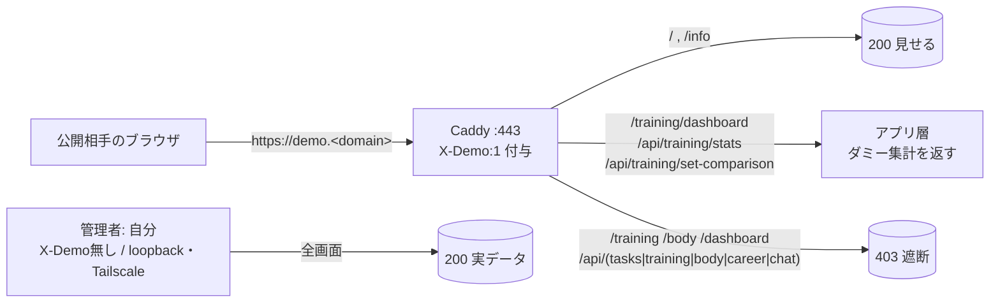

# 041 デモ公開の保護強化 — 管理画面を全遮断＋トレーニング分析ダッシュボードはダミーデータで公開

> #82/#83/#037/#040 で構築した「限定→正規HTTPSデモ公開」に対し、**個人データを含む管理画面をデモで全遮断**し、唯一“見せたい”**読み取り専用のトレーニング分析ダッシュボードだけをダミーデータで公開**した記録。
> 方針は AGENTS.md の「追加のみ＝デグレ無し」。アプリ層（`httpRouter` / `trainingService`）の2ファイルのみ・**追加変更**で完結。Caddy 設定・DB スキーマ・既存集計ロジックは不変。
> マスキング規約により実値（ドメイン/IP/ホスト名/ユーザ名/各種ID・実トレーニング値）は placeholder。
> 公式参考: Caddy `request_header`（X-Demo 付与）<https://caddyserver.com/docs/caddyfile/directives/header> ／ Node.js `http` <https://nodejs.org/api/http.html>

- 由来: NEXUS タスクボード #89。実施日: 2026-06-29。
- 対象アプリ: タスクボード（`tasks/task-board`、`src/interface → application → domain → repository → infra` の層構造）。
- 公開URL: `https://demo.<domain>`（Caddy が全プロキシ要求に `X-Demo: 1` を付与。デモ訪問者はこのヘッダを外せない＝アプリ層だけで保護成立）。

---

## 1. 背景と目的

デモ公開ではホーム/インフォ等の“見せる系”だけ出し、**個人データ（タスク・キャリア・チャット・ボディ/ヘルスケア・トレーニング記録）は出さない**のが原則。一方で「トレーニング分析ダッシュボード」は見栄えがよく見せたいが、**実データは個人情報**。そこで:

- 管理画面と書込/一覧API（GET含む）は **デモで全遮断（403）**。
- `/training/dashboard`（読み取り専用の分析グラフ）と、それが叩く集計API 2本だけ **デモで許可**し、**実データではなく決定的ダミーを集計して返す**。



---

## 2. As-Is → To-Be

### As-Is（#82/#90 時点）
- デモ遮断は **career/chat と /api/career, /api/chat のみ**。タスクはダミー（`is_dummy=1`）に限定。
- トレーニング/ボディ/管理ダッシュボードは **デモでも素通り**＝個人データが見える状態。
- ナビ非表示は `/career` のみ。

### To-Be（本対応）
- デモ（`X-Demo:1`）時、以下を **403**:
  - `/dashboard`（タスク管理）, `/training`, `/body`（GET含む）と `/index.html`
  - `/api/tasks/*`, `/api/training/*`, `/api/body/*`（**GET含む**＝個人データ非開示）
  - 既存の `/career*`, `/chat*`, `/api/career*`, `/api/chat*` は継続遮断
- **例外（読み取り専用・許可）**: `/training/dashboard`（＝`/training-dashboard`）, `/api/training/stats`, `/api/training/set-comparison`
  → これらは **ダミーデータ**を集計して返す（実DB非参照）。
- ナビリンクは `/career /dashboard /training /body` をデモ時CSSで非表示。
- デモは閲覧専用: 非GET（書込）は一律 403。
- 管理者（`X-Demo` ヘッダ無し＝loopback / Tailscale）は **全画面200・実データのまま＝デグレ無し**。

---

## 3. 実装（追加のみ・2ファイル）

### 3.1 `src/interface/httpRouter.mjs`（インターフェース層）
- `isDemo = req.headers['x-demo'] === '1'` 判定のうえ、**先頭アンカー付き正規表現**で 403 ガード。
  `p` は `url.pathname`（正規化済み）なので **ルーティング/パストラバーサルのバイパス不可**。
  ```js
  /^\/(dashboard|training|body)($|[\/.])/.test(p) ||
  p === '/index.html' ||
  /^\/api\/(tasks|training|body)($|[\/.])/.test(p)
  ```
- 読み取り専用の許可リスト `demoReadOnlyAllow`（`/training/dashboard`・`/training-dashboard`・`/api/training/stats`・`/api/training/set-comparison`）に該当するものは 403 ガードから除外。
- 集計API 2本は **デモ時のみダミーを渡す**（実データは渡さない）:
  ```js
  training.dashboard(days, isDemo ? training.demoSets() : undefined)
  training.setComparison(days, isDemo ? training.demoSets() : undefined)
  ```
- ナビ非表示CSS（`sendHtml` 内）に `/dashboard /training /body` を追加（`/career` に加えて）。

### 3.2 `src/application/trainingService.mjs`（アプリ層）
- `dashboard(days)` / `setComparison(days)` に **任意の第2引数 `sourceSets`** を追加。
  ```js
  const allSets = sourceSets || repo.listSets();
  ```
  指定なし＝従来どおり実DB集計（**後方互換・デグレ無し**）。指定時はその配列を集計。
- **決定的ダミー生成 `demoSets()` を新規追加**:
  - 戻り値は `repo.listSets()` と**同一の形・同一の並び**（`{id,date,category,exercise,weight,reps,unit,created_at}`、date 降順→同日 id 昇順）。
  - 線形合同法のシード固定乱数で**毎回同じ内容**（再現性・キャッシュ安全）。
  - 曜日ローテ（週4日: 胸/背中/足/肩＋腕）×直近84日。種目は既存 `EXERCISES` から抽出、重量は2.5kg刻みで微増。
  - **実DBに一切アクセスしない**（読み書きとも無し）。

> なぜ「ダミーのセット配列を既存集計に通す」設計か: 集計の戻り形（summary/series/categoryDist/topExercises/parts、setComparison の折れ線群）を**手作業で組み立てると形ズレ・描画崩れのリスク**。生データ相当を生成して**本番と同じ集計関数**を通せば、形が完全一致しフロント（SVGグラフ）が無改修で描画できる。

---

## 4. 多層防御の整理（デモ時の挙動）

| パス | デモ(X-Demo:1) | 管理者(ヘッダ無し) |
|---|---|---|
| `/` , `/info` | 200（見せる） | 200 |
| `/training/dashboard` | 200（**ダミー**） | 200（実データ） |
| `/api/training/stats`・`/set-comparison` | 200（**ダミー集計**） | 200（実集計） |
| `/training` , `/body` , `/dashboard` , `/index.html` | **403** | 200 |
| `/api/tasks/*`・`/api/training/sets`・`/api/body/*` | **403（GET含む）** | 200 |
| `/career*` , `/chat*` , `/api/career*` , `/api/chat*` | **403** | 200 |
| 非GET（書込） | **403** | 200 |

---

## 5. 検証（実施済み）

`node --check` 両ファイルOK。サービス再起動後、loopback とデモの両系統を確認。

- **管理者（ヘッダ無し）**: `/api/training/stats` → 実データ（例: workouts=7 規模）。`/training/dashboard` 200。全画面デグレ無し。
- **デモ（X-Demo:1、loopback と `https://demo.<domain>` 両方）**:
  - `/training/dashboard`・`/api/training/stats`・`/api/training/set-comparison` → **200・ダミー集計**（管理者の実データと別物＝個人データ非開示を確認）。
  - `/training`・`/body`・`/dashboard`・`/api/training/sets`・`/api/body/logs`・`/api/tasks`・`/career`・`/chat` → **403**。
  - `POST /api/training/sets` → **403**（書込拒否）。
  - `/`・`/info` → 200。
- `demoSets()` は**決定的**（同一出力）であることを確認。

---

## 6. 切り戻し（ロールバック）

着手前バックアップ（即復元可）:
- `~/.openclaw/workspace/.backups/task89-demo-hide-<ts>/`（管理画面の全遮断＝デモ保護前）
- `~/.openclaw/workspace/.backups/task89-demo-dummydash-<ts>/`（ダミー化前の2ファイル）

復元は当該 `httpRouter.mjs` / `trainingService.mjs` を上書きし、サービス再起動。

---

## 7. 完了処理

- **private バックアップリポ反映**: `private-openclaw-01`（task-board ソースの正本ミラー）へ2ファイルを byte-exact で反映・remote blob SHA 照合済み。
- **本ドキュメント**: `/opt/docs/openclaw/`（マスター）。実値はマスキング済み。

## 8. 任意の追加ハードニング（要 sudo・未適用）

エッジ（Caddy）でも `@blocked` に管理系パスを追記すれば**アプリに届く前に403**にできる（多層防御）。アプリ層で既に保護済みのため必須ではない。適用時は `sudo caddy validate` → `sudo systemctl reload caddy`。
