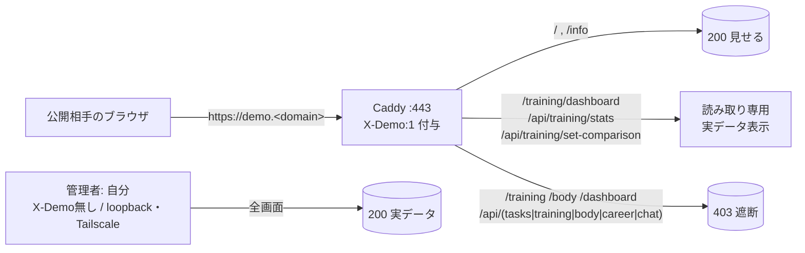

# 041 デモ公開の保護強化 — 管理画面を全遮断＋トレーニング分析ダッシュボードのみ公開（実データ）

> #82/#83/#037/#040 で構築した「限定→正規HTTPSデモ公開」に対し、**個人データを含む管理画面をデモで全遮断**し、唯一“見せたい”**読み取り専用のトレーニング分析ダッシュボードだけを公開**した記録。
> 方針は AGENTS.md の「追加のみ＝デグレ無し」。アプリ層（`httpRouter`）の最小変更で完結。Caddy 設定・DB スキーマ・既存集計ロジックは不変。
> マスキング規約により実値（ドメイン/IP/ホスト名/ユーザ名/各種ID）は placeholder。
> 公式参考: Caddy `request_header`（X-Demo 付与）<https://caddyserver.com/docs/caddyfile/directives/header> ／ Node.js `http` <https://nodejs.org/api/http.html>

- 由来: NEXUS タスクボード #89。実施日: 2026-06-29。
- 対象アプリ: タスクボード（`tasks/task-board`、`src/interface → application → domain → repository → infra` の層構造）。
- 公開URL: `https://demo.<domain>`（Caddy が全プロキシ要求に `X-Demo: 1` を付与。デモ訪問者はこのヘッダを外せない＝アプリ層だけで保護成立）。

> **設計判断（重要）**: トレーニング分析ダッシュボードは当初「デモではダミーデータを集計して表示」する実装も用意したが、**運用判断として撤去**。トレーニング記録（種目・重量・回数・日付）は機微度が低く、**生データの公開で十分**と判断したため、デモでも**実データをそのまま表示**する（タスク/キャリア/チャット/ボディ等の個人データは引き続き全遮断）。

---

## 1. 背景と目的

デモ公開ではホーム/インフォ等の“見せる系”だけ出し、**個人データ（タスク・キャリア・チャット・ボディ/ヘルスケア）は出さない**のが原則。一方で「トレーニング分析ダッシュボード」は見栄えがよく、かつ**機微度が低い**ため、読み取り専用で公開する。

- 管理画面と書込/一覧API（GET含む）は **デモで全遮断（403）**。
- `/training/dashboard`（読み取り専用の分析グラフ）と、それが叩く集計API 2本だけ **デモで許可**（実データを表示）。



---

## 2. As-Is → To-Be

### As-Is（#82/#90 時点）
- デモ遮断は **career/chat と /api/career, /api/chat のみ**。タスクはダミー（`is_dummy=1`）に限定。
- トレーニング/ボディ/管理ダッシュボードは **デモでも素通り**。
- ナビ非表示は `/career` のみ。

### To-Be（本対応）
- デモ（`X-Demo:1`）時、以下を **403**:
  - `/dashboard`（タスク管理）, `/training`, `/body`（GET含む）と `/index.html`
  - `/api/tasks/*`, `/api/training/*`, `/api/body/*`（**GET含む**＝個人データ非開示）
  - 既存の `/career*`, `/chat*`, `/api/career*`, `/api/chat*` は継続遮断
- **例外（読み取り専用・許可）**: `/training/dashboard`（＝`/training-dashboard`）, `/api/training/stats`, `/api/training/set-comparison`
  → これらは **実トレーニングデータ**を表示（機微度が低いため公開可と判断）。
- ナビリンクは `/career /dashboard /training /body` をデモ時CSSで非表示（ダッシュボードへは直リンク/トップから誘導）。
- デモは閲覧専用: 非GET（書込）は一律 403。
- 管理者（`X-Demo` ヘッダ無し＝loopback / Tailscale）は **全画面200・実データのまま＝デグレ無し**。

---

## 3. 実装（最小変更）

### `src/interface/httpRouter.mjs`（インターフェース層）
- `isDemo = req.headers['x-demo'] === '1'` 判定のうえ、**先頭アンカー付き正規表現**で 403 ガード。
  `p` は `url.pathname`（正規化済み）なので **ルーティング/パストラバーサルのバイパス不可**。
  ```js
  /^\/(dashboard|training|body)($|[\/.])/.test(p) ||
  p === '/index.html' ||
  /^\/api\/(tasks|training|body)($|[\/.])/.test(p)
  ```
- 読み取り専用の許可リスト `demoReadOnlyAllow`（`/training/dashboard`・`/training-dashboard`・`/api/training/stats`・`/api/training/set-comparison`）に該当するものは 403 ガードから除外。
- 集計API（`/api/training/stats`・`/api/training/set-comparison`）は **デモ/管理者を問わず実データを返す**（`training.dashboard(days)` / `training.setComparison(days)` をそのまま呼ぶ）。
- ナビ非表示CSS（`sendHtml` 内）に `/dashboard /training /body` を追加（`/career` に加えて）。

> 補足: 当初は `trainingService` に決定的ダミー生成 `demoSets()` と、集計関数の任意第2引数 `sourceSets` を追加して「デモ時はダミー集計」する実装を入れたが、**生データ公開で十分**との判断により撤去（`trainingService` は #81 時点の状態に戻し、変更は `httpRouter` のデモ制御のみに集約）。

---

## 4. 多層防御の整理（デモ時の挙動）

| パス | デモ(X-Demo:1) | 管理者(ヘッダ無し) |
|---|---|---|
| `/` , `/info` | 200（見せる） | 200 |
| `/training/dashboard` | 200（実データ・読み取り専用） | 200 |
| `/api/training/stats`・`/set-comparison` | 200（実集計） | 200 |
| `/training` , `/body` , `/dashboard` , `/index.html` | **403** | 200 |
| `/api/tasks/*`・`/api/training/sets`・`/api/body/*` | **403（GET含む）** | 200 |
| `/career*` , `/chat*` , `/api/career*` , `/api/chat*` | **403** | 200 |
| 非GET（書込） | **403** | 200 |

---

## 5. 検証（実施済み）

`node --check` OK。サービス再起動後、loopback とデモの両系統を確認。

- **管理者（ヘッダ無し）**: `/api/training/stats` → 実データ。全画面200・デグレ無し。
- **デモ（X-Demo:1、loopback と `https://demo.<domain>` 両方）**:
  - `/training/dashboard`・`/api/training/stats`・`/api/training/set-comparison` → **200・実集計**（管理者と同一サマリ＝実データ表示を確認）。
  - `/training`・`/body`・`/dashboard`・`/api/training/sets`・`/api/body/logs`・`/api/tasks`・`/career`・`/chat` → **403**。
  - `POST /api/training/sets` → **403**（書込拒否）。
  - `/`・`/info` → 200。

---

## 6. 切り戻し（ロールバック）

着手前バックアップ（即復元可）:
- `~/.openclaw/workspace/.backups/task89-demo-hide-<ts>/`（管理画面の全遮断＝デモ保護前）
- `~/.openclaw/workspace/.backups/task89-demo-dummydash-<ts>/`（＝本対応の最終状態。ダミー化前＝実データ表示）

復元は当該 `httpRouter.mjs` を上書きし、サービス再起動。

---

## 7. 完了処理

- **private バックアップリポ反映**: `private-openclaw-01`（task-board ソースの正本ミラー）へ byte-exact で反映・remote blob SHA 照合済み。
- **本ドキュメント**: `/opt/docs/openclaw/`（マスター）＋公開リポ。実値はマスキング済み。

## 8. 任意の追加ハードニング（要 sudo・未適用）

エッジ（Caddy）でも `@blocked` に管理系パスを追記すれば**アプリに届く前に403**にできる（多層防御）。アプリ層で既に保護済みのため必須ではない。適用時は `sudo caddy validate` → `sudo systemctl reload caddy`。
