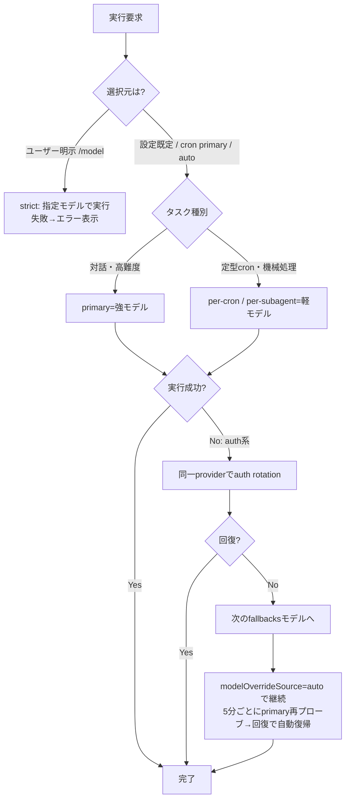
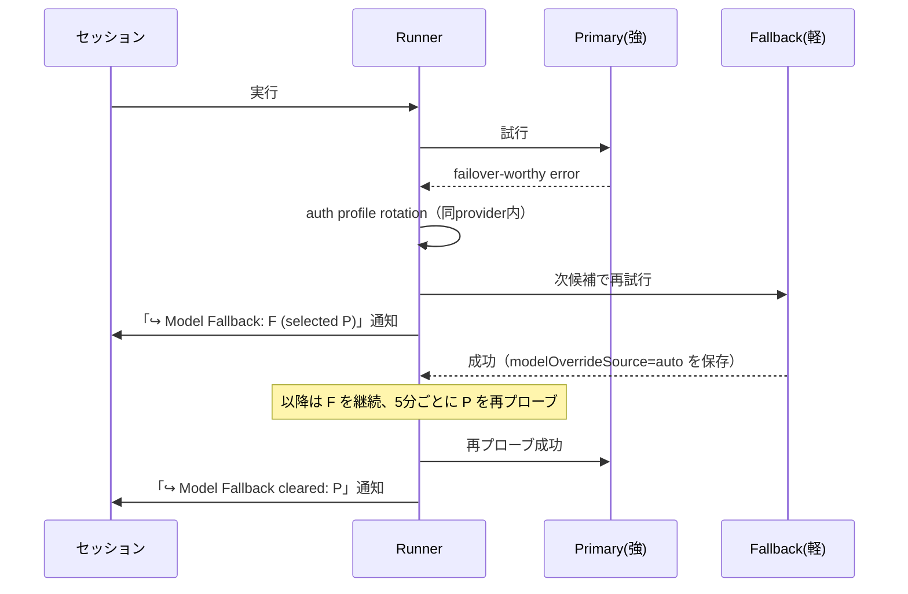
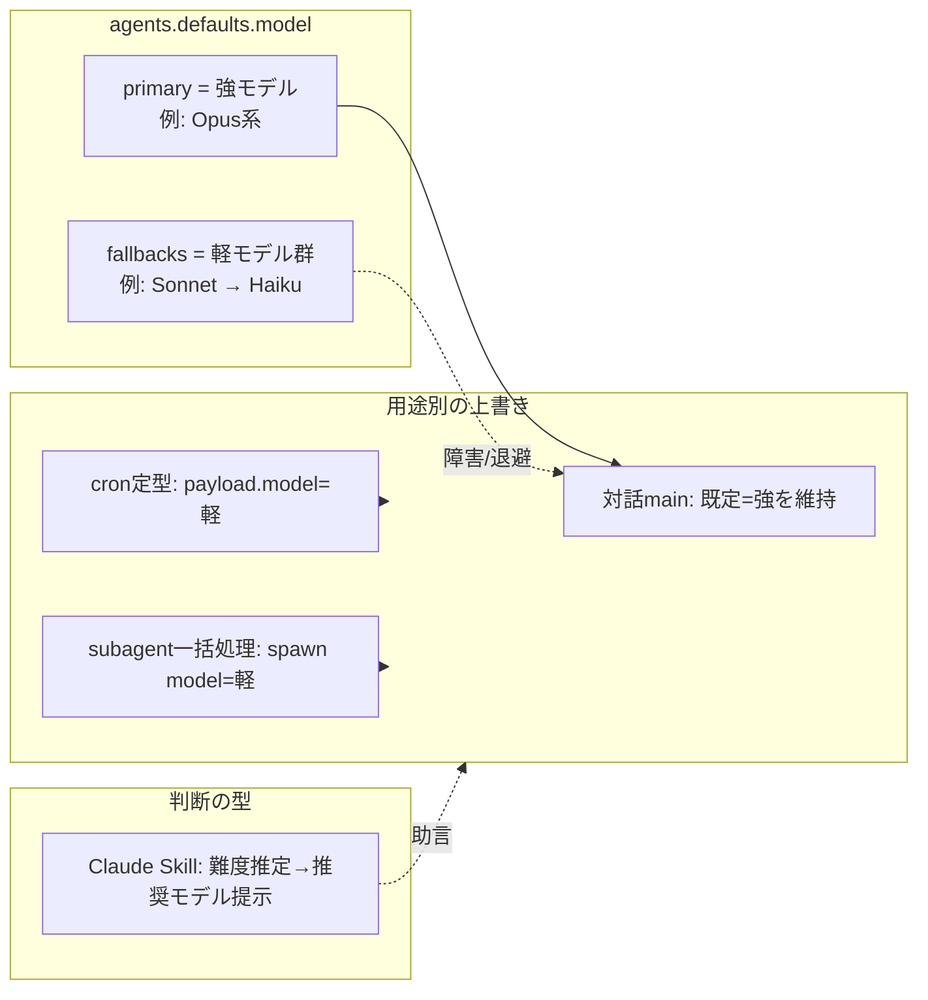

# 045_DONE_SETUP_llm-model-switching-research

**OpenClaw 上での「LLMモデル自動切り替え」機能：導入・実装方式の調査とドキュメント化**

- 作成日: 2026-07-16（JST）
- 種別: 調査 / 設計ドキュメント（**実装は別タスク・HITL承認後**）
- 関連タスク: #96（本タスク）, #95（LLMトークン最適化）, #97（推奨MCP）, #98（推奨Skills）
- 方針: 機能開発方針（#28/#46 踏襲）＝**追加のみ・デグレ無し・最小構成・層構造・着手前backup・検証必須**

> 本書は「調査＋ドキュメント化」までが完了範囲です。config への実変更は本書に記載した骨子をもとに、別途 HITL 承認と着手前バックアップを取ってから実施します。

---

## 0. 3行まとめ

- OpenClaw は **モデル切り替えの機能を標準ですでに備えている**（config の `primary`＋`fallbacks`、per-agent、per-cron、per-session、生成系別モデル）。新規に外部ルーターを足す必要はほぼ無い。
- 推奨は「**強モデルを primary、軽モデルを fallbacks に置き、定型・機械的処理は cron/サブエージェント単位で軽モデルを明示指定**」という最小構成。これで難度・コスト・レイテンシ・障害可用性を同時に満たせる。
- 「いつ・何を基準に切り替えるか」の判断は **Claude Skill（プレイブック）** として持つのが軽く保守的。外部ルーターMCPは比較検討の結果、現時点では非推奨（依存・保守コスト増）。

---

## 1. 目的と背景

このOpenClaw環境でLLMを実行する際、タスクや状況に応じて適切なモデルを使い分けたい。狙いは主に4点:

1. **コスト最適化** — 高価な強モデル（Opus系）を常用せず、定型作業は安いモデル（Sonnet/Haiku系）へ。
2. **レイテンシ最適化** — 速い応答が要る対話は軽量モデルへ退避可能に。
3. **難度への追従** — 難しい設計・コーディングは強モデルへ。
4. **障害時の可用性** — あるモデル/認証が落ちても自動で次候補へ。

結論を先に言うと、**上記はすべて OpenClaw の標準機能で実現できる**。以下、一次情報（ローカル OpenClaw docs）に基づいて仕組みを整理し、推奨アーキテクチャと導入手順の骨子を示す。

---

## 2. OpenClaw のモデル選択・切替の仕組み（一次情報）

### 2.1 モデル選択の優先順位

OpenClaw は次の順でモデルを解決する（出典: `/concepts/models` 「How model selection works」）。

1. **Primary model**: `agents.defaults.model.primary`（または `agents.defaults.model`）
2. **Fallbacks**: `agents.defaults.model.fallbacks`（記載順）
3. **Provider auth failover**: 次モデルへ移る前に、同一プロバイダ内で認証プロファイルのローテーションを試す

つまり切替は **「2段階」**。まず同じモデルのまま認証を替え（auth profile rotation）、それでもダメなら次のモデルへ落ちる（model fallback）。出典: `/concepts/model-failover`。

### 2.2 選択元（selection source）で挙動が変わる

同じ `provider/model` でも「どこで選ばれたか」で fallback 連鎖の可否が変わる（出典: `/concepts/models` 「Selection source and fallback behavior」, `/concepts/model-failover` 「Selection source policy」）。

| 選択元 | fallback 連鎖 | 補足 |
|---|---|---|
| 設定既定 `agents.defaults.model.primary` | **する**（`fallbacks` を使う） | 通常の起点 |
| エージェント primary `agents.list[].model` | しない（strict） | その model オブジェクトに `fallbacks` を持たせれば連鎖。`fallbacks: []` で strict を明示 |
| 自動フォールバック（auto override） | **する** | `modelOverrideSource: "auto"`。5分間隔で本来の primary を再プローブし、回復したら自動で戻す |
| ユーザー明示選択（`/model`, model picker, `session_status(model=)`, `sessions.patch`） | **しない（strict）** | 到達不能なら黙って他モデルに落ちず、素直にエラー表示 |
| cron ジョブ primary（`--model` / payload `model`） | **する** | ただし payload `fallbacks` を指定すればそちらが優先。`fallbacks: []` で strict cron |

**要点**: 「勝手にモデルが変わって困る」場面（ユーザー明示選択）は strict、「落ちても止めたくない」場面（既定・cron・auto）は連鎖、という設計になっている。

### 2.3 切替を効かせられる「単位」

| 単位 | 指定方法 | 使いどころ |
|---|---|---|
| **全体既定** | `agents.defaults.model.primary` / `.fallbacks` | 標準の起点。強モデル＋退避チェーン |
| **エージェント別** | `agents.list[].model`（＋ `bindings` で振り分け） | 用途別ペルソナ（例: あるDMだけ強モデル） |
| **セッション別** | `/model <ref>`, `session_status(model=...)` | 会話中に一時的に切替。strict |
| **サブエージェント別** | `sessions_spawn(model=...)` | 機械的な一括読取・検索は軽モデルで安く |
| **cron ジョブ別** | `cron --model` / payload `model`（＋ `fallbacks`） | 定型の定期タスクごとにコスト最適化 |
| **生成系別** | `imageModel` / `pdfModel` / `imageGenerationModel` / `musicGenerationModel` / `videoGenerationModel` | 画像/PDF/生成タスクは自動で別モデルへ |

出典: `/concepts/models`（Config keys, per-agent override）, `/concepts/multi-agent`（bindings 例）, `/automation/cron-jobs`（`--model` / `--fallbacks`）。

### 2.4 cron のモデル選択優先順位

孤立（isolated）cron ジョブのモデル決定順（出典: `/automation/cron-jobs`）:

1. Gmail フック由来のモデル上書き（許可時）
2. per-job payload `model`
3. ユーザー選択で保存された cron セッションのモデル上書き
4. エージェント/既定モデル

`--model` はジョブの primary。**許可リスト外/解決不能なら黙って既定に落ちずに明示エラーで run を失敗させる**（意図しない課金・挙動を防ぐ安全設計）。`--fallbacks ""` または payload `fallbacks: []` で strict run。

### 2.5 安全側の注意点（config を触る前に）

- `agents.defaults.models`（許可リスト）を設定すると、**それが `/model` とセッション上書きの許可リスト**になる。ここに無いモデルを選ぶと返信生成前に「Model ... is not allowed」で止まる（=無応答に見える）。出典: `/concepts/models`「Model is not allowed」。
- 許可リストの手編集は**追加マージ**で行う。`openclaw config set agents.defaults.models '{"provider/model":{}}' --strict-json --merge`。プレーンな代入は既存エントリ削除を検知して**拒否**される（clobber protection）。`--replace` は本当に総入れ替えする時だけ。
- `primary` を変えても**既存セッションの選択は書き換わらない**。`/model default` で当該セッションを既定へ戻す。

---

## 3. 「いつ・何を基準に切り替えるか」設計指針

### 3.1 判断軸

| 軸 | 強モデル寄り | 軽モデル寄り |
|---|---|---|
| **タスク難度** | 設計・コーディング・多段推論・曖昧要件 | 定型要約・分類・機械的抽出・テンプレ処理 |
| **コスト** | 重要成果物・失敗コスト大 | 大量反復・低ステーク |
| **レイテンシ** | 品質最優先で待てる | 即応が要る対話・軽い相槌 |
| **トークン量** | 長文脈で精度が要る | 短文脈・小さな入出力（#95 と連動） |
| **失敗時** | — | 障害時は fallbacks で可用性優先 |

### 3.2 切替フロー（Mermaid）

フォールバック発火→自動復帰のシーケンス:

---

## 4. 実装アプローチ比較

| # | 方式 | メリット | デメリット | 導入コスト | 保守性 | 推奨度 |
|---|---|---|---|---|---|---|
| 1 | **config標準**（`primary`＋`fallbacks`） | 全体の土台。障害時自動可用性。追加依存ゼロ | 全新規セッションに影響（primary変更時） | 低 | 高 | ★★★ 必須 |
| 2 | **session/subagent単位**（`/model`, `sessions_spawn(model=)`） | 会話・機械処理ごとに最適化。安く速く | 手動/コード側の指定が要る | 低 | 高 | ★★★ 推奨 |
| 3 | **cron単位**（`--model` / payload `fallbacks`） | 定期タスクを個別最適化。ポーラー等を軽量化 | ジョブごと設定。cron編集は要注意（後述） | 低 | 高 | ★★★ 推奨 |
| 4 | **Claude Skill でルーティング判断** | 「難度→推奨モデル」の知識をプレイブック化。宣言的・可搬 | 判断はエージェント任せ（決定論ではない） | 低〜中 | 高 | ★★ 推奨（軽量） |
| 5 | **MCP でルーティング** | 外部ロジックで細粒度制御 | サーバ保守・レイテンシ・機密経路増 | 中 | 中 | ★ 条件付き |
| 6 | **外部モデルルーター**（別プロダクト） | 高度なコストルーティング | 依存・障害点・課金経路が増える。標準機能と二重管理 | 中〜高 | 低〜中 | △ 現時点非推奨 |

**判断**: 1〜3 の標準機能で要件（難度・コスト・レイテンシ・可用性）は満たせる。4 の Skill を「判断の型」として足すのが軽い。5/6 は現状オーバースペックで、AGENTS.md の「最小構成・追加のみ」に反するため**現時点は見送り**（要件が細粒度化したら再検討）。

---

## 5. 推奨アーキテクチャ（最小・追加のみ・デグレ無し）

- **primary = 強モデル**（高難度・既定の品質担保）。
- **fallbacks = 軽モデル群**（コスト/レイテンシ退避＋障害時の可用性を1本のチェーンで兼務）。
- **cron の定型軽作業**（ポーラー等）は `payload.model` で軽モデルを明示 → コスト削減。
- **サブエージェントの機械的処理**（一括読取・検索）は `sessions_spawn(model=)` で軽モデル。
- **対話 main は強モデルを維持**（体験品質優先）。
- **判断ロジックは Claude Skill** として保持（実装依存を増やさない）。

この構成は既存 config へ `fallbacks` と per-cron/per-subagent 指定を**足すだけ**で、既存挙動を壊さない（デグレ無し）。

---

## 6. 導入手順の骨子（実変更は HITL 承認後）

> いずれも**着手前に config バックアップ**（`.backups/` へ退避）を取ってから実施。

1. **現状確認**: `openclaw models status`（解決中の primary / fallbacks / auth を確認）。
2. **fallbacks 追加**（追加のみ・マージ）:
   - CLI: `openclaw models fallbacks add <provider/軽モデル>`（順に追加）
   - or config: `agents.defaults.model.fallbacks` に配列で軽モデルを列挙
3. **許可リスト（任意）**: `agents.defaults.models` を使うなら、primary/fallbacks の全モデルを `--merge` で登録（未登録は「not allowed」で止まる）。
4. **cron 定型ジョブの軽量化**: 対象ジョブを `cron edit ... --model <軽モデル>`（必要なら `--fallbacks ""` で strict）。**注意**: 既存メモの通り、cron はツール注入仕様上 mcp ツールでの編集で壊れる事例があるため、**cron 変更は別タスクで慎重に**実施し、変更前に該当 cron の JSON を `.backups/` へ保存。
5. **判断 Skill の用意（任意）**: 「難度推定→推奨モデル」を SKILL.md 化（skill-creator）。
6. **検証**（下記 §7）。

### 参照する主な config キー

- `agents.defaults.model.primary`, `agents.defaults.model.fallbacks`
- `agents.defaults.models`（許可リスト＋エイリアス、`provider/*` で provider 単位許可）
- `agents.list[].model`（＋ `bindings`）
- `agents.defaults.imageModel` / `pdfModel` / `imageGenerationModel` / `musicGenerationModel` / `videoGenerationModel`
- cron: `--model` / payload `model` / payload `fallbacks`

---

## 7. 検証方法

- `openclaw models status`（`--probe` で live 認証チェック、`--check` で自動化用 exit code）。
- 実際に軽い会話で `/model <ref>` → `/model default` で切替・復帰を確認。
- fallback の発火は、意図的に primary を到達不能にする代わりに、**status 表示と通知**（`↪️ Model Fallback` / `... cleared`）で挙動を確認するのが安全。
- cron は変更後に手動 run（1回）→ history でモデル/コストを確認。
- config キー名は `configuration-reference` / `config-agents` と突合して実在確認（推測記述ゼロ）。

---

## 8. #95（トークン最適化）との連携

モデル切替はコスト最適化の「片輪」。もう片輪が**トークン最適化**（#95）。

- 軽モデルへ切替えても、無駄に長い文脈を積めばコスト・レイテンシは悪化する。切替と**同時に**入出力トークンを絞る（不要な履歴・添付を渡さない、compaction、簡潔プロンプト）。
- 定型 cron は「軽モデル × 短文脈」の組合せが最もコスト効率が高い。
- 詳細は `docs/openclaw/044`（#95 のトークン最適化ガイド）を参照。

---

## 9. リスク・前提

- **リスク**: 本タスク（本書）は文書のみ＝システム影響なし。将来の config 変更のうち `fallbacks` 追加は「追加のみ」だが、**`primary` 変更は全新規/未ピン セッションに影響**するため実装時は必ず HITL＋着手前バックアップ。
- **前提**: モデル可用性・課金はプロバイダの auth（Opus/Sonnet/Haiku 等）に依存。許可リスト（`agents.defaults.models`）を使うなら全候補の登録が必須。
- **cron 注意**: cron の mcp ツール編集で toolsAllow 再注入により壊れる既知事例あり。cron のモデル指定変更は独立タスクで慎重に、必ず変更前 JSON を `.backups/` へ退避。

---

## 10. 出典（一次情報 / OpenClaw 公式 docs）

- モデル選択・CLI・許可リスト・`/model`: <https://docs.openclaw.ai/concepts/models>
- フォールバック（auth rotation → model fallback・selection source policy・通知）: <https://docs.openclaw.ai/concepts/model-failover>
- マルチエージェント（`agents.list[].model` ＋ bindings）: <https://docs.openclaw.ai/concepts/multi-agent>
- cron のモデル指定（`--model` / `--fallbacks` / 優先順位）: <https://docs.openclaw.ai/automation/cron-jobs>
- config キー（agents defaults）: <https://docs.openclaw.ai/gateway/config-agents>
- トークン使用・コスト: <https://docs.openclaw.ai/reference/token-use> / <https://docs.openclaw.ai/reference/api-usage-costs>

> ローカル一次情報の実体: `/home/<your-user>/.npm-global/lib/node_modules/openclaw/docs/`（`concepts/models.md`, `concepts/model-failover.md`, `concepts/multi-agent.md`, `automation/cron-jobs.md`, `gateway/config-agents.md`, `reference/token-use.md`）。

---

## 付記: マスキング / セキュリティ

- 本書はプレースホルダ規約に従い、ホスト名・ユーザ名・IP・トークン等の実値を一切含まない（`<your-user>` 等で表記）。
- モデルID・エイリアスは公開情報のみ記載。認証情報は本書に書かない（auth 実体は per-agent の sqlite / 環境変数側で管理）。
