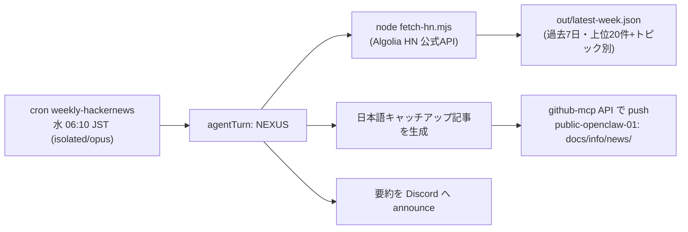

# 048 週次 Hacker News キャッチアップ cron の構築

- STATUS: DONE / CATEGORY: SETUP
- 作成日: 2026-07-23
- 目的: **毎週 Hacker News（HN）の話題スレッドを自動収集し、日本語のキャッチアップ記事を生成して公開リポへ push、Discord へ要約通知する** 仕組みを常設する。
- 位置づけ: 既存の `weekly-github-trending` と同型の週次ジョブ（isolated / agentTurn / 公式APIのみ・スクレイピング禁止）。

---

## 1. 全体構成



- **取得スクリプト**: `~/.openclaw/workspace/tasks/hackernews/fetch-hn.mjs`（Node標準のみ・依存ゼロ）
- **データ源**: **Algolia Hacker News Search API**（`https://hn.algolia.com/api`／公式提供・認証不要・プログラム利用可）。**Webスクレイピングは行わない**。
- **出力**: `tasks/hackernews/out/latest-week.json`（過去7日・ポイント50以上・上位20件＋優先トピック分類）、`snapshots/snapshot-<日付>.json`。
- **記事の公開先**: 公開リポ `TakahitoSuzukiii/public-openclaw-01` の `docs/info/news/<YYYYMMDD>_INFO_HN_hackernews-weekly.md`（github-mcp API で push）。`/info` では TOPIC=HN が既定の技術系カテゴリに分類される。

---

## 2. cron ジョブ定義

| 項目 | 値 |
|---|---|
| 名前 | `weekly-hackernews` |
| スケジュール | `cron 10 6 * * 3`（**毎週 水曜 06:10**）／ tz `Asia/Tokyo` ／ `--exact`（stagger無し） |
| セッション | `isolated`（agentTurn） |
| モデル | `opus`（anthropic/claude-opus-4-8） |
| 配信 | `announce` → Discord（`user:<discord-user-id>`） |
| toolsAllow | **未設定（null＝全ツール許可）** |

> 曜日選定: 月/火/木/金/土/日は既存の週次ジョブが使用中のため、**空いていた水曜**に配置。

---

## 3. 構築手順（実施コマンド）

### 3-1. 取得スクリプト配置
`tasks/hackernews/fetch-hn.mjs` を作成（Algolia HN API で過去7日の story を取得→ポイント降順→上位20件＋優先トピック〈ai/rust/go/typescript/python/security/devtools〉分類→ `out/latest-week.json` 出力）。

動作確認:
```bash
cd ~/.openclaw/workspace/tasks/hackernews
node --check fetch-hn.mjs
node fetch-hn.mjs   # 例: collected=300 (>=50pt), top=20
```

### 3-2. cron 追加（CLI で作成）
> ⚠️ **cron の作成・編集は CLI（`openclaw cron`）で行う。MCP の cron ツールで既存ジョブを編集しない**（toolsAllow が再注入され、全ツール前提の isolated ジョブが壊れるため）。新規作成時も `--tools` を付けない＝toolsAllow を null（全許可）に保つ。

```bash
# プロンプト（記事生成手順）を一時ファイルに用意して --message へ渡す
MSG="$(cat /path/to/prompt.txt)"
openclaw cron add --name weekly-hackernews \
  --cron "10 6 * * 3" --tz Asia/Tokyo --exact \
  --session isolated --model opus \
  --announce --channel discord --to user:<discord-user-id> \
  --message "$MSG"
```

プロンプト要旨（`payload.message`）:
1. `node fetch-hn.mjs` 実行 → `out/latest-week.json` を読む。
2. 日本語・初心者向けの記事を作成（優先トピックを手厚く／各スレッドに元記事・HN議論リンク／メタ行 `作成日 / STATUS: INFO / TOPIC: HN`／末尾に Author and Ownership 定型文）。
3. `github-mcp` で `docs/info/news/<YYYYMMDD>_INFO_HN_hackernews-weekly.md` へ push（既存は sha 取得後に更新・branch=master）。
4. 掲載件数／主な話題／記事URL を日本語要約で返す（＝Discord通知）。

---

## 4. 検証（実施済み）
- `node fetch-hn.mjs` … OK（過去7日 300件収集→上位20件）。
- `openclaw cron add` … 登録成功。`openclaw cron list` に `weekly-hackernews` 表示、次回 2026-07-29(水) 06:10 JST。`payload` に `toolsAllow` 無し（null 維持）を確認。
- **手動実行**（`openclaw cron run <id> --wait`）で end-to-end 成功 → 記事 `docs/info/news/20260723_INFO_HN_hackernews-weekly.md` を push、Discord 配信済み。

## 5. バックアップ
- 取得スクリプトを private ミラー（`private-openclaw-01`）へ **タスク別サブディレクトリ** `hackernews/fetch-hn.mjs` として byte-exact で反映（既存の per-task 方針に準拠）。

## 6. 運用メモ
- **編集**: スケジュール/プロンプトの変更は `openclaw cron update`（CLI）で。MCP cron ツールは使わない。
- **停止/再開**: `openclaw cron disable|enable <id>`。
- **手動実行**: `openclaw cron run <id> --wait`（公開リポへ push が走る点に注意）。
- **利用規約**: HN Algolia 公式APIのみ・スクレイピング禁止。トークン等の機密はログ/記事/コミット/通知に残さない（マスキング規約厳守）。

## 7. 参考
- Algolia HN Search API: https://hn.algolia.com/api
- 同型の先行タスク: `weekly-github-trending`（docs/openclaw 既存）。

## Author and Ownership / 著作権と所属について

This project was created as a personal initiative and is not connected to any organization or group.
It is published as an individual creative work.

本プロジェクトは個人の活動として作成したものであり、特定の組織や団体の業務とは関係ありません。
個人の創作物として公開しています。
