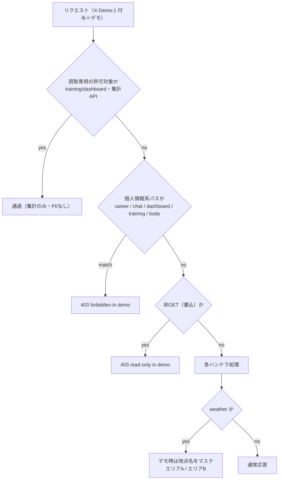

# 051 DONE SEC — 公開デモの個人情報露出ハードニング（weather 地点名マスク / chat 非表示 / career 撤去）

- **ステータス:** DONE
- **カテゴリ:** SEC（セキュリティ / 露出低減）
- **対象:** NEXUS タスクボード（`task-board`）を **公開デモ**（ポートフォリオ用）として外部提供するにあたっての個人情報露出面の点検と是正
- **日付:** 2026-08-09
- **関連:** `#82`（デモ公開ゲート）, `#89`（トレーニング閲覧専用許可）, `#90`（レポート公開）, career 撤去（同日）

---

## 1. 背景・目的

タスクボードを稼働中の `<server-host>`（EC2）上で、**転職ポートフォリオの公開デモサイト**として外部に見せる方針となった。外部の目に触れるため、画面・API 経由で**個人情報が露出しないか**を点検し、方針に沿って是正する。

デモ配信は Caddy がリバースプロキシし、**全プロキシ要求に `X-Demo: 1` ヘッダを付与**する。アプリ（`httpRouter.mjs`）はこのヘッダを見てデモ用の遮断/マスクを多層防御として適用する。ローカル（loopback）や tailnet からの自分用アクセスにはヘッダが付かないため、**自分の閲覧体験はデグレしない**。



---

## 2. 点検結果サマリ

### 2-1. 安全（意図どおり遮断／公開・変更不要）

- **chat**: `/chat`・`/api/chat/*` ともデモで **403**（`/^\/(career|chat)/` 正規表現で先頭一致遮断）。
- **body（ヘルスケア）**: `/body`・`/api/body/*`（体重・体組成・プロフィール）を **403**。ナビリンクも CSS 非表示。
- **training 書込**: 管理画面・`/api/training/sets` は **403**。公開は**集計のみ**（volume / 1RM / 部位別＝挙上データで PII 無し）＝ポートフォリオ用途で妥当。
- **reports ダウンロード**: `resolveSafe()` が**単一ファイル名＋拡張子 allowlist**（`/`・`\`・`..`・NUL 拒否、prefix 検証）で**パストラバーサルを厳格遮断**。
- **server-status**: ホスト名・IP を**意図的にマスク**（`hostnameMasked: true`、deviceId/publicKey 非出力）＝マスキング規約準拠。

### 2-2. 要対応（デモで開いていた個人情報面）

| # | 面 | 内容 | 判断 |
|---|---|---|---|
| 1 | **weather** | ホーム「自宅〜職場の天気」が **自宅＝`<home-area>`／職場＝`<work-area>`（座標）** を公開 | **是正**（地名マスク） |
| 2 | reports（body 含む） | `reportsService` は「個人データ非公開」設計だが `#90` でデモ公開。`body`（ボディメイク）レポートも自動公開されうる | **公開OK**（鈴木さん判断・据え置き） |
| 3 | system-status | OpenClaw 版・node 版・MCP/デバイス/skills/hooks/agents/plugins 構成サマリを公開 | **公開OK**（鈴木さん判断・据え置き） |
| 4 | **chat ナビリンク** | デモでも「💬 チャット」リンクが表示され、押すと 403（機能存在の露出＋リンク切れ） | **是正**（非表示） |

> `#2`（reports/body）と `#3`（インフラ露出）は鈴木さんの判断で**公開のまま据え置き**。是正対象は `#1`・`#4` のみ。

---

## 3. 実施した是正（`src/interface/httpRouter.mjs` 1ファイル・追加のみ／デグレ無し）

### 3-1. weather 地点名マスク（デモ時のみ）

`getWeather()` の応答に含まれる `label`（自宅/職場）と `area`（`<home-area>` 等）を、**デモ時だけ**汎用名に置換。座標は元々応答に含めていない。天気カード自体は維持。

```js
if (req.method === 'GET' && p === '/api/weather') {
  try {
    const wx = await getWeather();
    // デモ公開(#82): 地点名(自宅/職場・地名)は自宅位置の露出になるためマスク。天気機能自体は維持。
    const out = isDemo
      ? { ...wx, locations: (wx.locations || []).map((l, i) => ({ ...l, label: i === 0 ? 'エリアA' : 'エリアB', area: '' })) }
      : wx;
    return json(res, 200, out);
  } catch (e) { return json(res, 502, { error: String(e.message || e).slice(0, 160) }); }
}
```

### 3-2. chat ナビリンク非表示＋ホーム見出しの中立化（`sendHtml()` のデモ分岐）

デモ用の非表示 CSS に `/chat` を追加し、ホーム見出し「🌦 自宅〜職場の天気」を「🌦 天気」に中立化（配信 HTML への文字列置換のみ・元ファイルは不変）。

```js
const css = '<style>a.navlink[href="/dashboard"],a.navlink[href="/training"],a.navlink[href="/body"],a.navlink[href="/chat"]{display:none!important}</style>';
html = html.includes('</head>') ? html.replace('</head>', css + '</head>') : css + html;
// デモ公開(#82): ホームの天気見出し「自宅〜職場」も自宅露出になるため中立化（本文の天気カードは維持）。
html = html.replace('🌦 自宅〜職場の天気', '🌦 天気');
```

### 3-3. career 機能の撤去（同日・別対応の反映）

転職活動データを Hermes へ移行済みのため、当デモから career 機能を**完全撤去**（import・ルート群・ナビリンク・`careerService.mjs`・`src/infra/careerDocs.mjs`・`public/career*.html`）。`httpRouter` のデモ遮断正規表現内の `career` 文字列は**多層防御として残置**（該当パスは 404 化・ブラウザ非露出）。

---

## 4. 検証（`127.0.0.1:18790`・サービス再起動後）

| 検証 | 期待 | 結果 |
|---|---|---|
| デモ `/api/weather` の地点名 | `エリアA` / `エリアB`（area 空） | ✅ |
| 非デモ `/api/weather` | 実名（自分用・デグレ無し） | ✅ |
| デモ ホーム | chat リンク非表示・見出し「🌦 天気」 | ✅ |
| デモ `/chat` | 403 | ✅ |
| デモ `/body`・`/api/body/logs` | 403 | ✅ |
| デモ `/training/dashboard` | 200（意図どおり公開） | ✅ |
| `node --check httpRouter.mjs` | 構文 OK | ✅ |

- サービスは systemd user unit `openclaw-taskboard.service`（loopback `127.0.0.1:18790`）。コード反映は同 unit の restart。

---

## 5. private ミラー反映（byte-exact）

- 反映先: `private-openclaw-01`（master）。task-board ソースを**リポジトリのルート直下**に配置する byte-exact ミラー（docs/data は除外）。
- 手段: env トークン＋git で一時クローン→ファイル反映→**格納 blob SHA をローカルの `git hash-object` と照合**→commit→push。
- 反映セット（今朝の career 撤去が未反映だったため合わせて同期）:
  - **更新**: `src/interface/httpRouter.mjs`（BYTE-EXACT `c0371e3…`）, `public/home.html`（BYTE-EXACT `d902d52…`）
  - **削除**: `src/application/careerService.mjs`, `src/infra/careerDocs.mjs`, `public/career.html`, `public/career-2026.html`, `public/career-2026-docs.html`
- 最終確認: リモート実体（GitHub API）で `httpRouter.mjs` = `c0371e3…`（byte-exact）・career 完全消去を確認。

> **教訓（再発防止）**: `git rm` は削除を自動ステージするが、`cp` による**本文変更は `git add` しないとコミットに入らない**。`git status --short` の先頭桁（` M`＝未ステージ）を必ず確認し、更新ファイルは明示的に `git add` する。1コミットで「削除のみ」入り本文欠落 → 続コミットで是正。

---

## 6. 今後の注意

- **reports ディレクトリは publish-on-drop 面**（`data/reports` に置いたファイルはデモで一覧・DL 可能）。body レポートも公開する方針だが、意図しない機微ファイルを置かないこと。
- weather の**予報自体は実座標由来**（地名テキストはマスク済み）。市区レベルの広域予報のため精緻な位置特定には至らないが、方針変更時は座標そのものの扱いも再検討する。
- デモ公開の是非を伴う個人情報面の追加（新機能）を作る際は、**`httpRouter` のデモゲート（403 / マスク / ダミー化）に必ず配線**してから公開する。

## Author and Ownership / 著作権と所属について

This project was created as a personal initiative and is not connected to any organization or group.
It is published as an individual creative work.

本プロジェクトは個人の活動として作成したものであり、特定の組織や団体の業務とは関係ありません。
個人の創作物として公開しています。
