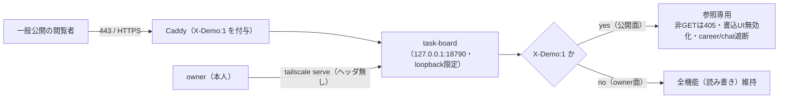

# 052 DONE SETUP — 公開デモの「参照専用サイト」再設計（allowlist 撤廃・全世界公開）

- **ステータス:** DONE
- **カテゴリ:** SETUP（デモ公開アーキテクチャの再設計）
- **対象:** NEXUS タスクボード（`task-board`）の公開デモを、IP allowlist に依存しない **参照専用（read-only reference）サイト**へ再設計
- **日付:** 2026-08-09 / 関連: `#82`（デモ公開ゲート）→ `#96`（参照専用化）, `#89`, `#90`, doc 051

---

## 1. 背景・目的

従来の公開デモは **AWS Security Group で対象企業のグローバル IP のみ許可（allowlist）** し、Caddy が付与する `X-Demo:1` でアプリ側の個人情報系を遮断していた。これを、

- **allowlist を撤廃して「全世界公開（`0.0.0.0/0`）」にしても安全**にしたい
- そのために**サイトを参照専用（書き込み不可）に**し、入力フォーム・書込 UI を**見た目そのままで無効化**したい

という方針へ変更する。安全性の担保を「ネットワークの入口制限（allowlist）」から「**アプリの read-only 強制**」へ移す。

---

## 2. アーキテクチャ（公開面と owner 面の分離）

調査の結果、既に2経路が綺麗に分離されており、**公開面のみ read-only 化すれば owner の管理は無傷**であることを確認した。



- **公開面**: `Caddy(:443)` →（`X-Demo:1` 付与）→ アプリ。**参照専用**。
- **owner 面**: `tailscale serve`（`https://<tailnet-host>`）→ アプリ（ヘッダ無し）→ **全機能**。
- アプリ port `18790` は **loopback 限定**（直接公開なし）。公開は必ず Caddy 経由。

---

## 3. 公開データ方針（2026-08-09 鈴木さん確定）

| 対象 | 公開面での扱い |
|---|---|
| home / info / training / トレーニング分析 | **閲覧公開** |
| ボディ/健康（体重・体組成・BMI 等） | **閲覧公開**（本人承認） |
| reports / system-status | **閲覧公開** |
| weather（天気） | 閲覧公開だが**地点名はマスク**（`エリアA/B`） |
| tasks（タスク） | **ダミー(`is_dummy=1`)のみ**表示（実タスク非開示） |
| chat（Nexusチャット） | **非表示**（画面・API とも 403、ナビリンクも CSS 非表示） |
| career（キャリア） | **撤去済み**（doc 051） |

---

## 4. 実装（`src/interface/httpRouter.mjs` ＋ `deploy/Caddyfile`・追加/最小改変）

### 4-1. read-only 強制（デモゲート簡素化）

`X-Demo:1` のとき **career/chat のみ遮断**し、それ以外は全ページ・GET API を閲覧公開。**非GET/HEAD は一律 405**（UI をすり抜けても書込不能＝防御の本体）。

```js
if (isDemo && (
  /^\/(career|chat)($|[\/.])/.test(p) ||
  /^\/api\/(career|chat)($|[\/.])/.test(p)
)) {
  return json(res, 403, { error: 'forbidden in demo' });
}
// 公開デモは参照専用: 書込(非GET/HEAD)を一律 405 で遮断
if (isDemo && req.method !== 'GET' && req.method !== 'HEAD') {
  return json(res, 405, { error: 'read-only demo' });
}
```

（従来の `dashboard/training/body` ページ＋API の 403 ブロックは撤去し、閲覧公開へ。tasks は `/api/tasks` 側でダミーのみに制限。）

### 4-2. 書込 UI 無効化シム（見た目そのまま）

デモ配信 HTML の `<head>` に注入。`window.fetch` の非GETを遮断し、`submit` を preventDefault。**`disabled` 等で灰色化せず**、書込操作だけ無反応化する。chat ナビのみ非表示（`dashboard/training/body` は表示）。

```js
const DEMO_HEAD = '<style>a.navlink[href="/chat"]{display:none!important}</style>'
  + '<script>(function(){var W=["POST","PUT","DELETE","PATCH"];var of=window.fetch;'
  + 'window.fetch=function(u,o){var m=((o&&o.method)||"GET").toUpperCase();'
  + 'if(W.indexOf(m)>=0){return Promise.resolve(new Response(JSON.stringify({error:"read-only demo"}),'
  + '{status:405,headers:{"content-type":"application/json"}}));}return of.apply(this,arguments);};'
  + 'document.addEventListener("submit",function(e){e.preventDefault();},true);})();</script>';
```

### 4-3. Caddyfile（方針コメントの実態化）

allowlist 撤廃・参照専用の方針をコメントへ反映。機能ディレクティブ（`X-Demo:1` 付与・chat 遮断）は不変。

---

## 5. 検証（`127.0.0.1:18790`・再起動後・`node --check` OK）

| 検証 | 期待 | 結果 |
|---|---|---|
| 公開面 ページGET `/ /dashboard /training /training/dashboard /body /info` | 200 | ✅ |
| 公開面 `/chat` `/career` | 403 | ✅ |
| 公開面 GET API（training/body/reports/system-status/weather） | 200 | ✅ |
| 公開面 GET API（chat/career） | 403 | ✅ |
| 公開面 書込（POST/DELETE tasks・training・body） | **405** | ✅ |
| 公開面 `/api/tasks` | ダミーのみ(`is_dummy:1`) | ✅ |
| 公開面 書込UIシム注入・chatナビ非表示・weather地名マスク | 有 | ✅ |
| **owner面（ヘッダ無し）全ページ/API** | 200（全機能維持） | ✅ デグレ無し |

---

## 6. 残作業（本人・sudo/AWS）

1. **AWS SG**: インバウンド `TCP 443` を **`0.0.0.0/0`** へ開放（allowlist 撤廃）。
2. **`/etc/caddy/Caddyfile`**: リポジトリ版（`deploy/Caddyfile`）で更新し `sudo caddy validate` → `sudo systemctl reload caddy`。
3. **HTTPS**: 現状は自己署名（`tls internal`）でブラウザ警告あり。全世界公開なら**独自ドメイン＋Let's Encrypt（#83）**を推奨。

> read-only の安全性はアプリ側で担保済みのため、上記が未了でも公開面から書込は不能。ただし正式 HTTPS は公開体験のため推奨。

---

## 7. ミラー / 補足

- private ミラー `private-openclaw-01`（master `b0c7697`）へ byte-exact 反映（`httpRouter.mjs` / `deploy/Caddyfile`）。
- `/api/home` の `taskSummary` は総件数（実＋ダミー）を返すが、**件数のみ**でタスク内容は含まない（画面のタスク一覧はダミーのみ）。
- 書込 UI シムは UX/多層防御の上乗せであり、**本体はサーバ側 405**。JS を無効化しても書込は不能。

## Author and Ownership / 著作権と所属について

This project was created as a personal initiative and is not connected to any organization or group.
It is published as an individual creative work.

本プロジェクトは個人の活動として作成したものであり、特定の組織や団体の業務とは関係ありません。
個人の創作物として公開しています。
