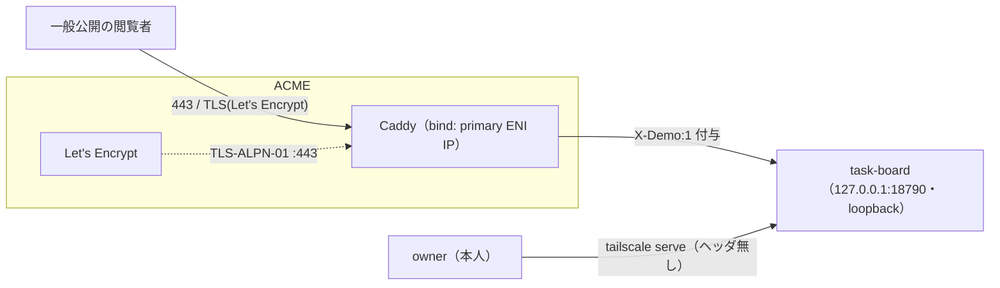

# 053 DONE SETUP — 公開デモの独自ドメイン＋正式HTTPS化（Caddy 導入 / Let's Encrypt）

- **ステータス:** DONE
- **カテゴリ:** SETUP（公開デモのTLS終端リバースプロキシ構築）
- **対象:** 転職ポートフォリオ公開デモ（NEXUS タスクボード）を独自ドメイン＋正式証明書で公開
- **日付:** 2026-08-10 / 関連: `#82`（IP限定公開）→ `#96`（参照専用化・doc052）→ `#83`（本ドキュメント）

---

## 1. 目的・到達点

自己署名（`tls internal`）でブラウザ警告が出ていた公開デモを、**独自ドメイン＋Let's Encrypt の正式 HTTPS** へ移行する。

- 公開URL: `https://<demo-domain>/`（Route53 A レコード → Elastic IP）
- TLS: **Let's Encrypt 自動発行（ACME / TLS-ALPN-01・443のみ）**
- リバースプロキシ: **Caddy v2.11.4**（静的バイナリ）が TLS 終端＋`X-Demo:1` 付与＋loopback アプリへプロキシ
- 安全性: アプリ側 read-only 強制（`X-Demo:1` で非GETを405＋書込UI無効化）は doc052 のまま。

---

## 2. 構成（公開＝Caddy / owner＝tailscale の分離）



- **tailscale 併存**: `tailscaled` が Tailnet IP の `:443` を使うため、Caddy は **primary ENI の private IP（`<server-private-ip>`）に bind** して衝突回避（`bind {$CADDY_HOST}`）。owner の書込は tailscale serve 経由で従来どおり全機能。
- **ACME 検証**: 443 のみ SG 開放のため **TLS-ALPN-01**。検証接続は EIP→NAT→ENI private IP に届き成立（`:80` 非開放でも発行可）。

---

## 3. 前提（構築前の状態）

- EC2（AL2023, x86_64）に **Elastic IP 付与済み**、Route53 に `A <demo-domain> → <global-ip>` 設定済み（DNS 伝播確認済）。
- AWS SG インバウンド: `443/tcp 0.0.0.0/0`（公開）＋ `22/tcp <your-ip>/32`（SSH限定）。**副 ENI 無し**（NIC は `ens5` 単一＋`tailscale0`）。
- アプリ（task-board）は `127.0.0.1:18790` で稼働（loopback 限定）。
- **Caddy は未導入**だったため新規インストール（本手順）。

---

## 4. 手順（Caddy 導入・sudo）

> 公式: https://caddyserver.com/docs/install / https://caddyserver.com/docs/automatic-https

### 4-1. 静的バイナリ配置（AL2023 は copr より静的バイナリ推奨）
```bash
# 公式ダウンロードAPI（linux/amd64・standard modules）で取得したバイナリを配置
sudo cp <caddy-binary> /usr/bin/caddy && sudo chmod +x /usr/bin/caddy
caddy version        # v2.11.4
```

### 4-2. 実行ユーザ
```bash
sudo groupadd --system caddy
sudo useradd --system --gid caddy --create-home --home-dir /var/lib/caddy \
  --shell /usr/sbin/nologin --comment "Caddy" caddy
```

### 4-3. systemd unit（公式）＋ `CADDY_HOST` 注入（drop-in）
```bash
sudo tee /etc/systemd/system/caddy.service >/dev/null <<'EOF'
[Unit]
Description=Caddy
Documentation=https://caddyserver.com/docs/
After=network.target network-online.target
Requires=network-online.target
[Service]
Type=notify
User=caddy
Group=caddy
ExecStart=/usr/bin/caddy run --environ --config /etc/caddy/Caddyfile
ExecReload=/usr/bin/caddy reload --config /etc/caddy/Caddyfile --force
TimeoutStopSec=5s
LimitNOFILE=1048576
PrivateTmp=true
ProtectSystem=full
AmbientCapabilities=CAP_NET_BIND_SERVICE
[Install]
WantedBy=multi-user.target
EOF

sudo mkdir -p /etc/systemd/system/caddy.service.d
printf '[Service]\nEnvironment=CADDY_HOST=<server-private-ip>\n' \
  | sudo tee /etc/systemd/system/caddy.service.d/override.conf
```
> `AmbientCapabilities=CAP_NET_BIND_SERVICE` で非root の caddy が 443 を bind 可能。`CADDY_HOST` は Caddyfile の `bind {$CADDY_HOST}` に注入され、Tailnet の 443 と衝突回避する。

### 4-4. Caddyfile 設置＋検証＋起動
```bash
sudo mkdir -p /etc/caddy
sudo cp <workspace>/tasks/task-board/deploy/Caddyfile /etc/caddy/Caddyfile
sudo CADDY_HOST=<server-private-ip> caddy validate --config /etc/caddy/Caddyfile   # Valid configuration
sudo systemctl daemon-reload
sudo systemctl enable --now caddy
sudo journalctl -u caddy -n 60 --no-pager    # "certificate obtained successfully"
```

### 4-5. Caddyfile（要点）
```caddyfile
<demo-domain> {
    bind {$CADDY_HOST}            # primary ENI IP に限定（tailscale の443と非衝突）
    encode zstd gzip
    @blocked path /career /career/* /api/career /api/career/* /chat /chat/* /api/chat /api/chat/*
    respond @blocked 403
    reverse_proxy 127.0.0.1:18790 {
        header_up X-Demo 1       # read-only モードのトリガ（詐称無効化）
    }
}
```

---

## 5. 検証（サーバ内 `--resolve` で実測・成功）

| 項目 | 結果 |
|---|---|
| 証明書 issuer / subject | **Let's Encrypt** / `<demo-domain>` ✅ |
| 有効期間 | 発行日〜+90日 ✅ |
| `curl ssl_verify` | `0`（信頼済） ✅ |
| `GET /`・`GET /body` | 200（体組成含め閲覧公開） ✅ |
| `GET /chat` | 403 ✅ |
| `POST /api/body/logs`・`POST /api/tasks` | **405（参照専用）** ✅ |

---

## 6. ロールバック / 運用

- **無効化**: `sudo systemctl disable --now caddy` → 公開 443 応答が止まり、アプリは loopback 限定に戻る（露出ゼロ）。
- **設定戻し**: `/etc/caddy/Caddyfile` を退避 `.bak` から戻して `sudo systemctl reload caddy`。
- **証明書更新**: Caddy が自動更新（ACME）。`:443` を塞がない限り無人継続。
- **SSH 安全**: 本手順は ENI/ネットワーク非干渉。SSH は `22/<your-ip>/32`（AWS）＋ tailscale の2系統で確保。**副 ENI のアタッチは行わない**（過去に SSH 断の原因）。
- **owner アクセス**: tailscale serve（ヘッダ無し）で従来どおり全機能（読み書き）。

## Author and Ownership / 著作権と所属について

This project was created as a personal initiative and is not connected to any organization or group.
It is published as an individual creative work.

本プロジェクトは個人の活動として作成したものであり、特定の組織や団体の業務とは関係ありません。
個人の創作物として公開しています。
