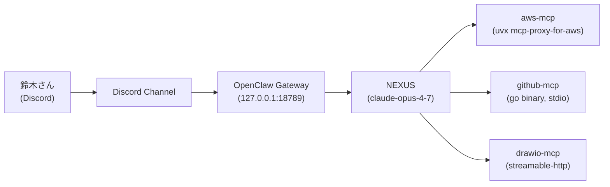

# MCP 接続構成図（動作確認用）

**作成日:** 2026-06-01
**目的:** drawio-mcp の動作確認テスト
**作成者:** NEXUS

## 概要

現在の NEXUS が接続している MCP（Model Context Protocol）サーバの構成図。

- 入力: Discord 経由（鈴木さん → Discord → OpenClaw Gateway → NEXUS）
- NEXUS から 3 つの MCP サーバへ接続:
  - **aws-mcp** — AWS リソース操作（uvx 経由の mcp-proxy-for-aws、read-only）
  - **github-mcp** — GitHub 操作（go バイナリ、stdio 接続、PAT 認証）
  - **drawio-mcp** — 図の生成（streamable-http、`https://mcp.draw.io/mcp`）

## 図（Mermaid）

## 関連ファイル

- `mcp-architecture-test.mmd` — Mermaid 原本（再描画用）

## 検証ログ

- drawio-mcp `create_diagram` ツール呼び出し: 成功（エラーなし、buildId 返却）
- 保存形式: Mermaid（`.mmd`）+ Markdown 埋め込み（`.md`）
